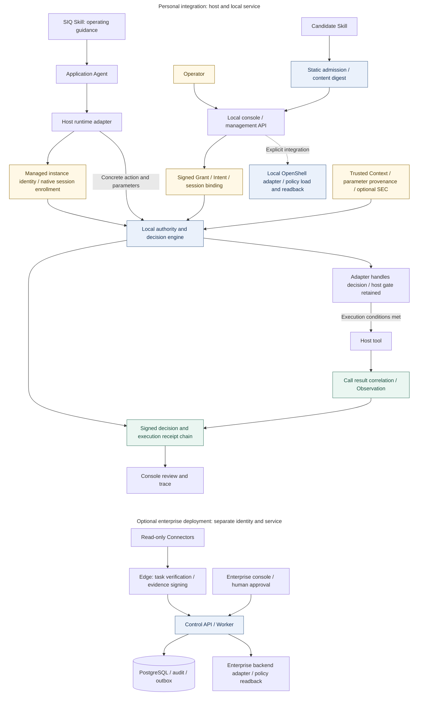
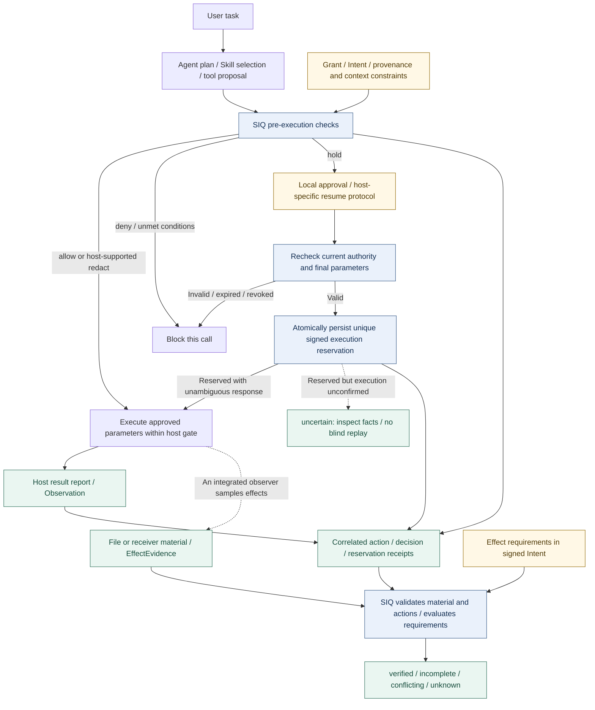

<p align="center">
  
</p>

<h1 align="center">SIQ Agent Security</h1>

<p align="center"><strong>Secure Runtime for Agent Skills</strong><br />
Agent security research and implementation: permissions, runtime checks and execution evidence</p>

<p align="center">Agent Skills define what agents can do. SIQ defines what they are allowed to do.</p>

<p align="center">
  <a href="https://github.com/maoyadongsh/siq-agent-security/actions/workflows/ci.yml?query=branch%3Amain"></a>
  <a href="https://github.com/maoyadongsh/siq-agent-security/actions/workflows/research.yml?query=branch%3Amain"></a>
  <a href="LICENSE"></a>
  <a href="https://github.com/maoyadongsh/siq-agent-security/releases/tag/siq-agent-security-v0.3.1"></a>
</p>

<p align="center">
  <a href="README.md">简体中文</a> · <strong>English</strong>
</p>

<p align="center">
  <a href="#quick-start">Quick start</a> · <a href="research/README.md">Research map</a> · <a href="#research-and-evidence">Research evidence</a> · <a href="#components-and-integrations">Integrations</a> · <a href="#contributing-and-next-steps">Contributing</a>
</p>

---

**SIQ is an open-source agent security system that uses a Skill to guide integration and a separate local program with host hooks to enforce protection.** It discovers and inventories agents and related assets in supported environments, manages Skill lifecycles and permissions, and connects assets, authorization, execution records and collected effect evidence.

Users keep working in their existing agents while SIQ helps them answer:

**Which agents exist → Which Skills are installed → What permissions they have → Which protections are active → What ran → What happened.**

Discovering an asset does not establish that it is managed or that blocking protection is active. Management and protection require separate confirmation of identity bindings, authorization and working host integration. Outcome verification depends on integrated effect collection and actual evidence.

The research asks how model proposals receive independent authorization, how provenance constrains execution, and how observed effects establish task completion. The implementation links trusted Intent, parameter provenance, Skill Execution Context (SEC), a unique post-approval execution reservation and effect verification: who authorized the action, which installation it belongs to, and what actually happened. Root-level [research/](research/README.md) connects literature, questions, methods, experiments, findings and governance; [evaluations/](evaluations/README.md) separates research observations, engineering acceptance and external reproductions.

The **personal client** provides a local service and browser console for agents, Skills and tasks. The **enterprise control plane**, Edge and Connectors support environment inventory, policy approval and deployment readback. The signed `0.3.1` stable release remains available; newer personal-client and report-tool features are merged into main. Enterprise API / Web updates have been deployed on the existing platform; real business-identity acceptance and convenient LAN team-device workflows remain incomplete.

**Product focus: user-authorized security management throughout the Agent and Skill lifecycle.** Agents plan tasks; the SIQ runtime checks specific actions against trusted authority and associates signed receipts with observed effects where collection is integrated. The project also maintains reproducible provenance/effect research and DGX Spark/OpenShell integrations. Its deterministic research demonstration runs on ordinary Linux without model API keys or a GPU.

> **Signed installation package (2026-09-19):** [0.3.1 release (Latest)](https://github.com/maoyadongsh/siq-agent-security/releases/tag/siq-agent-security-v0.3.1) provides an offline bundle, signed Skill and four target binaries, built from main commit `f3d9c3f` and signed with the existing publisher key. Download the Release installation assets; GitHub automatic source archives and `skills/siq-agent-security/` remain development source. Linux ARM64 passed native first-start and tamper-rejection checks; the other targets have build and signature-pin verification only. See [installation instructions](docs/signed-release-packaging.md) and [signing/publication evidence](docs/evidence/releases/0.3.1/README.md).

> **Newest signed candidate (2026-09-24):** `0.4.0-rc.2`, built from main `7b68c14`, has been signed with the original publisher key and includes the latest personal-client/report-tool changes. Four-target builds, official-root verification, Linux ARM64 final-package startup and 3/3 tamper rejections passed. It is prepared locally, not publicly released or Latest; upgrade/rollback and full cross-platform acceptance remain pending. Find the offline bundle under `.tmp/releases/0.4.0-rc.2-signed/`; see the [candidate record](docs/evidence/releases/0.4.0-rc.2/README.md). Use its bundled instructions and a separate state directory, not Skill-only network download before publication.

[Application modules](apps/README.md) · [Documentation map](docs/README.md) · [Current development](docs/development/current.md) · [Repository reorganization](docs/development/reorganization-progress.md) · [Platform delivery](platforms/README.md) · [Evaluations and external reproduction](evaluations/README.md)

## Product direction and support status

The product follows **discovery and review → admission and authorization → execution and approval → traceability and maintenance**. Main now includes environment/project discovery, model connection tests, multiple OpenShell gateway checks, read-only grant presets, native protection checks, activity filtering and authorized task-output viewing. Enterprise additions include role workspaces, guided enrollment, candidate review, approval readback, deployment preview/confirmation and durable request recovery, plus permission-scoped navigation to business results. Skill lifecycle, signed receipts, multi-tenant inventory, risk and audit remain part of the product. Priorities are same-candidate native acceptance and enterprise real-identity/cross-system validation before team-device delivery.

The personal client combines **Skill guidance, local program decisions and host hook integration**:

| Component | Role |
| --- | --- |
| [SIQ Skill](skills/siq-agent-security/SKILL.md) | Provides installation and operating guidance so the agent can invoke SIQ and present its decisions; the model does not judge safety or approve grants |
| [Separate local program](apps/agentshield/README.md) | The Go runtime checks rules and authorization, manages approvals, signs receipts and serves the browser console |
| [Host hooks and adapters](adapters/runtime/README.md) | Request local decisions before integrated tool calls, handle them under the host protocol and submit associated observations afterward; supported approval-resume paths also require a final check before execution |
| [OpenShell (optional)](README.md#dgx-spark-与-nvidia-openshell-深度适配) | Provides execution isolation and resource constraints for explicitly integrated tasks within the verified version and configuration scope |

**Installing the Skill alone does not install host hooks or establish active runtime protection.** Confirm that the local service is running and host hooks are loaded, then verify the actual checking and blocking behavior. A separate local program describes component responsibilities; it does not establish strong isolation from same-UID processes in the current desktop mode. Capabilities remain bounded by host integration and platform evidence.

**Repository snapshot, 2026-09-24:** Local development was merged through [PR #107](https://github.com/maoyadongsh/siq-agent-security/pull/107), merge commit `7b68c14`, covering personal/enterprise improvements, report authorization, business navigation, OpenClaw execution rechecks, DGX native CI gates and release-source validation. See the [integration record](docs/development/local-source-integration-20260924.md). **Latest stable remains `0.3.1`, built from `f3d9c3f`; merging source does not update an existing release.** Prior macOS/Windows work remains integrated, with scope in the [Windows review](docs/windows-main-integration-review-20260919.md). Historical native evidence retains its original source/candidate identity and does not establish full acceptance of the latest main.

| Scope | Current evidence | Remaining work |
| --- | --- | --- |
| Linux personal management | Discovery, model/gateway checks, guided authorization, native protection checks and task outputs are merged; OpenClaw/Hermes have separately scoped component/browser evidence. Both 0.3.1 and signed candidate 0.4.0-rc.2 have separate Linux ARM64 signature/fresh-start checks | New-candidate publication, system-service install/upgrade/rollback and full host journeys; stock OpenClaw checkpoints and desktop visual checks retain limitations; the supplemental continuous 12-hour admin-session leg is not claimed as passed |
| macOS | LaunchAgent lifecycle, staged OpenClaw/Hermes/WorkBuddy work and independent review fixes are merged; 0.3.1 includes a manifest-signed arm64 binary | Same-candidate host retests, native installation/upgrade and Apple signing/notarization; the project manifest signature is not notarization |
| Windows | Writer, migration recovery, DACL, resource/identity checks, host management, task install/upgrade/rollback and junction protection are merged; 0.3.1 includes a manifest-signed amd64 binary and Skill | Native installation/upgrade and same-candidate host retests; historical OpenClaw evidence uses a WSL Agent, Hermes uses native CLI, and minimal WorkBuddy native I/O does not establish full approval recovery, desktop update or repeatability |
| OpenClaw / Hermes / WorkBuddy | OpenClaw 2026.9.5 native components/session isolation/output paths and an isolated Hermes 0.21 real-model report journey have evidence; controlled checkpoints are tracked separately from stock capabilities | Linux covers OpenClaw/Hermes only; component tests do not establish a full model-driven OpenClaw workflow. macOS/Windows hosts and WorkBuddy desktop still require same-candidate native validation |
| LAN team management | Enterprise API / Web deployment updates, database migration, backup restoration and old/new image switching have been verified; Control API, Edge and Connectors provide centralized governance | Real organization accounts, independent approvers, cross-system result access; periodic/continuous discovery scheduling still pending acceptance; convenient team-device enrollment/management acceptance |

Personal Skill import accepts local directories, local ZIP files and policy-compliant HTTPS ZIP URLs. The Git repository import option remains disabled pending real-network acceptance; an arbitrary repository homepage is not an installation URL. Task outputs remain opt-in and task-authorized, without historical backfill; adapter-returned content is not independent effect evidence.

Linux WorkBuddy is outside the current delivery scope.

Install the personal client on your own computer for direct browser access. The `127.0.0.1` in the console URL points to the **machine running the browser**, not the remote service host: a Mac browser and the Linux server are two devices, so when the service is installed on a remote server, its loopback URL is not reachable directly from the browser machine — use the [same-port SSH forwarding instructions](docs/personal-client-operation-guide-20260916.md#2-启动与配对) or another approved controlled-access path. Do not make the service listen on `0.0.0.0`, disable authentication or relax firewall rules to gain access. Confirming the management-console session in the browser does not authorize agent business actions; actual checks and decisions remain with the local runtime. Reproducing the new connection experience requires the updated binary and Skill; older signed packages do not acquire these changes automatically.

**Local deployment, September 25:** The existing personal console at `http://127.0.0.1:47611/overview` now runs `0.4.0-dev-console` and redirects to the new `/agents` home, retaining Skill-assisted connection and 24-hour sessions. Existing identity and history were retained; enterprise services and signed release packages were not changed. This is a local source-candidate deployment, not a public release. See the [deployment and rollback record](docs/development/personal-console-deployment-20260925.md).

The same day's **console simplification source increment** adds four primary workflows—My Agents, Permissions, Security, and Runtime Audit—plus evidence-based framework/role/Skill navigation and batch revocation with signed previews, per-item revision checks, and audit records. Existing defenses and advanced workspaces remain; bulk permission expansion is not enabled. This increment is now deployed to the local instance with explicit user authorization, but has not entered existing signed packages. See [scope and validation](docs/development/personal-console-simplification-20260925.md).

**September 25 source update:** The personal console now offers “Connect through your agent.” Send the page's public connection request to the installed SIQ Skill; explicit local confirmation connects the originating browser without copying a pairing code. Requests expire after 5 minutes. New management sessions last a fixed **24 hours**; reload does not extend expiry, and logout or service restart requires reconnection. Manual pairing remains available. This change is not included in `0.3.1` or the local signed `0.4.0-rc.2` package, and connecting the browser does not grant agent permissions. See the [operation guide](docs/personal-client-operation-guide-20260916.md).

Main includes constrained OpenShell execution, multiple-gateway discovery/checks and request-bound supervision, revocation and cleanup recovery. Execution binds the CLI/endpoint, confirms policy and instance readback and rechecks authority; policy application alone is not execution evidence. Isolated Hermes / Qwen / OpenShell report results do not substitute for the fixed Nemotron path or real business identities. The native DGX CI workflow is merged, but runner acceptance, cross-scenario stop confirmation and performance remain open. See [current development](docs/development/current.md) and [environment gates](docs/development/remaining-environment-gates-20260924.md); historical v6 results remain in the [Linux ledger](docs/linux-dual-host-progress-20260918.md). Discovery does not establish protection, and request-specific recovery does not establish generic remote task stopping.

The current OpenClaw [compatibility manifest](patches/openclaw/compatibility.v1.json) pins **2026.9.5**. Stock plugin approval/events still lack SIQ's final post-approval parameter recheck and unique execution reservation, so SIQ holds fail closed before platform approval. Controlled patches bind exact source, patch and adapter digests; they do not establish stock or formal-release support. [Native component/output checks](docs/development/ux-runtime-output-openclaw-e155-validation-20260923.md) cover plugin loading, tool wrappers, session isolation and output persistence with a fixture after-call relay, not a complete model-driven OpenClaw/OpenShell business journey. Historical 2026.9.4 results remain in the [controlled-start record](docs/openclaw-controlled-start-linux-20260919.md).

The [September 24 enterprise deployment](docs/development/enterprise-runtime-delivery-20260924.md) verified migration `0013→0017`, isolated backup restoration, old/new image switching and desktop/mobile Gateway login entry points, including anonymous rejection. It did not complete real-account login or cross-system authorization journeys. Business navigation is tenant-scoped and restricted to configured origins; the business application must independently authorize result access. Periodic/continuous discovery scheduling — storage, confirmation and device-side execution — is still in closeout (see the [auto-onboarding closeout record](docs/development/enterprise-auto-onboarding-closeout-20260926.md)); this README does not claim that continuous scanning is fully integrated or proven on real devices. Troubleshooting order for common failures (console unreachable, empty environment/device, no heartbeat after registration, collection failures, policies not taking effect) and release-package prerequisites are in the [production runbook](docs/enterprise-production-runbook-v1.md). Historical “uncommitted/unpublished/undeployed” notes describe their original snapshots; use later integration/deployment records for current status.

## Core value

**Core outcome: manageable permissions, checked execution and traceable results.** Users can review what is allowed, check whether an integrated action is authorized, and inspect receipts and observations to establish what happened. These capabilities support Trusted Agent Execution.

| User concern | Implemented product and technical mechanism | Practical use |
| :--- | :--- | :--- |
| **Manage assets and changes** | Asset discovery and attribution, Skill admission checks, installation/update previews, confirmation and removal | Review sources and permission changes throughout the lifecycle |
| **Authority independent of the model** | A Go runtime checks Grant / Intent, session bindings and approvals before execution; model proposals cannot expand permissions | Auditable authorization boundaries for automated operations |
| **Same value, different provenance** | Trusted Context and parameter provenance bind to actions; identical recipient values can be allowed or denied based on trusted-database / MCP origin | Constrain recipient substitution and unauthorized delivery induced by tool results |
| **Completion grounded in effects** | Signed receipts associate actions; independent file and controlled-receiver observers distinguish tool success, observed effects and task completion | Evidence for delivery acceptance, fault diagnosis and execution audits |

Potential applications include enterprise Agent permission governance, research/report delivery and tool-platform integration. The local runtime, adapters and optional enterprise control plane provide the current foundation; scale, external SaaS effect verification and commercial returns still require validation in specific deployments. Assess research contributions through the [research questions](docs/research/research-questions.md) and [technical report](docs/research/technical-report.md); no priority or peer-reviewed novelty is claimed.

> [!IMPORTANT]
> **Research source prerelease with a Sigstore digital signature**
>
> [research-v0.1.0-rc.1](https://github.com/maoyadongsh/siq-agent-security/releases/tag/research-v0.1.0-rc.1) includes `SOURCE-INFO.json`, `SHA256SUMS` and `SHA256SUMS.sigstore.json`, with no newly compiled binaries or model weights. The signature binds the checksum manifest to this repository's GitHub Actions release workflow identity, covering the source archive and metadata. Verify the signature before checking file hashes: [verification instructions and signature scope](docs/research/release-authentication.md).

<details>
<summary>Initial research release source and identity</summary>

The research source prerelease is fixed at [`aefab111`](https://github.com/maoyadongsh/siq-agent-security/commit/aefab111c7fcad9075c8f429f97c9eab519dcd22); later README and publication-record updates do not change that identity.

A detached signature was added on 2026-09-09 without modifying the original assets. The `official_signature=false` field in `SOURCE-INFO.json` preserves the initial packaging status; see the separate [Sigstore signing and verification record](docs/research/evidence/release-signing-20260909.json).

</details>

## Start here

To evaluate source distribution through `vercel-labs/skills`, use the [pinned compatibility checks](docs/research/skills-distribution.md). This tool copies development source from a Git commit; it does not replace the [signed installation package](docs/signed-release-packaging.md). Historical directory-copy checks do not expand current product support.

| Your goal | Entry point | What to expect |
| :--- | :--- | :--- |
| Manage local agents and Skills | [Signed package installation](docs/signed-release-packaging.md) · [Source build](#personal-console-linux-source-build) · [Operations guide](AGENTSHIELD.md) | Start the local service, pair the browser and enable protection within verified platform scope |
| Govern organizational assets and policies | [Control-plane setup](docs/control-plane.md#快速开始) · [Production runbook](docs/enterprise-production-runbook-v1.md) | Enroll environments and Edge devices, review assets, approve policies and inspect deployment evidence |
| Try the complete flow | [Quick start](#quick-start) | A local demonstration without model keys |
| Reproduce and evaluate | [Reproduction guide](REPRODUCIBILITY.md) · [Research index](docs/research/README.md) | Fixed cases, evaluation protocols and evidence |
| Integrate your Agent | [Components and integrations](#components-and-integrations) | Runtime, adapter and contract entry points |
| Contribute to research | [Contributing](CONTRIBUTING.md) · [Community tasks](docs/research/community-backlog.md) | Clearly scoped starting points |

## What you can verify

Consider a task to analyze a repository, write a report and deliver it to a specified contact. The Agent dynamically selects research, report and delivery Skills. The demonstration exposes four observable outcomes:

| Scenario | Check | Expected result |
| --- | --- | --- |
| Normal delivery | Task authority, trusted contact, file and receiver effects | `verified`: required effects have been verified |
| MCP recipient injection | An untrusted tool result proposes a different recipient | `blocked`: the unauthorized action is stopped |
| Same value, different provenance | Identical recipient values from a trusted database and MCP | Trusted path allowed; MCP path denied |
| False tool success | The tool reports success, but the controlled receiver has no corresponding event | `incomplete`: a required effect is missing |

These demonstrations use explicit model fixtures to drive real SIQ components. They verify specific security paths; they do not measure prompt-injection attack success rates against a real model.

## How it works

### Components and authorization chain

This diagram shows the current local-runtime and enterprise control-plane relationships. Managed instances enroll real host sessions; trusted Context, parameter provenance and an optional Skill Execution Context (SEC) enter server-side verification. The optional enterprise deployment uses its own identity and service; running both consoles does not automatically synchronize authority. The personal runtime also has an independent OpenShell integration, described in the [Chinese integration overview](README.md#dgx-spark-与-nvidia-openshell-深度适配).



### Task execution and effect verification



- **Before execution**: statically inspect Skills and pin content digests. Constrain actions with Grants, Intent, instance/session identity, trusted Context and parameter provenance. Verify SEC when trusted Skill attribution is required; a name or installation path alone is not proof. Model output cannot create effective permissions.
- **During execution**: enforce decisions at integrated entry points while retaining the host gate. Supported hold-resume paths recheck authority and final parameters after local approval, then persist a unique reservation before attempting execution. Denial, expiry, revocation or missing resume capability blocks the call. Reserved but unconfirmed execution remains `uncertain`, without automatic replay.
- **After execution**: correlate results and signed receipts by action, decision and reservation. Integrated file or receiver observers collect effect material. Completion checks signed Intent requirements, action authority and valid material; missing or conflicting evidence cannot be shown as completed.

Dashed edges denote explicit integration or conditional paths, not universal effect coverage. Approval and host-gate ordering follows each adapter protocol; stock OpenClaw and a pinned checkpoint-patched copy have separate acceptance. `redact` requires host parameter-rewrite support; other mappings follow the adapter contract.

Ordinary Observation correlation and independent EffectEvidence establish different things. `uncertain` is an execution-reservation state, not a fifth Completion outcome. See the [technical report](docs/research/technical-report.md), [contracts](packages/contracts/README.md) and [security boundaries](#security-boundaries) for architecture and protocol details.

## Quick start

For the signed version, download the [0.3.1 offline bundle](https://github.com/maoyadongsh/siq-agent-security/releases/download/siq-agent-security-v0.3.1/siq-agent-security-0.3.1-bundle.zip) and follow the [installation instructions](docs/signed-release-packaging.md) to extract it, verify the package and start the local service. The bundled `INSTALL.md` now includes first-start instructions: verify the package, then use the verified binary’s `start` command to initialize state and start the service. Direct bootstrap use still requires initialization beforehand. No local Go/UI compilation is needed. The source-development and research steps remain below; GitHub automatic Source code archives are not signed installation packages.

### Personal console: Linux source build

This uses the foreground entry point available on current `main`. Prepare Git, Go **1.26.6**, and Node.js **22 / npm**; no enterprise Control API or PostgreSQL is required. Run from the repository root (if needed, first use the `git clone` and `cd` commands in the demonstration below):

```bash
npm --prefix apps/web ci
npm --prefix apps/web run build:local
mkdir -p .tmp/personal-bin
GOTOOLCHAIN=go1.26.6 go -C apps/agentshield build \
  -o "$PWD/.tmp/personal-bin/siq-agent-security" ./cmd/agentshield

export SIQ_AGENT_SECURITY_STATE_DIR="$PWD/.tmp/personal-state"
.tmp/personal-bin/siq-agent-security start --port 47611
```

Keep the terminal running, open **http://127.0.0.1:47611/overview**, and enter the one-time pairing code printed by the service. If the code expires, open another terminal at the same repository root and run:

```bash
export SIQ_AGENT_SECURITY_STATE_DIR="$PWD/.tmp/personal-state"
.tmp/personal-bin/siq-agent-security pair --port 47611
```

`start` initializes or reuses this directory's configuration and serves in the foreground on first use; press `Ctrl+C` to stop it. If a matching instance for the same directory is already running, it returns that instance's status; use `pair` above for a fresh pairing code. This example stores state in `.tmp/personal-state`; reuse the same path and preserve any needed data before cleaning `.tmp`. See the [operations guide](AGENTSHIELD.md) for background setup, upgrade and recovery commands and platform limitations; keep the selected state directory and instance consistent.

<details>
<summary>Frontend development and disconnected-state troubleshooting</summary>

Keep the Go service above running, then use another terminal:

```bash
npm --prefix apps/web run dev:local
```

Open the address printed by Vite. The development proxy targets `http://127.0.0.1:47611`; `dev:local` starts only the frontend. If the console reports a disconnected or unreachable decision API, check the local Go service and port, then pair the browser. The enterprise frontend uses separate Control API configuration. The embedded UI is served directly by Go and does not require Vite.

</details>

### 1. Run the research demonstration without model keys

The validated entry environment is Linux with Git, Go **1.26.6**, Python **3.12+**, and Node.js **22 / npm**. Initial dependency and toolchain installation needs network access. Use a fresh clone: the launcher refuses to overwrite existing demonstration state.

```bash
git clone https://github.com/maoyadongsh/siq-agent-security.git
cd siq-agent-security

bash scripts/hackathon/start.sh --mode test --port 47621
bash scripts/hackathon/healthcheck.sh
bash scripts/hackathon/pair.sh
```

The launcher installs locked Web dependencies and builds the local UI and Go binary. Open **http://127.0.0.1:47621/demo**, enter the one-time pairing code printed in your terminal, and select a scenario from the table above. Keep pairing codes and service state files on your machine.

> [!NOTE]
> Pass `--mode test` explicitly: the launcher's default `demo` mode uses configured real models. To pin the first release, run `git switch --detach research-v0.1.0-rc.1` before starting.

Stop this demonstration instance when finished:

```bash
bash scripts/hackathon/stop.sh
```

Before restarting, archive the instance's previous state as described in the [reproduction guide](REPRODUCIBILITY.md). That guide also covers occupied ports, pairing issues and environment diagnostics.

### 2. Reproduce the fixed benchmark

Install **uv** as well, then run these commands from the repository root. Use fresh state and output directories for every attempt.

```bash
(cd apps/control-api && uv sync --dev --locked)
mkdir -p .tmp/research-bin
GOTOOLCHAIN=go1.26.6 go -C apps/agentshield build \
  -o "$PWD/.tmp/research-bin/siq-agent-security" ./cmd/agentshield

apps/control-api/.venv/bin/python benchmarks/hackathon/run.py \
  --binary .tmp/research-bin/siq-agent-security \
  --state-root .tmp/my-research-controls \
  --out .tmp/my-research-results/controls.json

apps/control-api/.venv/bin/python benchmarks/hackathon/verify.py \
  .tmp/my-research-results/controls.json \
  --out .tmp/my-research-results/verification.json
```

The default cohort contains all **23 fixed control cases**. Check expectation violations and verifier results: `blocked` for an attack or `incomplete` for false tool success can be the correct outcome. Retain failed attempts and review reports against the [evidence export policy](docs/research/data-export-policy.md) before sharing. Do not upload private state directories.

### 3. Optional: use real models

<details>
<summary>Show the StepFun + DGX Spark setup path</summary>

The historical real-model demonstration uses **StepFun `step-3.7-flash` for remote planning** and **Ornith on DGX Spark for local analysis**. A later isolated Hermes 0.21 / Qwen / OpenShell report journey is tracked in the [closeout record](docs/development/flagship-closeout-current-20260924.md), separately from fixed Nemotron and real-account acceptance. These paths require separate model, credential and hardware configuration; run and report them separately from key-free tests.

Start with the [DGX deployment guide](deploy/dgx-spark/README.md), [private model configuration](docs/hackathon/step-plan.md) and [three-track reproduction guide](REPRODUCIBILITY.md). A local failure during confidential analysis must not automatically authorize fallback to a remote model.

</details>

## Research and evidence

Updated through **2026-09-24**. Recent engineering/release checks and historical research reproduction are listed separately. Each result belongs to its recorded source or candidate, environment and test scope; denominators must not be pooled or transferred to other versions.

**Recent engineering and signed-release verification (2026-09-18–24)**

| Archived observation | Result | Evidence and scope |
| --- | --- | --- |
| 0.4.0-rc.2 signed candidate | Official signature, four pins and Linux ARM64 final-package startup passed; **3/3** tamper rejections | [Candidate record](docs/evidence/releases/0.4.0-rc.2/README.md); fixed `7b68c14`, locally signed, not published; no upgrade/rollback or other-target native acceptance |
| Latest main integration | API **1089** tests, Web **299** tests and **44** Go test packages passed; four-target builds passed | [Integration record](docs/development/local-source-integration-20260924.md), [PR #107](https://github.com/maoyadongsh/siq-agent-security/pull/107); separate counting units, not release acceptance |
| Enterprise API / Web update | Migration, backup restoration, image switching and login-entry checks passed | [Deployment record](docs/development/enterprise-runtime-delivery-20260924.md); existing Gateway/IAM entry, not real-account, independent-approval or cross-system journey acceptance |
| Report-tool client handoff | Four-target builds, Linux ARM64 native startup and stale-source rejection passed | [Handoff](docs/development/client-report-release-handoff-20260924.md); original binaries bind E163 plus 11 files, were unsigned and must not be relabeled as merge-commit builds |
| OpenClaw 2026.9.5 components and outputs | Plugin/tool wrappers, session isolation, output authorization and restart persistence passed | [E155 checks](docs/development/ux-runtime-output-openclaw-e155-validation-20260923.md); fixture after-call relay, not a full model-driven business journey or independent effect proof |
| 0.3.1 signed package | Signature and native startup passed; **3/3** tamper rejections | [Release record](docs/evidence/releases/0.3.1/README.md); source `f3d9c3f`, four binary pins and Skill content, Linux ARM64 final-package start/status/pair/console/stop; other targets have no native installation acceptance for this release |
| 0.3.1 publication and source CI | **8/8** assets match; **6/6** source workflows succeeded | [Public readback](docs/evidence/releases/0.3.1/publication.json), [source CI](docs/evidence/releases/0.3.1/source-ci.json); regular release and Latest; workflow count is not a test count |
| Four-target Skill source checks | **4/4** native targets passed | [Fixed-candidate record](docs/evidence/repository-reorganization-final-20260919/README.md); PR #97 head `bf7dced`, actual merge checkout SHA in each report; Linux amd64/arm64, macOS arm64 and Windows amd64 self-admission, missing-manifest rejection, startup, pairing, console and stop. Source checks do not establish 0.3.0 system-service installation, upgrade or full host acceptance |
| 0.3.0 release package | **14/14** checks passed | [Package verification](docs/evidence/releases/0.3.0/verification.json); source `83fde2d`, official-root verification, tamper rejection and Linux ARM64 installation checks; includes executing the bundled INSTALL.md from empty state through startup, pairing, console and stop; other targets lack native installation acceptance |
| 0.3.0 publication and remote readback | **8/8** asset hashes match | [Publication verification](docs/evidence/releases/0.3.0/publication.json); regular Release, Latest at the time of that readback; four binary pins, Skill signature/content and Linux ARM64 signed-URL download/staging verified |
| 0.3.0 release-source CI | **5/5** workflows succeeded | [Source CI record](docs/evidence/releases/0.3.0/source-ci.json); commit `83fde2d`, ci, research, runtime-security, personal-experience and sonarcloud; separate from native release-asset installation acceptance |
| 0.3.0-rc.1 signed package | **13/13** checks passed | [Package verification](docs/evidence/releases/0.3.0-rc.1/verification.json); source `58ab22e`, official-root checks, six rejection cases, Linux ARM64 bootstrap, console and graceful stop; no native installation acceptance on other targets |
| 0.3.0-rc.1 remote asset readback | **8/8** asset hashes match | [Publication verification](docs/evidence/releases/0.3.0-rc.1/publication.json); four binary pins, Skill content and signature reverified, plus Linux ARM64 signed-URL download and staging |
| Linux installed service and user journey | B02 **16/16**; installed R07 **31/31**, nested R04 **31/31** | [Same-candidate checks](docs/evidence/personal-experience/linux-dual-host-20260918-211200/lx02-sec-hold-fix-installed-summary.json); sixth source candidate `67bc48c4…` with a test release trust root; not full user-journey acceptance of 0.3.0 |
| Hermes native CLI and browser approval | **24/24** checks passed | [Combined approval checks](docs/evidence/personal-experience/linux-dual-host-20260918-211200/lx03-hermes-browser-approval-native-summary.json); candidate `67bc48c4…`, approval, denial, parameter/object drift, concurrency and revocation; headless browser and synthetic model |
| OpenClaw 2026.9.4 controlled start | **22/22** checks passed | [Managed native CLI checks](docs/evidence/personal-experience/linux-dual-host-20260918-211200/lx03-openclaw-2026.9.4-controlled-managed-native-summary.json); candidate `67bc48c4…`, isolated installation and pinned patch; does not establish a post-approval checkpoint in the stock host |
| Browser management-session race repair | Web **117/117**; targeted real-browser checks **2/2** | [Session repair checks](docs/evidence/personal-experience/linux-dual-host-20260918-211200/lx05-session-transition-eighth-summary.json); eighth scoped candidate `a85c76b0…`; does not inherit sixth-candidate systemd/OpenShell acceptance |
| OpenShell D05 native functional matrix | **373** steps: 365 pass / 7 partial / 1 blocked / **0 fail** | [D05 results](docs/evidence/personal-experience/linux-dual-host-20260918-211200/lx06-sec-hold-fix-d05-summary.json); candidate `67bc48c4…`, backend 0.0.83; remote single-task stop remains limited, and zero failures do not establish full acceptance |
| OpenShell B3 functional journey | **57/57** passed | [B3 results](docs/evidence/personal-experience/linux-dual-host-20260918-211200/lx06-sec-hold-fix-b3-summary.json); candidate `67bc48c4…`, policy apply, receipts, denial, revocation and rollback; no performance-budget acceptance |
| PostgreSQL + OIDC/JWKS integration | **27/27** checks passed | [Isolated integration results](docs/evidence/personal-experience/linux-dual-host-20260918-211200/lx07-postgres-oidc-jwks-rotation-summary.json); Control API source `2187fea`, rotation, expired-cache rejection and recovery; local PostgreSQL and a test issuer, not customer production acceptance |

**Historical research reproduction and initial release (original run scope preserved)**

| Archived observation | Result | Evidence and scope |
| --- | --- | --- |
| Fixed control cases | **23/23** expectations satisfied | [Report and verification summary](docs/research/result-reproduction.md); controlled fixtures run during development |
| Benign task completion | **5/5** | All benign tasks in the same control report |
| Unsafe target materialization | **0/13** | Cases with a registered unsafe target; a different denominator from benign tasks |
| Receipt and effect-envelope verification | **318** receipts, **20** effect envelopes | [Independent verification output](docs/research/evidence/reproduction-b/verification.json) |
| Browser reproduction on ordinary Linux | **9/9** scenarios passed | [Hosted Ubuntu run](docs/research/evidence/reproduction-a/hosted-linux-identity.json); no GPU or model keys |
| Released-source CI | **31** required checks passed | [Release-source record](docs/research/evidence/release-ci.json); source `aefab111` |

Historical StepFun and Ornith benign-task cohorts each retain later **5/5** results, alongside earlier **4/5** failures in the [original benchmark report](docs/hackathon/benchmark-report.md). These small samples do not establish statistical guarantees and must not be pooled with fixed fixtures or later demonstrations. Hosted CI reproduction is not independent reproduction by an external researcher.

Research entry points: [questions](docs/research/research-questions.md) · [dataset card](docs/research/dataset-card.md) · [evaluation protocol](docs/research/evaluation-protocol.md) · [claims and evidence](docs/research/claims-evidence.md). No published paper, DOI or independent artifact certification is currently claimed.

## Components and integrations

| Component | Responsibility | Entry point |
| --- | --- | --- |
| Secure Agent and research Skills | Task planning and dynamic research / report / delivery selection | [Agent guide](apps/secure-agent/README.md), [Skills](skills/) |
| Local Go runtime and personal console | Admission, authorization, Skill lifecycle, approvals, task/privacy management and signed receipts; the personal UI is embedded in Go | [Personal UI](apps/web/README.md), [runtime guide](apps/agentshield/README.md), [local operations](AGENTSHIELD.md), [development specification](docs/agentshield-dev-spec-v1.md) |
| SIQ Skill and release tools | Operating guidance, manifest verification and secure staging; building and signing installation packages from fixed commits | [Skill source](skills/siq-agent-security/), [release tool](scripts/release/package.py), [installation guide](docs/signed-release-packaging.md) |
| Runtime adapters | OS-scoped Hermes, OpenClaw and WorkBuddy entry points | [Adapters](adapters/runtime/README.md), [capability matrix](docs/agentshield-capability-matrix-v1.md), [platform scope decision](docs/personal-platform-scope-decision-20260917.md) |
| OpenShell and DGX Spark integration | Deployment checks, local-model configuration, policy authorization/loading/recovery and constrained task execution | [DGX deployment](deploy/dgx-spark/README.md), [OpenShell implementation](apps/agentshield/internal/openshell/), [native evidence](docs/openshell-policy-load-wait-repair-20260916.md) |
| Enterprise control plane | Multi-tenant inventory, role workspaces, guided enrollment, policy approval, deployment confirmation/recovery, business-result navigation and Edge coordination | [API module](apps/control-api/README.md), [control plane](docs/control-plane.md), [production runbook](docs/enterprise-production-runbook-v1.md) |
| Edge and Connectors | Configuration, directory, framework, process, container and cluster collection; SIQ reads local business-security event projections without business credentials or database access, and is not yet advertised for remote Edge scheduling | [Edge](edge/agent/README.md), [Connectors](connectors/README.md), [SIQ Connector](connectors/siq/README.md), [compatibility](docs/compatibility.md) |
| Contracts and benchmarks | Cross-component data contracts, fixed corpus and evidence verification | [Contracts](packages/contracts/README.md), [Agent benchmark](benchmarks/hackathon/README.md), [runtime benchmark](benchmarks/runtime-security/README.md) |

The local demonstration does not require PostgreSQL, enterprise login or the enterprise API. Collection, tool blocking and native validation are tracked separately for each platform. An adapter's existence does not establish protection across all versions or execution paths. Consult the relevant runbook for production prerequisites and unverified scope.

## Security boundaries

- **No same-UID isolation**: desktop mode cannot prevent a malicious process under the same OS user from reading keys or modifying state. The Python ToolGateway is not an OS sandbox.
- **Limited integration coverage**: authorization checks cover correctly integrated execution paths. Source registration and sensitivity classification still depend on trusted operators.
- **Scoped effect evidence**: file and controlled-receiver observations do not prove delivery across arbitrary external SaaS systems. Missing or conflicting evidence cannot be counted as success.
- **Limited experimental claims**: a small fixed corpus and model fixtures do not establish universal prompt-injection protection, full semantic provenance or production security certification. Cross-compilation is not native validation on every platform.

See the [threat model](docs/threat-model.md), [capability matrix](docs/agentshield-capability-matrix-v1.md) and [dataset card](docs/research/dataset-card.md). Report unpatched vulnerabilities through the private channel in [SECURITY.md](SECURITY.md).

## Contributing and next steps

Contributions are welcome for ordinary Linux reproduction, same-value provenance explanations, fixture diagnostics, metric corrections and negative cases with documented origins. Read [CONTRIBUTING.md](CONTRIBUTING.md), then choose a [starter task](docs/research/community-backlog.md), [Issue](https://github.com/maoyadongsh/siq-agent-security/issues) or [Discussion](https://github.com/maoyadongsh/siq-agent-security/discussions).

Delivery proceeds from the personal experience to LAN team management:

1. **Complete new-candidate release acceptance.** The 0.4.0-rc.2 source inventory has been reviewed and signed with the original publisher trust root. Complete same-candidate system-service installation, upgrade, rollback and exit across all four targets, then public distribution/readback under the release process. Keep 0.3.1 and newer-candidate evidence separate; fill platform signing/notarization and compatibility gaps.
2. **Complete real-environment workflows.** Retest implemented personal enrollment, authorization and output paths; validate real enterprise organizations/accounts, independent approval and business-result access. Resolve fixed Nemotron, native DGX CI, stock OpenClaw checkpoints and cross-scenario OpenShell stop/performance conditions without treating isolated accounts or component tests as business acceptance.
3. **Develop team-device management.** Build on the existing control plane and Edge to improve device onboarding, shared authorization, offline recovery and cross-device audit, with actual environment acceptance before expanding delivery.

See [current development](docs/development/current.md), the [client handoff](docs/development/client-report-release-handoff-20260924.md), [enterprise deployment](docs/development/enterprise-runtime-delivery-20260924.md) and [environment gates](docs/development/remaining-environment-gates-20260924.md); the overall roadmap remains in the [v5 taskbook](docs/personal-experience-lan-team-next-development-taskbook-20260915-232155.md).

Research priorities remain long-term archival and a DOI, independent external reproduction, new experiments with protocols defined in advance, and paper/artifact review. Personal-client releases do not change the research source tag, experimental denominators or conclusions; new research artifacts still need independent identity, distribution and acceptance records. Actual progress is recorded in the [operations report](docs/research/operations-20260908.md) and [task ledger](docs/open-source-research-tasks-20260908.md). Contributions follow the [DCO](DCO) and [governance rules](GOVERNANCE.md); community participation follows the [code of conduct](CODE_OF_CONDUCT.md).

## Licensing, citation and historical material

Project-owned software uses **[Apache-2.0](LICENSE)**. Explicitly listed original research documents use **[CC BY 4.0](LICENSES/README.md)**. Third-party code, patches and fonts retain their own licenses; see the [scope mapping](LICENSES/scope.json) and [third-party notices](THIRD_PARTY_NOTICES.md). Model weights and external API services are outside the project license grant.

Use **[CITATION.cff](CITATION.cff)** for the project title and author information; its version/date currently identify `research-v0.1.0-rc.1`. When citing personal-client 0.3.1, specify that release tag, source `f3d9c3f` and the actual artifact digest; experiments also need their corpus digest. See the [citation guide](docs/research/citation-guide.md).

| Community and governance | Research and archives |
| :--- | :--- |
| [Contributing](CONTRIBUTING.md) · [DCO](DCO) | [Citation guide](docs/research/citation-guide.md) · [CITATION.cff](CITATION.cff) |
| [Governance](GOVERNANCE.md) · [Code of conduct](CODE_OF_CONDUCT.md) | [Technical report](docs/research/technical-report.md) · [Reproduction](REPRODUCIBILITY.md) |
| [Private security reports](SECURITY.md) · [Third-party notices](THIRD_PARTY_NOTICES.md) | [Competition demo](HACKATHON.md) · [V5 frozen snapshot](docs/hackathon/final-submission-state.md) |
| [Development conventions](AGENTS.md) · [Continuous integration](https://github.com/maoyadongsh/siq-agent-security/actions) | [Operations report](docs/research/operations-20260908.md) · [Task ledger](docs/open-source-research-tasks-20260908.md) |

The competition snapshot retains its original source, artifacts, video and experimental denominators. Research releases and subsequent documentation updates carry their own identity records.
