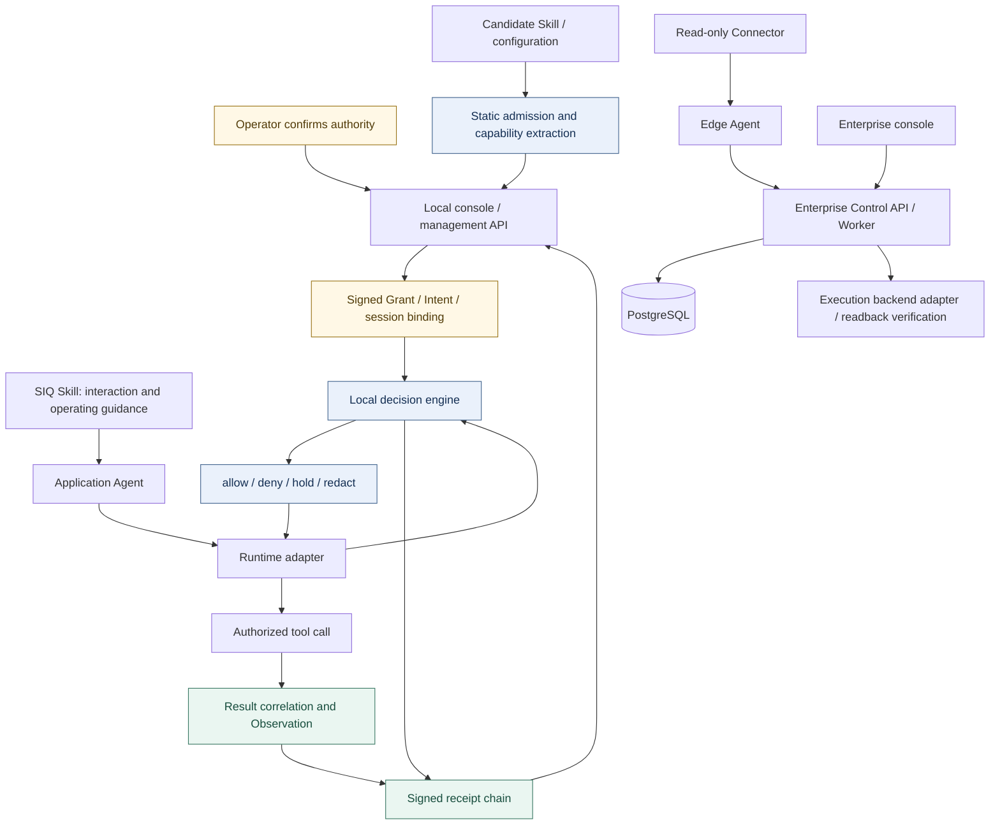
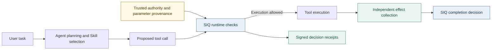

<p align="center">
  
</p>

<h1 align="center">SIQ Agent Security</h1>

<p align="center"><strong>Secure Runtime for Agent Skills</strong></p>

<p align="center">Agent Skills define what agents can do. SIQ defines what they are allowed to do.</p>

<p align="center">
  <a href="https://github.com/maoyadongsh/siq-agent-security/actions/workflows/ci.yml"></a>
  <a href="https://github.com/maoyadongsh/siq-agent-security/actions/workflows/research.yml"></a>
  <a href="LICENSE"></a>
  <a href="https://github.com/maoyadongsh/siq-agent-security/releases/tag/research-v0.1.0-rc.1"></a>
</p>

<p align="center">
  <a href="README.md">简体中文</a> · <strong>English</strong>
</p>

<p align="center">
  <a href="#quick-start">Quick start</a> · <a href="#research-and-evidence">Research evidence</a> · <a href="#components-and-integrations">Integrations</a> · <a href="#contributing-and-next-steps">Contributing</a>
</p>

---

SIQ Agent Security connects user authority, parameter provenance, tool execution and observed effects into an inspectable evidence chain. The Agent plans tasks and selects Skills. The SIQ runtime checks actions against trusted authority and determines task completion from independently collected effect evidence.

The project serves researchers, Agent tool and adapter developers, and platform teams evaluating agent permission controls. The initial demonstration runs on ordinary Linux with deterministic model fixtures, without API keys, a GPU or the enterprise control plane.

## Core value

**Core outcome: Trusted Agent Execution.** Agents plan dynamically; SIQ constrains permissions through trusted intent, checks actions against parameter provenance, and determines completion from observed effects.

| Research focus | Implemented mechanism | Business use |
| :--- | :--- | :--- |
| **Authority independent of the model** | A Go runtime checks Grant / Intent, session bindings and approvals before execution; model proposals cannot expand permissions | Auditable authorization boundaries for automated operations |
| **Same value, different provenance** | Trusted Context and parameter provenance bind to actions; identical recipient values can be allowed or denied based on trusted-database / MCP origin | Constrain recipient substitution and unauthorized delivery induced by tool results |
| **Completion grounded in effects** | Signed receipts associate actions; independent file and controlled-receiver observers distinguish tool success, observed effects and task completion | Evidence for delivery acceptance, fault diagnosis and execution audits |

Potential applications include enterprise Agent permission governance, research/report delivery and tool-platform integration. The local runtime, adapters and optional enterprise control plane provide the current foundation; scale, external SaaS effect verification and commercial returns still require validation in specific deployments. Assess research contributions through the [research questions](docs/research/research-questions.md) and [technical report](docs/research/technical-report.md); no priority or peer-reviewed novelty is claimed.

> [!IMPORTANT]
> **Current release: source prerelease with a Sigstore digital signature**
>
> [research-v0.1.0-rc.1](https://github.com/maoyadongsh/siq-agent-security/releases/tag/research-v0.1.0-rc.1) includes `SOURCE-INFO.json`, `SHA256SUMS` and `SHA256SUMS.sigstore.json`, with no newly compiled binaries or model weights. The signature binds the checksum manifest to this repository's GitHub Actions release workflow identity, covering the source archive and metadata. Verify the signature before checking file hashes: [verification instructions and signature scope](docs/research/release-authentication.md).

<details>
<summary>Release source and version identity</summary>

The released source is fixed at [`aefab111`](https://github.com/maoyadongsh/siq-agent-security/commit/aefab111c7fcad9075c8f429f97c9eab519dcd22); later README and publication-record updates do not change that identity.

A detached signature was added on 2026-09-09 without modifying the original assets. The `official_signature=false` field in `SOURCE-INFO.json` preserves the initial packaging status; see the separate [Sigstore signing and verification record](docs/research/evidence/release-signing-20260909.json).

</details>

## Start here

For distribution through `vercel-labs/skills`, run the [pinned compatibility checks](docs/research/skills-distribution.md) first. File equivalence, binary setup, admission, authorization and runtime protection have separate acceptance criteria.

| Your goal | Entry point | What to expect |
| :--- | :--- | :--- |
| Try the complete flow | [Quick start](#quick-start) | A local demonstration without model keys |
| Reproduce and evaluate | [Reproduction guide](REPRODUCIBILITY.md) · [Research index](docs/research/README.md) | Fixed cases, evaluation protocols and evidence |
| Integrate your Agent | [Components and integrations](#components-and-integrations) | Runtime, adapter and contract entry points |
| Contribute to research | [Contributing](CONTRIBUTING.md) · [Community tasks](docs/research/community-backlog.md) | Clearly scoped starting points |

## What you can verify

Consider a task to analyze a repository, write a report and deliver it to a specified contact. The Agent dynamically selects research, report and delivery Skills. The demonstration exposes four observable outcomes:

| Scenario | Check | Expected result |
| --- | --- | --- |
| Normal delivery | Task authority, trusted contact, file and receiver effects | `verified`: required effects have been verified |
| MCP recipient injection | An untrusted tool result proposes a different recipient | `blocked`: the unauthorized action is stopped |
| Same value, different provenance | Identical recipient values from a trusted database and MCP | Trusted path allowed; MCP path denied |
| False tool success | The tool reports success, but the controlled receiver has no corresponding event | `incomplete`: a required effect is missing |

These demonstrations use explicit model fixtures to drive real SIQ components. They verify specific security paths; they do not measure prompt-injection attack success rates against a real model.

## How it works

### Components and authorization chain

This diagram preserves the complete local runtime and enterprise control-plane relationships. The enterprise control plane is optional; the local demonstration does not depend on that path.



### Task execution and effect verification



- **Before execution**: statically scan Skills and record capability requirements. Constrain actions with Grants, Intent, trusted Context and parameter provenance. Model output cannot create effective permissions.
- **During execution**: check authority at integrated tool entry points and recheck held approvals before execution. Adapters associate actual calls with decisions.
- **After execution**: record signed receipts and collect file or controlled-receiver effect evidence. Tool-reported success, observed effects and task completion are separate records.

Ordinary Observation correlation and independent EffectEvidence establish different things. See the [technical report](docs/research/technical-report.md), [contracts](packages/contracts/README.md) and [security boundaries](#security-boundaries) for architecture and protocol details.

## Quick start

### 1. Run the demonstration without model keys

The validated entry environment is Linux with Git, Go **1.26.6**, Python **3.12+**, and Node.js **22 / npm**. Initial dependency and toolchain installation needs network access. Use a fresh clone: the launcher refuses to overwrite existing demonstration state.

```bash
git clone https://github.com/maoyadongsh/siq-agent-security.git
cd siq-agent-security

bash scripts/hackathon/start.sh --mode test --port 47621
bash scripts/hackathon/healthcheck.sh
bash scripts/hackathon/pair.sh
```

The launcher installs locked Web dependencies and builds the local UI and Go binary. Open **http://127.0.0.1:47621/demo**, enter the one-time pairing code printed in your terminal, and select a scenario from the table above. Keep pairing codes and service state files on your machine.

> [!NOTE]
> Pass `--mode test` explicitly: the launcher's default `demo` mode uses configured real models. To pin the first release, run `git switch --detach research-v0.1.0-rc.1` before starting.

Stop this demonstration instance when finished:

```bash
bash scripts/hackathon/stop.sh
```

Before restarting, archive the instance's previous state as described in the [reproduction guide](REPRODUCIBILITY.md). That guide also covers occupied ports, pairing issues and environment diagnostics.

### 2. Reproduce the fixed benchmark

Install **uv** as well, then run these commands from the repository root. Use fresh state and output directories for every attempt.

```bash
(cd apps/control-api && uv sync --dev --locked)
mkdir -p .tmp/research-bin
GOTOOLCHAIN=go1.26.6 go -C apps/agentshield build \
  -o "$PWD/.tmp/research-bin/siq-agent-security" ./cmd/agentshield

apps/control-api/.venv/bin/python benchmarks/hackathon/run.py \
  --binary .tmp/research-bin/siq-agent-security \
  --state-root .tmp/my-research-controls \
  --out .tmp/my-research-results/controls.json

apps/control-api/.venv/bin/python benchmarks/hackathon/verify.py \
  .tmp/my-research-results/controls.json \
  --out .tmp/my-research-results/verification.json
```

The default cohort contains all **23 fixed control cases**. Check expectation violations and verifier results: `blocked` for an attack or `incomplete` for false tool success can be the correct outcome. Retain failed attempts and review reports against the [evidence export policy](docs/research/data-export-policy.md) before sharing. Do not upload private state directories.

### 3. Optional: use real models

<details>
<summary>Show the StepFun + DGX Spark setup path</summary>

The existing real-model demonstration uses **StepFun `step-3.7-flash` for remote planning** and **Ornith on DGX Spark for local analysis**. This path requires separate model, credential and hardware configuration. Run it separately from the key-free paths and report its results separately.

Start with the [DGX deployment guide](deploy/dgx-spark/README.md), [private model configuration](docs/hackathon/step-plan.md) and [three-track reproduction guide](REPRODUCIBILITY.md). A local failure during confidential analysis must not automatically authorize fallback to a remote model.

</details>

## Research and evidence

These numbers describe specific archived runs, not guarantees for arbitrary environments or future versions.

| Archived observation | Result | Evidence and scope |
| --- | --- | --- |
| Fixed control cases | **23/23** expectations satisfied | [Report and verification summary](docs/research/result-reproduction.md); controlled fixtures run during development |
| Benign task completion | **5/5** | All benign tasks in the same control report |
| Unsafe target materialization | **0/13** | Cases with a registered unsafe target; a different denominator from benign tasks |
| Receipt and effect-envelope verification | **318** receipts, **20** effect envelopes | [Independent verification output](docs/research/evidence/reproduction-b/verification.json) |
| Browser reproduction on ordinary Linux | **9/9** scenarios passed | [Hosted Ubuntu run](docs/research/evidence/reproduction-a/hosted-linux-identity.json); no GPU or model keys |
| Released-source CI | **31** required checks passed | [Release-source record](docs/research/evidence/release-ci.json); source `aefab111` |

Historical StepFun and Ornith benign-task cohorts each retain later **5/5** results, alongside earlier **4/5** failures in the [original benchmark report](docs/hackathon/benchmark-report.md). These small samples do not establish statistical guarantees and must not be pooled with fixed fixtures or later demonstrations. Hosted CI reproduction is not independent reproduction by an external researcher.

Research entry points: [questions](docs/research/research-questions.md) · [dataset card](docs/research/dataset-card.md) · [evaluation protocol](docs/research/evaluation-protocol.md) · [claims and evidence](docs/research/claims-evidence.md). No published paper, DOI or independent artifact certification is currently claimed.

## Components and integrations

| Component | Responsibility | Entry point |
| --- | --- | --- |
| Secure Agent and research Skills | Task planning and dynamic research / report / delivery selection | [Agent guide](apps/secure-agent/README.md), [Skills](skills/) |
| Local Go runtime | Admission, authorization, management API, signed receipts and effect verification | [Local operations](AGENTSHIELD.md), [development specification](docs/agentshield-dev-spec-v1.md) |
| Runtime adapters | Specific tool entry points in Hermes, OpenClaw and CodeBuddy | [Adapters](adapters/runtime/), [capability matrix](docs/agentshield-capability-matrix-v1.md) |
| Enterprise control plane | Multi-tenant inventory, evidence, policy approval and Edge coordination | [Control plane](docs/control-plane.md), [production runbook](docs/enterprise-production-runbook-v1.md) |
| Edge and Connectors | Configuration, directory, framework, process, container and cluster collection | [Edge](edge/agent/), [Connectors](connectors/), [compatibility](docs/compatibility.md) |
| Contracts and benchmarks | Cross-component data contracts, fixed corpus and evidence verification | [Contracts](packages/contracts/), [Agent benchmark](benchmarks/hackathon/README.md), [runtime benchmark](benchmarks/runtime-security/README.md) |

The local demonstration does not require PostgreSQL, enterprise login or the enterprise API. Collection, tool blocking and native validation are tracked separately for each platform. An adapter's existence does not establish protection across all versions or execution paths. Consult the relevant runbook for production prerequisites and unverified scope.

## Security boundaries

- **No same-UID isolation**: desktop mode cannot prevent a malicious process under the same OS user from reading keys or modifying state. The Python ToolGateway is not an OS sandbox.
- **Limited integration coverage**: authorization checks cover correctly integrated execution paths. Source registration and sensitivity classification still depend on trusted operators.
- **Scoped effect evidence**: file and controlled-receiver observations do not prove delivery across arbitrary external SaaS systems. Missing or conflicting evidence cannot be counted as success.
- **Limited experimental claims**: a small fixed corpus and model fixtures do not establish universal prompt-injection protection, full semantic provenance or production security certification. Cross-compilation is not native validation on every platform.

See the [threat model](docs/threat-model.md), [capability matrix](docs/agentshield-capability-matrix-v1.md) and [dataset card](docs/research/dataset-card.md). Report unpatched vulnerabilities through the private channel in [SECURITY.md](SECURITY.md).

## Contributing and next steps

Contributions are welcome for ordinary Linux reproduction, same-value provenance explanations, fixture diagnostics, metric corrections and negative cases with documented origins. Read [CONTRIBUTING.md](CONTRIBUTING.md), then choose a [starter task](docs/research/community-backlog.md), [Issue](https://github.com/maoyadongsh/siq-agent-security/issues) or [Discussion](https://github.com/maoyadongsh/siq-agent-security/discussions).

Next priorities are long-term archival and a DOI, independent external reproduction, new experiments with protocols defined in advance, and paper/artifact review. A new binary research release still needs separate distribution and native acceptance checks. Actual progress is recorded in the [operations report](docs/research/operations-20260908.md) and [task ledger](docs/open-source-research-tasks-20260908.md). Contributions follow the [DCO](DCO) and [governance rules](GOVERNANCE.md); community participation follows the [code of conduct](CODE_OF_CONDUCT.md).

## Licensing, citation and historical material

Project-owned software uses **[Apache-2.0](LICENSE)**. Explicitly listed original research documents use **[CC BY 4.0](LICENSES/README.md)**. Third-party code, patches and fonts retain their own licenses; see the [scope mapping](LICENSES/scope.json) and [third-party notices](THIRD_PARTY_NOTICES.md). Model weights and external API services are outside the project license grant.

Use **[CITATION.cff](CITATION.cff)** to cite the software, and record the version, commit and corpus digest actually used. The [citation guide](docs/research/citation-guide.md) explains source and research-material references.

| Community and governance | Research and archives |
| :--- | :--- |
| [Contributing](CONTRIBUTING.md) · [DCO](DCO) | [Citation guide](docs/research/citation-guide.md) · [CITATION.cff](CITATION.cff) |
| [Governance](GOVERNANCE.md) · [Code of conduct](CODE_OF_CONDUCT.md) | [Technical report](docs/research/technical-report.md) · [Reproduction](REPRODUCIBILITY.md) |
| [Private security reports](SECURITY.md) · [Third-party notices](THIRD_PARTY_NOTICES.md) | [Competition demo](HACKATHON.md) · [V5 frozen snapshot](docs/hackathon/final-submission-state.md) |
| [Development conventions](AGENTS.md) · [Continuous integration](https://github.com/maoyadongsh/siq-agent-security/actions) | [Operations report](docs/research/operations-20260908.md) · [Task ledger](docs/open-source-research-tasks-20260908.md) |

The competition snapshot retains its original source, artifacts, video and experimental denominators. Research releases and subsequent documentation updates carry their own identity records.
