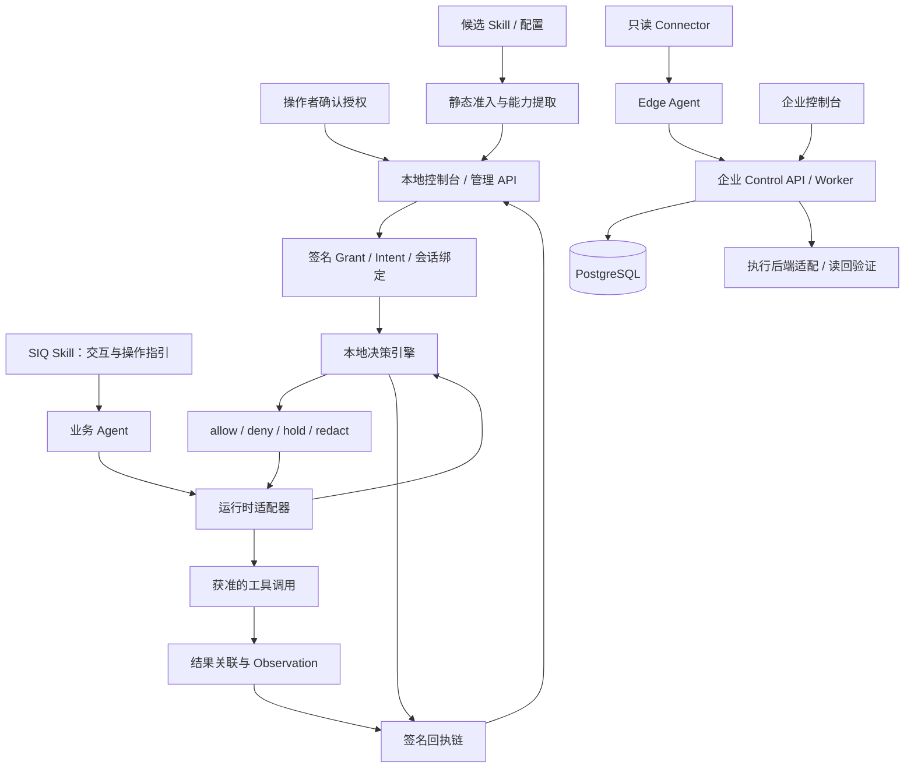

# SIQ Agent Security

**面向本地与企业智能体的任务授权、运行时门禁与可验证审计。**

SIQ Agent Security 将“谁授权、允许访问什么、可以产生哪些效果、实际发生了什么”连接成一条可检查的安全链。它以可安装的 Skill 作为交互入口，以本地 Go 程序执行确定性的授权判断，通过运行时适配器接入工具调用，并以签名回执记录决策与结果关联。企业控制面进一步提供多环境资产盘点、证据管理、策略审批和执行协调。

项目面向使用 Hermes、OpenClaw、WorkBuddy / CodeBuddy 等智能体的开发者、平台团队与安全团队，也面向在 NVIDIA DGX Spark 等设备上部署私有 AI 工作流的组织。

[快速开始](#快速开始) · [核心能力](#核心能力) · [技术前沿与项目创新](#技术前沿与项目创新) · [商业价值](#商业价值与应用场景) · [安全边界](#安全边界与当前限制) · [开发与验证](#开发与验证)

[产品介绍](https://maoyadongsh.github.io/siq-agent-security/) · [架构全景](https://maoyadongsh.github.io/siq-agent-security/architecture.html) · [CI](https://github.com/maoyadongsh/siq-agent-security/actions/workflows/ci.yml) · [发布版本](https://github.com/maoyadongsh/siq-agent-security/releases)

> **开发状态，2026-09-08：** 当前 checkout 的 `codex/provenance-bound-effect-v1` 分支在 Trusted Intent V2 基础上加入了跨模式授权硬门禁、实验性参数来源图与 Intent V3、实验性效果证据及完成判定。21 对组件基准、文件强杀恢复和八阶段性能微基准已有本地证据；分支已推送并创建[草稿 PR #4](https://github.com/maoyadongsh/siq-agent-security/pull/4)，`54f5d32` 的远端检查30项成功、nightly按触发条件跳过；尚未合并到 `main` 或发布正式 Release，后续提交须重新验证。平台自动集成、完整证据重放与最终验收仍在进行中，支持矩阵没有因此升级为 `supported`。详见[开发台账](./docs/provenance-bound-effect-v1-progress.md)和[能力矩阵](./docs/agentshield-capability-matrix-v1.md)。

## 为什么需要 SIQ Agent Security

智能体可以安装 Skill、读取文件、调用 MCP 服务、运行命令和向外部系统提交数据。它的风险随行动能力扩大：一段来自网页、文档或工具结果的恶意指令，可能把一个正常任务转变成越权操作。

传统应用可以围绕固定接口进行授权；智能体会在执行过程中组合工具、构造参数和选择资源。因此，安全检查需要覆盖三个不同问题：

| 检查层次 | 需要回答的问题 | SIQ 的处理方式 |
| --- | --- | --- |
| 能力进入工作流之前 | 这个 Skill 包含什么代码、指令和权限需求？ | 静态准入扫描、内容摘要、能力声明与 Skill Card |
| 每次行动之前 | 当前主体在这个任务中，是否有权对这个资源执行此操作？ | Grant、签名 Intent、工具效果与参数约束的联合检查 |
| 行动及变更之后 | 哪项授权导致了决策？结果属于哪个动作？记录是否完整？ | 动作标识、Decision / Observation 关联、签名回执与企业审计 |

例如，用户只授权助手读取客户 A 的资料并生成本地报告。即使助手拥有文件工具，也不应因此读取客户 B 的资料；即使拥有网络工具，也不应因此把报告发往任意地址。SIQ 将这些约束表示为可执行的数据合同，并在已经接入的工具入口检查。

项目遵循一项核心原则：**模型可以提出操作和解释结果；授权依据来自受信管理流程，最终权限判断由程序执行。** 当前桌面部署的操作系统边界及例外见[安全边界](#安全边界与当前限制)。

## 产品形态与系统架构

同一仓库提供两种运行方式，复用 JSON Schema、证据语义与检测规则，但各自拥有独立运行入口。

| 维度 | 本地模式 | 企业控制面 |
| --- | --- | --- |
| 使用对象 | 单台开发机、个人助手、本地 AI 主机 | 多团队、多环境的智能体治理 |
| 主要能力 | Skill 准入、Grant、Intent V2、工具决策、签名回执 | 资产与证据台账、权限分析、策略审批、Edge 任务与执行协调 |
| 运行组件 | `siq-agent-security serve`，Go 单文件内嵌控制台 | React 控制台、FastAPI、Worker、PostgreSQL、Edge / Connector |
| 身份入口 | 一次性配对建立本地管理会话 | 生产使用 OIDC / JWKS 与租户权限检查 |
| 数据存储 | 本机状态目录、签名记录与恢复标记 | PostgreSQL，使用 Alembic 管理迁移 |
| 前端代码 | `apps/web/src/local/` | `apps/web/src/` 中的企业入口 |
| 本地开发服务 | `127.0.0.1:47611` | API `127.0.0.1:8600`，前端由 Vite 提供 |

**安装 Skill 后对应的是本地控制台。** `apps/web` 是一个前端工程，包含本地和企业两套应用入口；产品介绍站用于展示项目。运行本地模式无需启动企业 API、PostgreSQL 或企业登录服务。



本地链路依赖平台工具钩子执行决策；Observation 当前记录的是适配器上报结果。企业链路与本地链路共享合同，现有本地 `sync` 主要上传盘点证据，尚未形成企业签发 Intent 到本地执行的完整分发链。

## 核心能力

### 1. 资产发现与 Skill 准入

盘点平台配置、Agent、Skill 与 MCP 配置引用。企业 Edge 通过 11 个 Connector 覆盖 Hermes、OpenClaw、Directory、Dify、PiAgent、WorkBuddy、MCP、Docker、Process、systemd 与 Kubernetes；采集能力和运行时阻断能力分别登记。

准入过程静态读取候选内容，不执行脚本、不导入被扫描模块。扫描范围、文件数量、体积、深度和特殊文件受到限制，输出三类结论：

| 结论 | 含义 | 后续处理 |
| --- | --- | --- |
| `quarantine` | 命中隐藏指令、欺骗、凭据外传或完整性失败等隔离条件 | 停止安装；CLI 退出码为 `3` |
| `admit_with_conditions` | 存在工具、出网、文件写入等需要授权的能力声明 | 审阅权限，起草 Grant |
| `admit` | 当前规则与输入范围内未触发上述条件 | 仍需遵守后续授权与运行时检查 |

`allowed-tools`、网络访问和软件安装属于需要治理的能力需求，不单凭它们认定 Skill 恶意。扫描结论带有规则及证据，可以回溯到具体发现；通过扫描不代表对未知攻击免疫。

### 2. 最小权限与人工管理流程

Grant 将能力需求转化为可审阅的权限范围，支持起草、批准、部署、拒绝和撤销。批准挑战绑定待批准内容与版本，并使用一次性 nonce；过期、重复或对象已变化的挑战不能继续批准。

本地管理会话和适配器决策 token 分权：决策客户端不能调用 Intent 签发、批准等管理接口。服务持有单写者锁，运行期间的 Grant 修改通过控制台或管理 API 完成；离线 CLI 不与服务竞争写入状态。

权限事实保留五种语义：`declared` 声明、`inferred` 推断、`observed` 观察、`effective` 后端读回确认、`unknown` 未知。每种状态都有证据要求，策略已下发本身不会提升为 `effective`。

### 3. Trusted Intent V2：任务级授权

Grant 描述已授予的能力，Intent 进一步约束这些能力在**当前任务**中的使用范围。V2 包含主体、Agent、任务、工具、效果、资源、参数、有效期与发行信息，由管理端校验后签名，并绑定到确定的平台、Agent 和会话。

在 `block` 模式下，对于绑定 V2 的会话，授权判断可以概括为：

```text
允许执行 = Grant 允许
        ∩ Intent 签名、身份、绑定与时效有效
        ∩ 工具、效果、资源、参数满足约束
        ∩ 运行时安全状态允许
```

实现支持：

- **可信授权解析：** 从本地不可变签名 Store 读取 Intent；拒绝以请求内嵌 Intent 创建授权，客户端主体与任务提示仅用于一致性检查。
- **工具与效果分离：** 区分工具名称和 `file.read`、`file.write`、`network.request` 等效果；Shell 带有 `unknown` 效果，绑定 V2 时采取保守拒绝策略。
- **结构化资源约束：** 对文件路径、网络 host / IP 和消息收件人进行规范化与匹配，识别相邻目录前缀混淆和多个参数别名。
- **参数约束：** 使用 JSON Pointer 定位嵌套字段及数组元素，支持 `equals`、`one_of`、`prefix`、`suffix`、`regex` 等操作；资源域另有对应约束。
- **固定绑定与防降级：** 已绑定会话不能通过省略字段、替换任务提示或重启服务退回未绑定授权路径。

`purpose` 是任务说明文本，不由在线模型解释为额外权限。V2 当前通过管理 API 使用，完整的可视化任务授权流程仍待完善。默认配置及 `warn` / `audit_only` 的实际语义见[任务授权使用说明](#使用-trusted-intent-v2)。

### 4. 运行时决策、动作关联与恢复

适配器将工具调用映射为统一动作信封。引擎综合授权、敏感信息、会话污点和风险组合，返回 `allow`、`deny`、`hold` 或 `redact`。平台对等待审批和参数改写的支持程度决定最终映射方式。

每个动作由服务端分配 `action_id`、`task_seq` 和 `parent_action_id`。结果上报必须关联合法的前置 Decision，并匹配平台、会话、Agent、工具及调用标识。同一结果重复上报复用已有回执；冲突结果被拒绝；拒绝决策和未经本地批准的 hold 不能产生获准执行的 Observation。

签名链在重启时用于恢复绑定、动作关联和相关运行状态。已有并发、重复上报、任务边界和进程强杀恢复测试；动作窗口有界，不能通过清空安全状态来把旧会话伪装成干净会话。

### 5. 企业资产治理与执行协调

企业控制面提供候选资产确认、证据回链、权限事实、风险处置、策略变更审批、部署与回滚状态，以及 Edge 注册、心跳、任务租约和回执处理。

关键实现包括租户身份派生、对象级权限检查、职责分离、业务变化与审计 / Outbox 同事务、Edge 凭据在线吊销校验、签名任务与证据协议。生产配置要求 PostgreSQL 和外部身份验证，开发身份头与 SQLite 仅用于显式开发模式。

详见[企业控制面](./docs/control-plane.md)、[合同目录](./packages/contracts/README.md)与[生产运行手册](./docs/enterprise-production-runbook-v1.md)。实际客户环境的身份接入、网络入口和执行验证需要单独验收。

## 技术前沿与项目创新

项目的技术主线是将智能体的动态行动约束转化为**可执行授权合同、可恢复状态和可检查证据**。以下是当前实现的工程特点与后续研究方向，不构成“全球首创”或论文效果复现声明。

### 从工具允许列表推进到任务和参数授权

同一个工具可以用于完全不同的业务目的。SIQ 在工具权限之上增加签名任务合同，把主体、资源、参数和效果共同纳入决策，使“允许使用文件工具”能够进一步收敛为“本次只允许读取指定目录”。授权验证不依赖在线模型再次判断自然语言意图。

### 将授权来源与调用方输入分开

在提示注入场景中，调用参数、工具描述和模型解释都可能受到污染。SIQ 的管理 API 与决策 API 分权，Intent 通过不可变签名 Store 解析；模型自报的主体或来源引用不会因此成为授权依据。

这一设计与 MCP 对工具元数据的信任边界相容：MCP 规范要求谨慎对待来自不可信服务器的工具 annotations。[MCP Tools 规范](https://modelcontextprotocol.io/specification/2025-06-18/server/tools)。本项目当前已实现 MCP 配置发现，完整 MCP 协议中介仍在规划中。

### 将动作身份、结果关联与故障恢复一并设计

只保存一条工具日志无法解决重复回调、迟到结果、重启和跨任务混淆。SIQ 将动作身份与授权摘要纳入签名链，结合幂等结果关联和恢复逻辑，使审计记录能够回答“这份结果属于哪次获准动作”。签名验证覆盖记录完整性；业务效果是否真实发生需要额外证据。

### 通过证据描述权限的实际状态

权限声明、管理批准、策略部署、后端读回与实际执行验证是不同事实。SIQ 通过五态权限和能力矩阵将这些差别呈现给操作者，避免用一个“已启用”状态掩盖接入范围及验证缺口。

### 与 Skill 供应链治理及沙箱形成互补

NVIDIA Verified Skills 提供扫描、评测、签名和 Skill Card，覆盖能力发布与进入工作流的治理。[NVIDIA 官方说明](https://docs.nvidia.com/skills)。SIQ 保留安装前准入，并进一步连接用户授权、运行时动作和本地回执。

OpenShell 可作为执行隔离与策略后端；SIQ 通过适配器协调能力探测、策略操作和读回。其官方策略区分静态与动态配置，接入时仍需按本仓实际版本和探针结果验证。[OpenShell 策略文档](https://docs.nvidia.com/openshell/sandboxes/policies)。

### 实验性参数来源与效果验证

参数值相同不代表授权相同。Intent V3 可以要求某个高影响参数来自已注册的可信签发者：相同路径由 USER 签发时可通过，由 MCP/untrusted 提供时可被拒绝。来源图绑定任务、会话、Agent、内容摘要和期限；普通转换不提升信任，混合聚合保留最低父信任。当前验证覆盖显式来源关系，不追踪模型内部因果链。

EffectEvidence 将工具自报结果与独立采样材料分开。文件 observer 提供 `host_independent/partial` 证据；受控网络 oracle 验证实际接收端点。Completion 根据签名要求、材料及历史授权输出 `verified`、`incomplete`、`conflicting` 或 `unknown`。这些是实验性组件能力，不能等同任意平台的 OS 隔离或通用业务正确性证明。具体控制与残余风险见[威胁模型 T27–T35](./docs/threat-model.md)。

## 技术难点与工程取舍

| 难点 | 当前处理方式 | 仍需注意的边界 |
| --- | --- | --- |
| 不可信输入进入授权链 | 管理 / 决策接口分权；不可变签名 Intent；固定会话绑定 | 同 UID 进程仍可能接触本地状态；受管 Linux 隔离待实现 |
| 参数解释不一致导致越权 | 路径与 host 规范化、JSON Pointer、精确 JSON 数值比较、共享匹配语料 | 路径词法匹配无法证明文件系统对象及符号链接的实际目标 |
| 工具名称掩盖副作用 | Tool / Effect 分离；未知效果保守拒绝 | 任意 Shell 的全部效果无法仅由命令字符串完整推导 |
| 状态安全与性能同时满足 | 确定性绑定 ID 直接定位目标，每次读取仍验签；动作关联缓存有界 | 微基准之外仍需整体 HTTP、落盘和长期运行负载验证 |
| 崩溃中断多文件写入 | 单写者、版本比较、提交恢复标记和幂等重放 | 已覆盖的故障模型不等于任意文件系统损坏下均可自动恢复 |
| 平台钩子差异 | 薄适配器统一 pre/post、调用 ID 和断连行为；按能力登记状态 | 框架安装入口、审批、参数改写与后置钩子覆盖不同 |
| 跨语言签名和合同演进 | 版本化 Schema、固定摘要 / Ed25519 向量、历史回执兼容测试 | Python 合同验证不等于另一个完整 V2 授权引擎 |
| 采集有用证据又避免泄密 | 摘要、引用、脱敏与长度预算；导出投影单独签名 | 普通哈希不提供加密机密性，低熵值仍需限制访问 |

本地裁决核心只依赖 Go 标准库，便于单文件构建和离线分发；前端在构建时嵌入，运行裁决不依赖 Python 服务。企业 API 使用 Python / FastAPI，前端使用 React / TypeScript / Vite，各组件通过显式合同协作。

## 商业价值与应用场景

SIQ 的价值在于帮助组织把智能体从个人试用推进到可管理的业务试点：建立资产归属、限制权限范围、保留审查依据，并降低框架接入和事故排查的重复工作。

| 用户与场景 | 实际问题 | 可交付价值 | 适合在试点中衡量的指标 |
| --- | --- | --- | --- |
| 开发者与小团队 | Skill 来源不明、授权粗放、工具调用难追溯 | 本地准入、权限审阅与工具回执 | 安装成功率、误阻断率、排查耗时 |
| 企业 AI 平台团队 | Agent 分散在框架、主机与容器中 | 多 Connector 资产发现与统一证据台账 | 资产覆盖率、未知权限比例、重复接入工作量 |
| 安全与审计团队 | 权限变更和执行记录缺少关联 | 审批、部署、回执与证据回链 | 证据完整率、审计准备耗时、漂移处置时长 |
| 私有部署与本地 AI 客户 | 业务资料与模型运行在客户环境 | 本地决策及存储，按需上传脱敏盘点证据 | 数据外传范围、任务完成率、额外运行延迟 |
| 智能体应用与集成服务商 | 每个客户重复建设授权和审计功能 | 可复用合同、适配器和执行协调组件 | 新框架接入周期、场景复用率、交付维护成本 |

可探索的商业交付路径是：**单机开发者工具 → 受控企业 PoC → 多环境治理与持续运维服务**。本地部署降低首次验证门槛，企业控制面承接组织级审批与运营；客户可以保留原有模型、身份系统和业务平台。

这些是商业价值假设与验证方向。仓库没有据此宣称已获得客户收入、确定的成本节省比例或第三方安全认证。正式交付范围应由实际支持矩阵、部署环境和验收指标确定。

## 快速开始

### 环境要求

| 依赖 | 用途 |
| --- | --- |
| Git、Go 1.22+（兼容下限）；安全构建使用已验证的 Go 1.26.6 | 获取源码并构建本地程序 |
| Node.js 22、npm | 从当前前端源码构建完整本地控制台；使用完整发布二进制时无需 Node |
| Python 3、OpenSSL 3 | Skill 安装脚本校验清单签名、内容哈希及二进制 |
| 支持工具钩子的 Agent 平台 | 运行时接入；只体验控制台和静态扫描时可以暂不安装 |

以下命令适用于 Linux / macOS 的 POSIX Shell，建议先在独立状态目录试用。Windows 有独立 PowerShell 安装脚本，运行时支持范围见[平台矩阵](#平台适配与-dgx-spark-验证)。

### 1. 构建当前 main 和本地前端

```bash
git clone https://github.com/maoyadongsh/siq-agent-security.git
cd siq-agent-security
git switch main
export SIQ_REPO_ROOT="$(pwd)"

npm --prefix apps/web ci
npm --prefix apps/web run build:local

go -C apps/agentshield build -trimpath -ldflags "-s -w" \
  -o siq-agent-security ./cmd/agentshield

export SIQ_AGENT_SECURITY_BIN="$SIQ_REPO_ROOT/apps/agentshield/siq-agent-security"
"$SIQ_AGENT_SECURITY_BIN" version
```

`build:local` 将静态资源写入 Go 的 embed 目录，因此应在 Go 构建之前运行。源码构建默认版本为 `0.0.0-dev`，避免把新代码误标为旧 Release。企业前端由 `npm run build` 单独构建到 `apps/web/dist`。

### 2. 启动本地控制台

```bash
export SIQ_AGENT_SECURITY_STATE_DIR="$HOME/.local/state/siq-agent-security-demo"
"$SIQ_AGENT_SECURITY_BIN" serve --port 47611 --mode block
```

打开 **http://127.0.0.1:47611**，在页面输入终端显示的管理配对码。配对码五分钟内单次有效，管理凭据保存在浏览器内存中；刷新后需要重新建立管理会话时，重启 `serve` 获取新码。

状态目录包含签名密钥、适配器 token 和审计历史。后续命令及平台进程必须使用同一状态目录；不要把配对码、token、私钥或整个状态目录放进聊天、录屏和代码仓库。

本地页面包括概览、智能体资产、权限、风险、Grant、回执、运行绑定和设置。启动服务与打开页面只建立管理入口；完成适配器接入后，平台工具调用才会经过门禁。

### 3. 安装 Skill 与运行时适配器

另开终端，进入仓库根目录并设置与服务一致的环境变量。以下以 Hermes 为例：

```bash
export SIQ_REPO_ROOT="$(pwd)"
export SIQ_AGENT_SECURITY_BIN="$SIQ_REPO_ROOT/apps/agentshield/siq-agent-security"
export SIQ_AGENT_SECURITY_STATE_DIR="$HOME/.local/state/siq-agent-security-demo"
export SIQ_AGENT_SECURITY_STAGE_DIR="$HOME/.cache/siq-agent-security-stage"

mkdir -p "$HOME/.hermes/skills"
# 若目标已经存在，先核对已有安装，再决定更新方式。
ln -s "$SIQ_REPO_ROOT/skills/siq-agent-security" \
  "$HOME/.hermes/skills/siq-agent-security"

skills/siq-agent-security/scripts/bootstrap.sh
skills/siq-agent-security/scripts/adapter.sh hermes
"$SIQ_AGENT_SECURITY_BIN" adapter status hermes
```

安装会写入所选平台的适配器与配置，并保留可卸载的备份。重启或重新加载平台，使 Skill 和钩子生效；如采用独立状态目录，也要将该环境变量传给启动 Agent 的进程。不同平台的接入方法见下表，实际工具事件仍需通过一次端到端调用验证。

| 平台 | Skill 目录 | 适配器与接入说明 |
| --- | --- | --- |
| Hermes | `~/.hermes/skills/siq-agent-security` | [插件与安装包装](./adapters/runtime/hermes-agentshield/README.md)，平台名 `hermes` |
| OpenClaw | `~/.openclaw/skills/siq-agent-security` 或其支持的共享 Skill 目录 | [安装策略与运行时插件](./adapters/runtime/openclaw-agentshield/README.md)，平台名 `openclaw` |
| WorkBuddy / CodeBuddy | `~/.codebuddy/skills/siq-agent-security` | [CodeBuddy 工具钩子](./adapters/runtime/codebuddy-agentshield/README.md)，平台名 `codebuddy`；客户端需重启 |
| Trae | `~/.trae/skills/siq-agent-security` | 当前仅审计，不能阻断运行中的工具 |

随后可在 Agent 中请求：“盘点本机 Skill”“审查这个候选目录”“解释这条回执”。Skill 引导模型调用程序并呈现结果；权限批准由操作者完成。

**安装与版本校验：** 脚本先验证签名清单和 Skill 内容，再校验并暂存二进制。默认允许本地构建产物与 Release 哈希不同，并给出告警；设置 `SIQ_AGENT_SECURITY_REQUIRE_PINNED=1` 可要求匹配清单制品。此模式不适用于任意源码构建产物。

当前 Shell / PowerShell 引导脚本已实现显式下载路径：找不到本地二进制且设置 `SIQ_AGENT_SECURITY_ALLOW_DOWNLOAD=1` 时，才从签名清单中的 URL 获取并验证制品。默认不下载；清单目前指向 v0.2.0，下载该版本不会获得当前 main 的 V2 增量。下载实现、发布兼容性与实机支持分别验收。

### 4. 审查一个候选 Skill

在上述第二个终端中运行仓库的合成夹具：

```bash
"$SIQ_AGENT_SECURITY_BIN" admit \
  "$SIQ_REPO_ROOT/skills/siq-agent-security/evals/fixtures/toxic-finreport-enhancer"
# 预期：quarantine，退出码 3；这是测试中的预期阻断。

"$SIQ_AGENT_SECURITY_BIN" admit \
  "$SIQ_REPO_ROOT/skills/siq-agent-security/evals/fixtures/official-like"
# 预期：admit_with_conditions；该目录是合成夹具，并非官方认证 Skill。
```

真实使用时，应在复制候选 Skill 到平台加载目录**之前**审查。WorkBuddy / CodeBuddy 当前没有通用安装前阻断入口；其运行时钩子不能替代这一步。

在控制台刷新资产与准入结果，检查能力范围，起草 Grant，由操作者批准并部署。之后通过真实平台发起获准与越权调用，在回执页核对结果。

服务运行时，Grant 变更使用控制台或管理 API。离线 CLI 需要先停止同一状态目录下的 `serve`，再由操作者执行；以下占位值应替换为实际输出：

```bash
"$SIQ_AGENT_SECURITY_BIN" grant '<admission_id>' --platform hermes --subject '<agent_id>'
"$SIQ_AGENT_SECURITY_BIN" grant challenge '<grant_id>'
"$SIQ_AGENT_SECURITY_BIN" grant approve '<grant_id>' \
  --approve-as '<operator_id>' --challenge-id '<challenge_id>' --nonce '<nonce>'
"$SIQ_AGENT_SECURITY_BIN" grant deploy '<grant_id>'
```

完成后重新启动服务。`--approve-as` 和挑战机制记录审批操作并防止对象混淆，不能单独证明操作者一定是真实人类。

### 5. 核验、导出与卸载

```bash
"$SIQ_AGENT_SECURITY_BIN" verify
"$SIQ_AGENT_SECURITY_BIN" export --out ./siq-agent-security-export.json
"$SIQ_AGENT_SECURITY_BIN" incomplete
```

`verify` 检查回执哈希链和签名，发现断链时退出码为 `4`。脱敏导出不携带 token 或私钥，其派生签名证明导出投影自身的完整性，不冒充原始回执签名。

`incomplete` 查看未完成的多文件提交。恢复操作为 `incomplete --recover`，必须在能够取得排他写锁时执行，通常需要先停止 `serve`。

卸载所选平台适配器可运行 `"$SIQ_AGENT_SECURITY_BIN" adapter uninstall hermes`，再移除自己创建的 Skill 链接。保留状态目录以便继续核验历史记录。

## 使用 Trusted Intent V2

默认 `intent_enforcement=optional`：未绑定会话沿用 Grant 授权，新回执显式记录 `unbound`。需要每个会话都绑定 Intent 时，在停止服务后，将现有 `<state>/config.json` 中的对应设置合并为：

```json
{
  "intent_enforcement": "required",
  "enforcement_mode": "block"
}
```

保留其他已有配置，再重新启动服务。**在当前开发分支中，无效的必需 Authority 在 `block`、`warn`、`audit_only` 下均硬拒绝。** `required` 缺绑定、撤销、来源无效等不能由 advisory 放宽；普通策略的建议模式保持兼容。`optional` 只允许从未绑定的旧会话沿用 Grant，已绑定会话不能通过删除或撤销绑定降级。

V2 管理入口如下：

| API | 用途 | 身份要求 |
| --- | --- | --- |
| `POST /v1/intents` | 校验并签发不可变 V2/V3 Intent | 配对产生的管理会话 |
| `GET /v1/intents`、`GET /v1/intents/{id}` | 查询授权合同 | 管理会话 |
| `POST /v1/intent-bindings` | 将 Intent 固定绑定到平台、Agent 和会话 | 管理会话 |
| `GET /v1/intent-bindings`、`GET /v1/intent-bindings/{id}` | 查询绑定 | 管理会话 |
| `POST /v1/intent-bindings/{id}/revoke` | 终态撤销一条绑定，保留历史记录 | 管理会话 |
| `POST /v1/intents/{id}/revoke` | 全局撤销 Intent，影响全部关联会话及新绑定 | 管理会话 |
| `POST /v1/decide`、`POST /v1/observe` | 提交动作与关联结果 | 适配器决策凭据 |

绑定请求示意：

```json
{
  "platform": "hermes",
  "session_id": "actual-session-id",
  "agent_id": "actual-agent-id",
  "intent_id": "issued-intent-id"
}
```

先签发 Intent，再使用实际平台身份建立绑定。`intent_id` 来自签发响应，其他字段必须与适配器实际事件一致；签名和摘要由服务端生成。决策 token 不能调用以上管理接口，也不能通过把 Intent 填入工具参数完成授权。

完整字段见 [V2 Schema](./packages/contracts/intent-contract.v2.schema.json)、[合同样例](./apps/agentshield/testdata/contracts/intent-contract.v2.sample.json)和[工程报告](./docs/trusted-intent-v2-report-20260907-161622.md)。测试样例中的 ID、时间和签名用于合同验证，实际使用需按任务重新签发。当前没有专用 Intent CLI 子命令，也没有 Intent 解绑、覆盖或原会话换任务接口。

### 体验实验性 V3 与效果证据

新任务可按[V3 合同](./packages/contracts/intent-contract.v3.schema.json)签发参数来源约束，旧 V2 合同仍可读取。管理端注册可信 issuer；普通 decision 凭据只能上报 MCP/WEB/TOOL/AGENT/UNKNOWN 的低可信内容，不能签发 USER/IAM 权威。显式派生必须经过选择接口，不能把原结果的引用直接挪给已变化的参数。接口及样例见[Provenance API](./docs/provenance-api-v1.md)。

效果采样使用管理员签发、固定来源与范围的独立 observer 凭据，decision token 不能替代。文件 begin 保存原快照，finish 归档材料；跨重启由管理员显式接管，保持原期限并检查所有历史身份的撤销状态。`GET /v1/tasks/{task_id}/completion` 提供完成判定，工具返回 `success` 不会自动成为 verified。

开发者可在隔离临时目录中复现组件流程：

```bash
python3 benchmarks/runtime-security/run.py --out /tmp/siq-runtime.json
apps/control-api/.venv/bin/python benchmarks/runtime-security/evidence.py /tmp/siq-runtime.json
python3 benchmarks/runtime-security/recovery_fixture.py --out /tmp/siq-recovery.json
python3 benchmarks/runtime-security/performance.py --out /tmp/siq-performance.json
```

需要本地 Go 和已安装开发依赖的 Control API 虚拟环境。报告中的 D0–D5 分别注明实际证据与未评估值；无独立材料的样本不进入 D5 成功/失败分母。性能报告是暖态组件微基准，不是生产 SLA。完整复现说明见[基准文档](./benchmarks/runtime-security/README.md)。Hermes 已有配置化 MCP 结果上报和显式引用桥接，但原生 MCP 注册/调度器的完整集成仍待验收；未知工具继续保留 unknown 效果限制。

## 企业控制面启动

企业形态在本地模式之外独立启动。以下仅用于隔离的开发环境，需要 Python 3.12+、uv、Node.js 22 和 npm。

```bash
# 终端 A：从仓库根目录进入 API 工程
cd apps/control-api
uv sync --dev --locked
SIQ_AS_DEV=1 SIQ_AS_ALLOW_SQLITE=1 SIQ_AS_BOOTSTRAP_TENANT_ID=dev-tenant \
  uv run uvicorn app.main:app --host 127.0.0.1 --port 8600
```

```bash
# 终端 B：从仓库根目录进入前端工程
cd apps/web
npm ci
VITE_DEV_MODE=true VITE_DEV_TENANT_ID=dev-tenant npm run dev -- --host 127.0.0.1
```

浏览器访问 Vite 输出的地址。需要处理后台任务时，在 API 工程另起 Worker，并使用同一组开发配置：

```bash
SIQ_AS_DEV=1 SIQ_AS_ALLOW_SQLITE=1 SIQ_AS_BOOTSTRAP_TENANT_ID=dev-tenant \
  uv run python -m app.worker --once
```

`--once` 处理一轮任务；持续运行时去掉该参数。开发身份头仅用于此模式。生产需要 PostgreSQL、迁移、OIDC issuer / audience / JWKS、签名密钥注入及受控网络入口，不能把上述开发启动方式直接作为生产部署。

PostgreSQL 开发 Compose、Edge 注册及执行后端配置见[企业控制面文档](./docs/control-plane.md)和[部署目录](./deploy/compose/)。本仓不直接导入其他 SIQ 仓库内部代码，也不查询其数据库；跨系统接入通过版本化 API 或事件合同完成。

## 平台适配与 DGX Spark 验证

### 平台能力按接入点和证据登记

| 平台 / 后端 | 当前接入方式 | 已有证据与边界 |
| --- | --- | --- |
| Hermes | 安装包装、pre/post 工具插件 | 2026-09-05 Spark 本机插件 L0–L2 记录；最新 V2 全链路仍待实机验收 |
| OpenClaw | 安装策略 `policy-exec`、运行时插件 | 隔离 HOME 下安装策略与调用合同记录；未因此宣称接管日常网关 |
| WorkBuddy / CodeBuddy | PreToolUse / PostToolUse 钩子 | Linux 隔离 HOME 的真实 hook 记录；未完成 GUI 客户端完整 V2 验收 |
| Trae | Skill 操作指引与审计 | 当前无法进行工具阻断 |
| Claude Code / Codex | 矩阵中保留实验性 L0 条目 | 本轮没有运行时阻断支持声明 |
| OpenShell | CLI 能力探测、网络策略操作与读回 | 本地适配器最高为 `readback_verified`；实际强制效果仍待验证 |

L0 表示盘点 / 审计，L1 表示安装门禁，L2 表示运行时决策 / 回执，L3 表示 OpenShell 网络策略接入。某平台存在高档位设计，不代表该档位已实机验收；`readback_verified` 也不等于 `enforcement_verified`。

正式声明以[签名 manifest](./skills/siq-agent-security/skill-manifest.json)、[能力矩阵](./docs/agentshield-capability-matrix-v1.md)与[兼容文档](./docs/compatibility.md)共同约束。交叉编译覆盖 Linux amd64 / arm64、macOS arm64 和 Windows amd64；编译结果不替代各系统上的运行与安全测试。

### DGX Spark 的实际角色

仓库归档了 2026-09-05 在 NVIDIA DGX Spark、NVIDIA GB10、Ubuntu 24.04、linux/arm64 环境下的安装、准入、授权、钩子与回执验证。v0.2.0 的 ARM 制品约 13.8 MB，大小是历史发布数据，当前源码构建以实际产物为准。

Spark 可以承担业务模型的本地推理和 Agent 工作流，SIQ 在同机完成授权检查与审计。安全裁决核心运行于 CPU，不要求为规则判断加载 GPU 模型；其价值是使本地 AI 的工具访问具备可检查的权限边界。业务模型及其他工具是否出网，仍需按其配置与执行环境验证。

本地服务绑定 loopback；OpenShell 集成先探测网关身份，不自动启动或接管现有网关。具体环境与限制见[实机证据索引](./docs/evidence/agentshield/README.md)。

## 安全边界与当前限制

安全能力的适用范围是产品接口的一部分。评估与部署时需保留以下事实：

| 边界 | 当前状态 |
| --- | --- |
| 同一操作系统用户 | 默认 `desktop-same-uid`。协议分权、配对和审批挑战不能阻止同 UID 恶意进程读取密钥、改写状态或执行 CLI；`managed-linux` 尚未实现 |
| 工具中介覆盖 | 只能治理已接入并正确执行决策的入口；无钩子、替代执行路径及平台绕过需要额外隔离与验证 |
| 运行模式 | 无效必需 Authority 在三模式均硬拒绝；普通策略的 warn/audit_only 保留 advisory 语义。未验证 Authority 不等于获得权限 |
| 工作目录授权 | caller `context.cwd` 不授予写权限；可信 ContextAssertion 校验签名、scope、期限及工作区约束。其证明范围仍取决于可信签发端，不等于 OS 路径隔离 |
| 文件与网络资源 | 当前 V2 文件规范化采用 POSIX 路径语义；host 匹配不证明最终 DNS / 重定向目的地；路径匹配不提供 OS 对象隔离 |
| 结果真实性 | Observation 证明结果与前置动作的协议关联；签名链不自动证明工具自报成功为真实业务效果 |
| 来源与委派 | 已实现选定高影响参数的显式签名来源绑定、受限 MCP 上报与确定性选择；不提供完整语义因果追踪、Delegation DAG 或通用行为沙箱 |
| 生命周期与性能 | Grant、Intent binding 与全局 Intent 均有撤销路径；效果恢复不恢复执行授权。已有分阶段与完整 Engine.Decide 采样，长期生产负载仍需验证 |

现有签名链提供完整性检查及恢复依据；同 UID 威胁模型下不能宣称密钥不可访问或历史记录绝对不可伪造。检测规则也不能完整识别所有自然语言提示注入。

具体威胁、测试映射和整改任务见[威胁模型](./docs/threat-model.md)及[下一阶段开发计划](./docs/provenance-bound-effect-development-plan-20260907-180117.md)。

## 开发与验证

### 可追溯验证记录

截至本 README 基线，已有以下工程证据。表中的历史结果不表示每次阅读 README 时都重新执行过测试。

| 范围 | 已归档结果 | 证据 |
| --- | --- | --- |
| 当前 main CI | `1ffd809` 对应运行成功 | [GitHub Actions](https://github.com/maoyadongsh/siq-agent-security/actions/runs/34103966603) |
| 本地 V2 回归 | Go 测试 / race / vet、32 并发、进程强杀恢复、历史签名兼容；Python 501 项、Web 11 项及构建通过 | [2026-09-07 进度报告](./docs/trusted-intent-v2-progress-20260907-164919.md) |
| 跨语言合同 | 固定签名向量与 Schema 验证；31 组共享匹配语料，其中授权匹配结论由 Go 测试执行 | [合同测试](./apps/control-api/app/tests/test_intent_v2_contracts.py) |
| 平台实机 | 2026-09-05 Spark 上的插件 / 隔离钩子记录 | [平台证据目录](./docs/evidence/agentshield/README.md) |

绑定查找微基准在 Go 1.26.5 / linux/arm64、4,096 个合成绑定、200 个样本下，P50 为 0.2194 ms、P95 为 0.2396 ms、P99 为 0.3003 ms。该测量包含目标绑定与 Intent 的读取 / 验签，**不包含 HTTP、回执 fsync、模型推理与工具执行，不是端到端 SLA**。[原始数据](./docs/evidence/intent-v2/local-20260907-164553-direct-bindings-4096.json)

当前 Skill eval 集合有 7 个条目，另有工程测试。项目尚未公布完整研究基准上的攻击成功率、正常任务完成率或独立安全认证结果。

### 常用验证命令

```bash
# 本地 Go 模块；从仓库根目录运行
go -C apps/agentshield vet ./...
go -C apps/agentshield test ./...
go -C apps/agentshield test -race ./...

# 企业 API 与跨语言合同
(cd apps/control-api && uv sync --dev --locked && uv run ruff check app && uv run pytest)

# 两种前端构建
npm --prefix apps/web test
npm --prefix apps/web run build:local
npm --prefix apps/web run build

# 适配器与能力声明门禁
node scripts/test-openclaw-adapter.cjs
python3 scripts/check_capability_honesty.py
git diff --check
```

运行前先完成各组件依赖安装。Edge 和每个 Connector 是独立 Go module，需分别在相应目录执行检查；完整模块清单和静态检查入口以 [CI 工作流](./.github/workflows/ci.yml) 为准。

复测绑定查找性能：

```bash
go -C apps/agentshield run ./cmd/perfbaseline \
  -intent -intent-bindings 4096 -intent-samples 200 -out /tmp/siq-intent-perf.json
```

修改本地前端后，运行 `npm --prefix apps/web run build:local`，再重新构建 Go 程序。开发热更新可用 `npm --prefix apps/web run dev:local`，其 API 代理指向已启动的 `127.0.0.1:47611`。

### 常见问题

| 现象 | 检查与处理 |
| --- | --- |
| 页面是占位内容或未反映新界面 | 先构建 `build:local`，再构建并重启实际运行的 Go 二进制 |
| 配对失败或刷新后无管理权限 | 检查服务实例和端口；配对码单次有效，必要时重启服务重新配对 |
| `binary not found` | 设置 `SIQ_AGENT_SECURITY_BIN`；下载发布版本需显式开启，并检查版本差异 |
| 清单校验失败 | 检查 Python / OpenSSL、Skill 内容和制品版本；不要把完整性失败当成可忽略的普通告警 |
| Grant CLI 提示 writer lock | 服务运行期间通过控制台管理；需要离线 CLI 时先停止同一状态目录的服务 |
| 所有工具调用被拒绝 | 检查模式、已部署 Grant 的主体、平台身份，以及 required 模式下的 Intent 绑定 |
| 安装 Skill 后没有运行时回执 | 检查平台是否支持钩子、适配器状态、平台重载、状态目录与实际工具事件 |

## 后续路线

| 阶段 | 重点任务 | 交付目标 |
| --- | --- | --- |
| 授权与交付收口 | 可信 cwd、授权硬门禁合同、适配器失联语义、真实 V2 验收、安装文档与候选发布 | 一个平台上的完整可复现安全工作流 |
| 来源约束与效果证据 | 受信上下文声明、受控参数来源、独立文件 / 网络效果证据、受管 Linux 边界 | 在明确威胁模型下验证来源与实际操作 |
| 企业与生态扩展 | Intent 分发与撤销、受控 MCP 中介、更多实机平台、持续对抗评测 | 可运营的多环境治理能力 |
| 研究性能力 | 有界来源图、行为沙箱编排、跨 Agent 委派 | 根据效用、风险与复杂度逐步验证 |

详尽任务、依赖和验收条件见[前沿优化开发计划](./docs/provenance-bound-effect-development-plan-20260907-180117.md)。参赛演示和企业 PoC 可以选择明确场景先交付；长期路线中的新增能力不计入当前支持范围。

## 仓库地图与文档

```text
skills/siq-agent-security/     Skill、安装脚本、签名 manifest、评测夹具
apps/agentshield/              本地 Go 核心、CLI、管理 API、内嵌前端
apps/web/                      本地与企业两种前端入口
apps/control-api/              企业 API、Worker、数据库迁移与 Python 测试
adapters/runtime/              Hermes / OpenClaw / CodeBuddy 运行时适配器
edge/agent/                    Edge 注册、任务、签名证据与 Connector 协议
connectors/                    框架、目录、进程、容器及集群采集
packages/contracts/            JSON Schema、协议与兼容合同
scripts/                       静态门禁、回归、发布与性能辅助
deploy/compose/                企业开发环境部署
docs/                          规格、ADR、威胁模型、计划与验证证据
site/                          项目展示站
```

对外名称、CLI 和 Skill 名称统一为 `siq-agent-security`；部分源码目录仍保留 `agentshield` 作为历史内部路径。

| 阅读目的 | 入口 |
| --- | --- |
| 本地操作与演示 | [AGENTSHIELD.md](./AGENTSHIELD.md) |
| 本地架构决策 | [ADR-011：便携 Skill 形态](./docs/adr/0011-portable-skill-form.md) |
| 本地开发规格 | [开发规格](./docs/agentshield-dev-spec-v1.md) |
| V2 授权与动作恢复 | [基础报告](./docs/trusted-intent-v2-report-20260907-161622.md)、[后续进度](./docs/trusted-intent-v2-progress-20260907-164919.md) |
| 企业控制面 | [控制面文档](./docs/control-plane.md)、[生产运行手册](./docs/enterprise-production-runbook-v1.md) |
| 支持范围与威胁 | [能力矩阵](./docs/agentshield-capability-matrix-v1.md)、[威胁模型](./docs/threat-model.md) |
| 检测规则与测试 | [检测基线](./docs/detection-baseline.md)、[合同目录](./packages/contracts/README.md) |
| 发布与制品 | [发布检查](./docs/agentshield-release-checklist-v1.md)、[签名 manifest](./skills/siq-agent-security/skill-manifest.json) |
| 开发约定 | [仓库指南](./AGENTS.md) |

参与开发时，先确定合同、能力边界和验证方法。新增适配器需要实际接入证据，安全修复需要正负向测试；涉及身份、授权或签名语义的变更，应同步更新版本化合同、实现、测试和使用说明。


2026-09-08工具链安全验证：本地Go 1.26.5的govulncheck发现5项可达标准库漏洞，使用`GOTOOLCHAIN=go1.26.6`复扫未发现漏洞。旧版本兼容测试不代表其标准库安全；构建发布二进制应使用已修复工具链，例如在本地Go模块执行`GOTOOLCHAIN=go1.26.6 go build ./cmd/agentshield`。独立CI任务runtime-security-toolchain严格运行漏洞扫描及race/vet；结果只适用于对应源码、工具链和当时漏洞库。详见[工具链核验](docs/provenance-bound-effect-v1-toolchain-20260908.md)。
