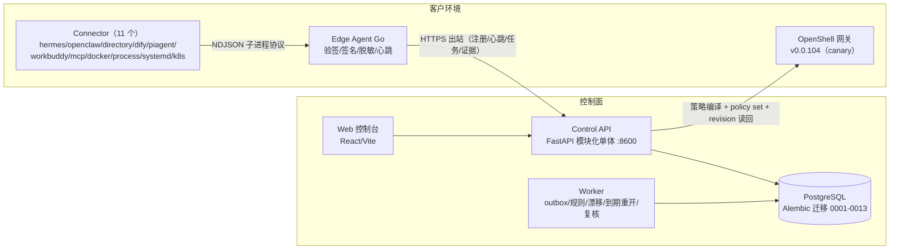

# siq-agent-security

独立部署的智能体安全管控面（Agent Security Control Plane）：把"谁、以什么目的、对什么资源、执行什么动作"的决策，转化为可执行、可观测、可审计的运行约束。

> 状态：**Phase 0–2 基线可运行，Phase 3（OpenShell 策略管控）进行中——部署闭环已在 OpenShell v0.0.104 隔离网关实测接通，正式迁移（canary 窗口）runbook 待执行**。
> 治理收口进行中：代码已领先于经评审修订的设计基线，设计文档 v0.2 待最终评审确认。
> 设计文档与评审意见见工作区根目录 [`SIQ_AGENT_SECURITY_DESIGN.md`](../SIQ_AGENT_SECURITY_DESIGN.md)（v0.2，待最终评审确认）、
> [`SIQ_AGENT_SECURITY_DESIGN_REVIEW.md`](../SIQ_AGENT_SECURITY_DESIGN_REVIEW.md)（v1.0）、
> 开发计划 [`SIQ_AGENT_SECURITY_DEVELOPMENT_PLAN.md`](../SIQ_AGENT_SECURITY_DEVELOPMENT_PLAN.md)（v1.0，决策登记表 3 项已拍板、15 项待拍板）。

## 简介

一个可工作的智能体不只是一次模型调用：它同时拥有运行进程、框架配置、模型 Provider、工具、文件目录、网络目标、业务身份、数据权限和凭据引用。这些能力散落在 Manifest、容器、IAM、API Gateway、沙箱策略和运行日志里，导致管理员普遍回答不了四个问题：

- 环境里到底跑着多少个智能体，各自属于谁、扮演什么角色？
- "配置里声明的""模型推测的""运行中观察到的""当前真正生效的"权限分别是什么？
- 哪些权限过大、未知、冲突或发生了带外漂移？
- 某项策略由谁提出、谁批准、何时下发、是否真的生效、能否回退？

本产品要回答的就是这些问题，并进一步把"收紧权限"变成一条有差异预览、有审批、有签名下发、有读回验证、可回滚的受控流水线。它不是沙箱工具的一个页面，而是一套**以证据为基础、以最小权限为目标、可对接多框架与多执行后端的智能体安全控制面**：

- **管理平面（Control Plane）**与**客户环境中的采集/执行平面（Edge Agent + Connector）**分离，支持本地、自托管与集中管理多环境；
- **不替代现有控制面**：不做第二套 IAM、不替代网关与记忆服务。生产身份沿用 OIDC/JWKS（SIQ 部署形态下直连 siq-org-iam，ADR-010）；本产品的职责是把"身份 → 权限 → 证据 → 策略"的决策链统一编排成运行约束；
- 模型只负责辅助理解、归类和建议，**永远不能**直接创建有效权限或通过审批；
- 首个执行后端是 OpenShell（沙箱/策略网关），首个接入框架是 Hermes，均已实测联通；当前为独立可部署产品，尚未进入 siq-platform Compose 与 Gateway 路由（规划中）。

## 核心能力

- **智能体资产盘点与生命周期**：Edge Agent 驱动 Connector（应用级：hermes / openclaw / directory / dify / piagent / workbuddy / mcp；运行级：docker / process / systemd / kubernetes，共 11 个已交付，详见 `docs/compatibility.md`）按受控范围扫描，产出候选（candidate）与证据（evidence）；候选经人工确认纳管（confirm）或驳回（dismiss，必填原因与有效期，到期自动回到候选池）。资产状态机：`candidate → needs_review → confirmed → managed`（旁路 `dismissed`）。智能扫描/重新扫描幂等：空批跳过、工具集解析容错，重扫不产生重复资产（近期"smart-scan 实弹修复"提交）。
- **证据链与可解释结论**：每个角色/归属/权限/风险结论都必须携带 `evidence_ids` 回链可验证证据；控制面强制"每批 evidence 必须被本批 candidate 引用"，孤儿证据直接 422；权限事实的 `evidence_ids` 同样逐条校验。
- **确定性分类 + 可选模型辅助**：默认确定性词表分类器（零误报基线）；可通过 `SIQ_AS_CLASSIFIER=provider` 接 OpenAI 兼容端点（temperature=0、输出严格 Schema 校验），每次分类落 `classification_run`（classifier/model/prompt/schema 版本 + temperature/seed + 原始输出），支持可追溯重跑；`model-off` 可显式关闭；模型不可用自动退化为规则 + 人工确认，低置信一律 `needs_review`（绝不自动纳管）。
- **权限解析与四域精细化管控**：
  - **身份域**：OIDC/JWT 生产身份 + Edge 设备身份（注册码/设备密钥/吊销），Permission Fact 含 `delegated_user` 委托维度（智能体代用户运行时，有效数据范围 = Agent 权限 ∩ 调用用户数据范围）；
  - **权限域**：权限以 Permission Fact 表达（subject/domain/action/resource/effect/conditions/state/authority/revision/evidence_ids），五种状态 `declared / inferred / observed / effective / unknown` 域间不合并；覆盖 10 类权限域（业务/数据范围/工具/文件/网络/进程/模型/凭据/资源/控制面），MVP Resolver 聚焦文件、网络、进程、模型、工具五域；Web 提供五域精细编辑器（fs 路径/网络端点/工具/模型/执行档位 → 生成期望策略 → 审批部署）；
  - **证据域**：签名证据 + 同事务审计，结论可逐条回链；
  - **策略域**：审批状态机 + `enforcement_mode` 渐进档位 + 漂移检测，策略变更全程受控。
- **漂移检测**：从执行后端回读有效策略（`/api/v1/permissions/sync-openshell`），与已生效部署做 revision 比对，不一致即生成高严重度 Finding；后端不可达时如实报错（fail-closed），绝不把"没查到"当"没漂移"。
- **风险中心（Findings）**：内置规则引擎按租户周期评估、幂等 upsert；风险接受必填 Owner/原因/到期时间，到期自动重开并发出 `agent.finding.reopened.v1` 事件；驳回（dismissed）资产到期自动回到候选池。
- **恶意脚本静态检测与自动隔离**（`app/threat_analysis.py` + `app/routers/threat.py`）：纯静态分析（绝不执行/导入被扫描内容），25 条确定性规则（下载管道执行、凭据/私钥访问、持久化植入、混淆解码执行、反弹 shell、C2/外传、提示注入、硬编码密钥字面量等）覆盖 shell/Python/PowerShell/JS；Python 额外走 AST 检查（`os.system`/`subprocess(shell=True)`/`ctypes` 动态加载）。命中记录只存行号/规则 id/sha256/≤40 字符截断摘要，摘要按规则包内 `redaction_patterns` 脱敏（密钥/令牌/私钥块/JWT 等），原文整段不入库。命中 `critical`/`high` 且置信度 ≥0.85 自动隔离（`QuarantineCase`）并联动吊销关联 `RuntimeBinding`，阈值收紧避免误报阻断正常运维；扫描权限独立于日常 Finding 处置（SoD），资产 owner 可自服务扫描自己名下资产、无需租户级权限。规则包与脱敏规则同 Ed25519 签名、同版本化热更新、同 fail-closed 校验（`app/rulepack.py`），运维可不改代码更新检测覆盖面。
- **策略治理闭环**：`draft → validated → proposed → approved → deploying → effective` 全状态机；职责分离（SoD，提出者不能是唯一批准者，break_glass 不豁免）、幂等键防重复变更、未批准不可部署（409）、回滚同权审计；`enforcement_mode` 渐进档位 `audit_only → warn → block` 只允许升级，降级必须走新的 high_risk 变更单并审批；Break-glass 紧急通道需独立权限点 `change:break_glass`（security_admin）、仅跨人批准，记录短期授权并到期转入 `post_review_due` 事后复核。
- **OpenShell 执行后端**（`apps/control-api/app/adapters/openshell/`）：后端无关的 DesiredPolicy 经策略编译器翻译为 OpenShell 策略，经 CLI 后端下发（`policy set`）并读回 revision 验证后置为 `effective`；FakeBackend 契约测试覆盖能力探测/revision 冲突/静态 generation/正负验证/回滚/unsupported 显式标记；已在 v0.0.104 真实网关完成"审批 → `policy set` → 读回验证 → `effective`"闭环实测（含网络策略热更新）。**已知限制（如实声明）**：渐进模式的设计与审批状态机已就绪，但 openshell-cli 后端当前仅支持 `block`（enforced）档——`audit_only`/`warn` 策略在部署时返回 422（`openshell_cli_mode_unsupported`），待后端支持后方可实际部署。
- **Edge 全生命周期管控**：环境（Environment）→ 一次性注册码（15 分钟 TTL、只存哈希、单次有效）→ 设备注册（device secret 只返回一次、只存 sha256）→ 心跳（吊销即时生效，每次请求在线校验）→ 签名任务领取与执行（任务 Ed25519 签名 + TTL）→ 证据批次上传（批次 + 逐条双重验签、5 分钟新鲜度窗口）→ 回执。
- **审计与事件**：AuditEvent 与状态变化同事务写入（审计缺失即操作失败），Outbox 事件同事务落库、由后台 worker 发布（Webhook/日志兜底）；审计摘要只存标识/数量/哈希，Secret 明文永不落库、不进日志；响应错误只返回错误引用（error digest）。
- **Web 控制台**（`apps/web`，React/Vite/TS）：总览、资产、Agent 详情（五域编辑器 + enforce 徽标）、权限、风险、策略、变更、运行时绑定（登记/列表/吊销）、环境、审计、设置等 12 个页面组件（13 条路由，含首页重定向与 404）均已接真实 API；token 只存内存不落 localStorage / sessionStorage。

## 技术优势与创新点

- **跨语言信任链（Go Edge + Python 控制面）**：Go Edge agent 用 Ed25519 校验控制面任务签名（信封含租户/环境/范围/过期时间），验签失败即拒绝；状态文件原子持久化（临时文件 + fsync + rename，`0600` 文件 / `0700` 目录），崩溃不留半写状态；`register / heartbeat / tasks / run-once` 协议与跨语言签名夹具（Python `signing.py` ↔ Go `signature_test.go`）保证两端行为一致。
- **合同优先（Contract-first）**：`packages/contracts/` 是唯一事实源——5 份 JSON Schema（candidate / evidence / permission-fact / desired-policy / event-envelope）+ Connector 子进程协议 v1，共 6 份合同文件跨组件共享。任何破坏性变更先升 Schema 版本，再同步实现方与测试，杜绝"实现漂移即合同"。
- **策略治理语义（写入合同）**：`desired-policy.schema.json` 含渐进执行档位 `enforcement_mode`（audit_only/warn/block）；`permission-fact.schema.json` 含 `delegated_user` 委托维度与五态 `state`；重叠冲突（overlap）语义在设计文档 §12.4 定义（基线 + 实例组合 deny-overrides、selector 冲突编译期报错），实现侧以编译期静态校验起步，显式冲突输出仍为待办（见"状态说明"）。
- **证据优先 + 模型非权威（ADR-003）**：模型输出永远不能成为 `effective` 权限、不能直接纳管或通过审批；所有结论必须回链证据。评测集基线（`docs/eval-baseline.md`）把"确定性基线召回 0.75、误报 0%、hard 组差距 0.25"写成测试锁死——任何人无法通过调词表把数字做漂亮，模型接入后的增量价值被诚实量化。
- **Fail-closed 生产门禁**：`config.py` 在启动期强制校验——生产只允许 PostgreSQL（禁止 SQLite 与自动建表）、必须配置 OIDC JWKS（RS256）、任务签名私钥必须由 Secret Manager 注入（32 字节 base64，仓库内禁止出现 `signing-key*.seed`）、CORS 白名单逐条校验（拒绝 `*`、URL 内凭据、非 HTTPS 来源）；任一缺失即拒绝启动。dev 模式（SQLite、`X-Dev-*` 身份头）必须显式开关。
- **Edge 信任模型（ADR-002）**：Edge 仅出站连接；注册码一次性 + 短 TTL + 只存哈希；吊销即时生效（每次请求在线校验，不做纯离线验签——吸取了 SIQ IAM 服务主体吊销滞后 15 分钟的教训）；证据由 Edge 统一签名（批次 + 逐条双重验签、任务绑定、5 分钟新鲜度窗口），篡改或重放即拒。
- **受限子进程 Connector 协议（ADR-008）**：Connector 以子进程运行、stdin/stdout 走 NDJSON；不注入任何凭据、默认禁网、单条 collect 60s 超时 + 8MB 输出上限；输出必须完成脱敏（`redaction_profile: siq.redaction.v1`），`.env`/私钥命中即整批作废（`redaction_failure`）；每个 Connector 通过负向语料（恶意配置不执行、符号链接逃逸拒绝、超大文件截断）。
- **事务边界即安全边界**：审计、Outbox 事件与业务状态变化在同一数据库事务提交——审计缺失即操作失败；高风险写操作不留"先斩后奏"窗口。
- **多租户混淆不可区分**：tenant_id 只从验证身份派生（客户端不可覆盖）；对象级端点"先租户定位（404）再权限（403）"，跨租户 ID 猜测与资源不存在在响应上不可区分，并有全组负向测试守护。
- **能力探测而非版本假设（ADR-005/009）**：执行后端能力一律 `probe` 实测，不按版本号推断；OpenShell 升级路径经 spike 实测定案（v0.0.104 修复 v0.0.83 解码缺陷、两个 OpenShell 本地 patch 已被上游吸收可退役），5 个本地 patch 全部登记 owner/上游 issue/rebase 步骤。
- **威胁模型可回链**：`docs/threat-model.md` 维护 22 条威胁（T1–T22，含恶意 Agent 本体、管理员账号接管、委托链放大、扫描风暴 DoS、MCP 攻陷、时钟偏移、Agent 绕 Hub 直连模型网关等行）× 控制 × 负向测试矩阵，每条威胁都能指到具体测试用例；未闭环项（部署回执独立验证、mTLS、Connector 强隔离）显式列入 TODO 而非隐藏。

## 商业价值

> 企业规模化部署智能体时，安全团队需要"**看得见（资产盘点）、管得住（策略审批 + 强制）、查得到（证据审计）**"——这是合规与审计师接受 AI 项目的关键证据链。以下每条能力 → 收益均来自已实现功能，不包含虚构数字。

- **影子智能体盘点 → 消除治理盲区**：持续发现容器、目录、框架配置中的智能体资产并确认归属，客户第一次能回答"我有多少智能体、谁负责"，这是任何安全与合规动作的前提。
- **证据链 + 同事务审计 → 降低合规成本**：每个结论可回链证据、每次状态变化有不可绕过的审计记录，面向监管的说明从"人工整理材料"变为"导出即有据可查"。
- **五态权限视图 + 漂移检测 → 持续收敛攻击面**：声明与生效权限的差异、带外修改、未知组合权限被显式暴露，最小权限从一次性整改变为可持续运营；带外降级（如绕过策略直接回退 Host）无处遁形。
- **审批闭环 + 渐进执行 → 权限变更可控**：SoD、幂等、`enforcement_mode` 渐进档位让客户可以先观察（audit_only）再阻断（block），降低"上安全管控影响业务"的推行阻力；高风险变更降级必须二次审批，Break-glass 有事后复核兜底。（**已知限制**：openshell-cli 执行后端当前仅支持 `block` 档，`audit_only`/`warn` 待后端支持后方可实际部署——渐进执行当前止于设计与审批状态机层面。）
- **多框架 Connector + 后端无关策略模型 → 避免厂商锁定**：11 个 Connector 已接入（应用级 Hermes/OpenClaw/受控目录/Dify/PiAgent/WorkBuddy/MCP，运行级 Docker/Process/systemd/Kubernetes），策略模型不绑定 OpenShell，客户现有框架与未来执行后端的接入成本都被合同隔离。
- **独立产品形态 → 一份资产多处变现**：不依赖 SIQ 代码与数据库即可部署，同一产品可服务 SIQ 客户与非 SIQ 环境（自托管/Managed）。

## 架构与仓库结构



```text
packages/contracts/       合同事实源：5 个 JSON Schema + connector-protocol.v1.md（变更先升版本）
apps/control-api/         Control Plane API（Python ≥3.12 / FastAPI / SQLAlchemy / Alembic，端口 8600）
  app/routers/            environments / inventory / findings / policies / audit
  app/adapters/openshell/ OpenShell 执行后端：contracts / base / policy_compiler / fake_backend / client / cli_backend
  app/worker.py           单进程后台循环：outbox 发布、规则引擎、漂移、风险接受到期重开、dismissed 到期回归、Break-glass 复核
  app/tests/              pytest 套件（319 项，2026-08-20 实测全绿）：含租户隔离/SoD/注册生命周期/签名跨语言夹具/威胁检测规则包与脱敏覆盖率负向测试
  migrations/             Alembic 迁移（0001–0013，干净库可全量回放）
apps/web/                 Web 控制台（React / Vite / TypeScript；dev 代理 /api → 127.0.0.1:8600；token 仅内存）
edge/agent/               Edge Agent（Go 1.22）：register / heartbeat / tasks / run-once + 共享 protocol 包 + 原子 0600 状态
connectors/hermes/        Hermes Profile Connector（Go；scope 校验/符号链接逃逸/.env 拒绝/toolsets 声明事实）
connectors/openclaw/      OpenClaw Connector（Go；L1/L2 只读，auth-profiles 永不读只记大小，不写配置）
connectors/directory/     受控目录 Connector（Go；无默认范围、.env 永不读取）
connectors/dify/          Dify Deployment Connector（Go；docker-compose 清单，仅 dify 相关行入 content_hash）
connectors/piagent/       PiAgent Profile Connector（Go；~/.piagent 目录，apiKey/token 字段不进结构体）
connectors/workbuddy/     WorkBuddy Install Connector（Go；~/.workbuddy 目录，config.yaml 永不读正文）
connectors/mcp/           MCP Server 配置 Connector（Go；各 MCP 客户端众所周知配置文件，env 值绝不采集）
connectors/docker/        Docker Connector（Go；环境变量值不出机——结构体刻意无 Env 字段）
connectors/process/       主机进程 Connector（Go；args 夹带的 token 绝不出进程，只留摘要）
connectors/systemd/       systemd service unit Connector（Go；ExecStart 内容优先于名称初筛，避免结构性漏报）
connectors/kubernetes/    Kubernetes pod Connector（Go；流式 JSON 解码，超字节预算优雅截断不整批失败）
docs/                     威胁模型、兼容矩阵、评测基线、威胁检测基线、D1 spike、OpenShell 迁移 runbook、ADR-001 ~ ADR-010
deploy/compose/           本地开发部署（PostgreSQL 16 @127.0.0.1:55433 + control-api @8600，迁移自动回放）
```

规划中目录（已登记未交付，勿按已交付理解）：`connectors/siq`（依赖跨仓 Export Contract D3–D5）、`packages/policy-model`、`packages/sdk`、`adapters/enforcement`（独立 Enforcement 进程形态）、`adapters/runtime`、`services/worker`（独立 Worker 服务形态）、`deploy/helm`、`docs/runbooks/`（目录已建、内容待补）、跨组件 `tests/`。`connectors/kubernetes` 已交付（见上方仓库结构与 `docs/compatibility.md`），不再属于本列表。

## 快速开始

前置：Python ≥3.12 + [uv](https://docs.astral.sh/uv/)、Node ≥20 + npm、Go ≥1.22（Edge/Connector）、Docker（可选，compose 部署）。

### Control API（dev 模式）

```bash
cd apps/control-api
uv sync --dev
SIQ_AS_DEV=1 SIQ_AS_ALLOW_SQLITE=1 uv run uvicorn app.main:app --port 8600
# dev 身份头：X-Dev-Tenant-Id / X-Dev-User-Id / X-Dev-Roles（仅 dev 模式生效）
# 健康检查：curl http://127.0.0.1:8600/health
```

后台 worker（outbox 发布 / 规则引擎 / 漂移检测 / 到期重开与复核，另起一个进程）：

```bash
cd apps/control-api
SIQ_AS_DEV=1 SIQ_AS_ALLOW_SQLITE=1 uv run python -m app.worker --once   # 单次执行；去掉 --once 为 60s 循环
```

compose 一键起 PostgreSQL + API（迁移自动回放，非生产用途）：

```bash
docker compose -f deploy/compose/compose.yaml up --build
# postgres @127.0.0.1:55433，control-api @127.0.0.1:8600
```

### Web 控制台

```bash
cd apps/web
npm ci
VITE_DEV_MODE=true npm run dev     # 仅本地；/api 由 Vite 代理到 127.0.0.1:8600
npm run build                      # 产物构建（tsc -b && vite build）
```

dev 模式下控制台自动携带 `X-Dev-*` 身份头（`VITE_DEV_TENANT_ID` 默认 `dev-tenant`，与后端种子租户一致，见 `apps/web/.env.example`）。

### Edge Agent 与 Connector

```bash
cd edge/agent
go build ./... && go vet ./... && go test -race ./...

# 构建 Connector（以 hermes 为例；其余 10 个同法：openclaw/directory/dify/piagent/workbuddy/mcp/docker/process/systemd/kubernetes）
cd ../../connectors/hermes && go build -o hermes-connector . && go test ./...

# 本地单次扫描（不连控制面），输出 NDJSON 候选与证据
cd ../../edge/agent && go run . run-once --connector hermes --connector-bin ../../connectors/hermes/hermes-connector
```

接入控制面的完整闭环：控制台创建环境 → 签发注册码 → `edge-agent register --control-plane https://<cp> --enrollment-code <code>` → `heartbeat` + `tasks` 常驻。

### 生产部署要点

生产模式（不设 `SIQ_AS_DEV`）启动即 fail-closed 校验，必须满足：PostgreSQL（`SIQ_AS_DATABASE_URL`）+ Alembic 迁移（`uv run alembic upgrade head`，禁止自动建表）、OIDC RS256/JWKS（`SIQ_AS_OIDC_JWKS_URL` 等）、Secret Manager 注入 32 字节 base64 任务签名私钥（`SIQ_AS_TASK_SIGNING_KEY_SEED`，仓库内禁止 `signing-key*.seed` 文件，CI 会拒绝）、CORS 仅显式 HTTPS 白名单。Edge 连接非回环控制面强制 HTTPS。完整配置模板见 `apps/control-api/.env.example`。

## 在 SIQ 生态中的位置

本仓库是 SIQ 工作区下的独立 Git 仓库、独立产品（ADR-001）：**不 import 兄弟仓库内部代码、不查询兄弟仓库数据库**；SIQ 专属能力只经 `connectors/siq`（规划中）以版本化 API/事件接入。SIQ 是首个接入方与验证环境。**当前为独立可部署形态：尚未进入 siq-platform Compose 与 Gateway 路由，容器化编排与网关路由接入均为规划中项。**

| 方向 | 对象 | 集成方式 | 状态 |
| --- | --- | --- | --- |
| 上游依赖 | siq-org-iam | 生产身份：OIDC RS256/JWKS 直连 IAM（不建第二套 IdP，ADR-010）；委托维度复用 `/auth/delegated-token`（需 audience 泛化，D6）；产品角色与权限点注册到 IAM（D8） | JWKS 校验已实现；D6/D8 为 SIQ 侧跨仓依赖，已登记为待决策/待拍板项 |
| 上游依赖 | siq-agent-hub | Export Contract：`/runs/{id}/audit` 服务身份豁免 + `/ledger` cursor 分页（D3），供 SIQ Connector 采集运行台账 | 待 D3（Phase 1 前置） |
| 上游依赖 | siq-gateway | Export Contract：keys/routes/usage 只读 service scope（D5）；agent×model 组合事实当前无校验源 → 标 `unknown` 并告警 | 待 D5 |
| 上游依赖 | siq-platform | OpenShell 生产基座部署（D2）、渐进执行模式字段对齐（D7）、Host fallback 归类漂移监控（D9）；进入平台 Compose 与 Gateway 路由（规划中） | D2 为 Phase 3 集成测试前置 |
| 集成对象 | hermes-agent | Hermes Connector 扫描 profile 目录（config.yaml/SOUL.md + toolsets）；Hermes 0.13.0 的 3 个本地 patch 已登记治理（ADR-005） | Connector 已实现 |
| 集成对象 | OpenShell（外部） | 首个 Enforcement Adapter：策略编译、`policy set` 下发、revision 读回验证、effective 事实同步 | v0.0.104 隔离网关闭环实测通过；正式迁移 runbook 待执行 |
| 下游 | siq-notify / siq-document-engine / siq-memory / siq-flow-engine / siq-workbench | 当前无直接集成；事件经 Outbox → Webhook 外发，未来可接 siq-notify 事件摄取 | 规划中 |

跨仓依赖编号（D1–D9）与阶段前置关系详见开发计划 §3。

## 开发与测试

仓库约定见 [AGENTS.md](AGENTS.md)（边界、事实源顺序、安全不变量、按变更类型的最低验证要求）。所有改动不得破坏 7 条安全不变量：租户隔离、Secret 不明文落库、审计同事务、Edge 凭据只存哈希、模型非权威、孤儿证据拒绝、生产禁 SQLite/`X-Dev-*`。

### 测试与质量命令

```bash
# Control API（apps/control-api）
uv run ruff check app          # 静态检查（line-length 120，规则 E/F/W/I/UP/B）
uv run pytest                  # 319 项测试（2026-08-20 实测全绿）：含跨租户/SoD/注册生命周期/签名负向/评测集基线/威胁检测与脱敏覆盖率
uv run alembic upgrade head    # 迁移在干净库全量回放（CI 用 PostgreSQL 17 验证）

# Edge Agent 与 Connector（各自目录）
gofmt -l .                     # CI 强制零输出
go build ./... && go vet ./... && go test -race ./...

# Web（apps/web）
npm ci && npm run build        # 构建即类型检查（tsc -b）
```

CI（`.github/workflows/ci.yml`）四个门禁：**gitleaks**（泄密扫描 + 签名私钥现存与 Git 历史扫描，`signing-key*.seed` 一律拒绝）、**control-api**（ruff / pytest / pip-audit / Alembic 干净 PostgreSQL 全量回放）、**edge**（gofmt / build / vet / `test -race`，矩阵覆盖 Edge Agent + 全部 11 个 Connector）、**web**（build + `npm audit`）。

### 提交约定

- 格式：`<scope>: <简洁主题>`，scope 如 `contracts:`、`control-api:`、`edge:`、`web:`、`docs:`；
- 安全修复必须带负向测试，证明旧行为被拒绝；
- 合同变更：先改 `packages/contracts/`（升版本），再同步实现方与测试。

## 状态说明

**当前阶段**：Phase 0（合同与安全骨架）/ Phase 1（只读发现）/ Phase 2（权限视图与风险中心）已实现；Phase 3（OpenShell 策略管控）进行中——部署闭环已在 OpenShell v0.0.104 隔离网关实测接通（审批 → `policy set` → 读回验证 → `effective`，含回滚与网络策略热更新），但 SIQ 侧正式迁移（v0.0.83 → v0.0.104）尚处于 canary 窗口期，迁移 runbook（`docs/openshell-v083-to-v0104-migration.md`）待执行。控制面 API 319 项测试全绿；11 个 Go Connector `go vet`/`go test` 全绿（详见 `docs/compatibility.md`）；Web 控制台页面已接真实 API，含运行时绑定登记/列表/吊销管理页。

**治理收口进行中（如实声明）**：代码实现已领先于经评审修订的设计基线——设计文档 `SIQ_AGENT_SECURITY_DESIGN.md` v0.2 已按 2026-08-13 深度评审修订、**待最终评审确认**；开发计划决策登记表共 18 项：3 项已拍板（MVP 完整路线、文档策略、独立产品定位），15 项待拍板（许可证、交付形态、首个外部验证环境、OpenShell 版本路径等）；Phase 0 退出条件"决策表全部有结论"尚未达成。设计文档本身声明："设计条目不因代码存在而自动视为生产验收通过。" 本 README 的"核心能力/技术优势"按当前实现如实描述，与设计基线存在差距的能力均显式标注待办。

**明确标注为"规划中"的能力**（目录已建或已登记、实现未交付，勿按已交付理解）：`connectors/siq`（依赖 D3-D5）、`packages/policy-model`、`packages/sdk`、`adapters/enforcement`（独立进程形态）、`adapters/runtime`、`services/worker`（独立服务形态）、`deploy/helm`、`docs/runbooks/`（目录已建、内容待补）、跨组件 `tests/`。`connectors/kubernetes` 已于 2026-08 交付（不再是规划中）。

**设计与实现的已知差距（不隐藏风险）**：

- `overlap_conflicts`（域内重叠冲突显式输出）语义已定义于设计文档 §12.4，当前实现以编译期静态校验起步，显式冲突输出待补——本 README 不将其列为已交付能力；
- `connectors/docker` 目前只覆盖 `classifyContainer` 分类逻辑单测，尚缺 docker CLI 缺失/inspect 输出畸形等 collectOp 层负向测试（其余 9 个已交付 Connector 负向语料全绿，见 `docs/compatibility.md`）；
- 威胁检测规则（`app/data/threat_rules.v1.json`）与脱敏规则均为确定性正则黑名单，可被刻意混淆的变种绕过——属静态规则的固有局限，非漏洞；
- 部署回执的独立可信验证器与完整性证明待 Phase 4 评估（当前部署回执可信度以 Edge 完整性为上限，ADR-002 已记录残余风险）；
- Edge mTLS / 设备证书自动轮换、Connector OS 级强隔离（低权限用户/容器/seccomp）为后续加固项；
- SIQ Export Contract（D3-D5）等跨仓依赖决定 SIQ Connector 与委托维度联调节奏；
- 许可证待定（开发计划决策 #1），暂未添加 LICENSE 文件。
