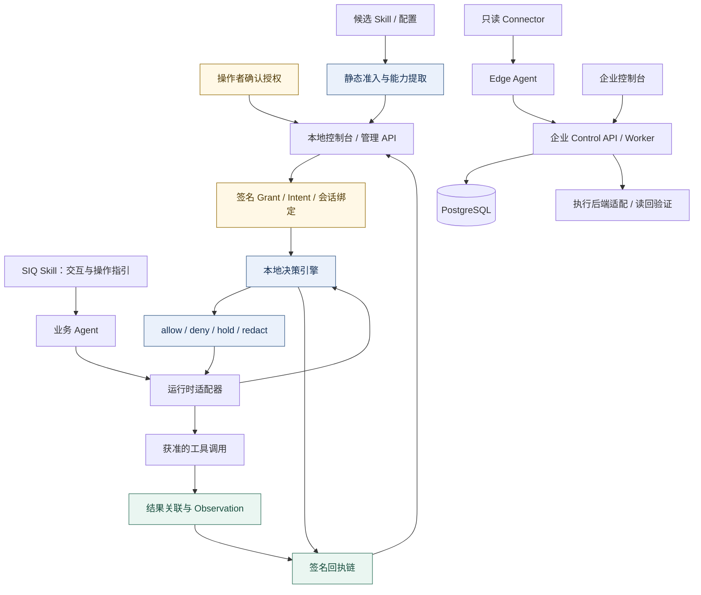
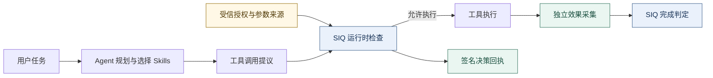

<p align="center">
  
</p>

<h1 align="center">SIQ Agent Security</h1>

<p align="center"><strong>Secure Runtime for Agent Skills</strong><br />
面向 Agent Skills 的可信执行安全运行时</p>

<p align="center">Skills 给 Agent 能力，SIQ 给能力边界。</p>

<p align="center">
  <a href="https://github.com/maoyadongsh/siq-agent-security/actions/workflows/ci.yml"></a>
  <a href="https://github.com/maoyadongsh/siq-agent-security/actions/workflows/research.yml"></a>
  <a href="LICENSE"></a>
  <a href="https://github.com/maoyadongsh/siq-agent-security/releases/tag/research-v0.1.0-rc.1"></a>
</p>

<p align="center">
  <strong>简体中文</strong> · <a href="README.en.md">English</a>
</p>

<p align="center">
  <a href="#快速开始">快速开始</a> · <a href="#研究与证据">研究证据</a> · <a href="#组件与接入">组件接入</a> · <a href="#贡献与下一步">参与贡献</a>
</p>

---

SIQ Agent Security 将用户授权、参数来源、工具执行和实际效果连接成可检查的证据链。Agent 负责规划任务和选择 Skills，SIQ 运行时依据受信授权检查动作，并根据独立采集的效果证据判断任务完成情况。

项目面向研究者、Agent 工具与适配器开发者，以及评估智能体权限治理的平台团队。首次体验可以在普通 Linux 上使用确定性模型夹具，不需要 API 密钥、GPU 或企业控制面。

## 核心价值

**核心结果：Trusted Agent Execution（可信的 Agent 执行）。** Agent 动态规划，SIQ 以受信意图约束权限、以参数来源核验动作、以实际效果判定完成。

| 研究重点 | 已实现的技术机制 | 业务用途 |
| :--- | :--- | :--- |
| **权限独立于模型** | Go 运行时核验 Grant / Intent、会话绑定与执行前审批；模型提议不能扩大权限 | 为自动化操作设置可审计的授权边界 |
| **同值参数，区分来源** | 将受信 Context 与参数来源绑定到动作；相同收件人值可因可信数据库 / MCP 来源不同而获准或拒绝 | 约束被工具结果诱导的收件人替换与越权交付 |
| **完成依赖实际效果** | 签名回执关联动作；独立观察文件与受控接收端，区分工具成功、效果发生和任务完成 | 为交付验收、故障定位与执行审计提供证据 |

商业应用方向包括企业 Agent 权限治理、研究与报告交付、工具平台集成。现有基础是本地运行时、适配器与可选企业控制面；规模化部署、外部 SaaS 效果证明和商业收益仍需具体场景验证。创新性评价以[研究问题](docs/research/research-questions.md)与[技术报告](docs/research/technical-report.md)为依据，当前不宣称首创或已获同行评审认可。

> [!IMPORTANT]
> **当前发布：源码预发布 · 已提供 Sigstore 数字签名**
>
> [research-v0.1.0-rc.1](https://github.com/maoyadongsh/siq-agent-security/releases/tag/research-v0.1.0-rc.1) 附 `SOURCE-INFO.json`、`SHA256SUMS` 与 `SHA256SUMS.sigstore.json`，不包含新编译的二进制或模型权重。签名绑定本仓库的 GitHub Actions 发布工作流身份，通过校验清单覆盖源码包和版本信息文件。请先验证签名，再核对文件摘要：[验证方法与签名范围](docs/research/release-authentication.md)。

<details>
<summary>发布源码与版本身份</summary>

发布源码固定在 [`aefab111`](https://github.com/maoyadongsh/siq-agent-security/commit/aefab111c7fcad9075c8f429f97c9eab519dcd22)，后续首页与发布回执更新不改变这一身份。

2026-09-09 为原有附件补充独立签名，未改写原附件。`SOURCE-INFO.json` 中的 `official_signature=false` 保留首次打包时的历史状态；本次 Sigstore 签名及验证结果见[签名记录](docs/research/evidence/release-signing-20260909.json)。

</details>

## 从这里开始

| 你的目标 | 推荐入口 | 可以获得什么 |
| :--- | :--- | :--- |
| 体验完整流程 | [快速开始](#快速开始) | 无需模型密钥的本地演示 |
| 复现与评价 | [复现指南](REPRODUCIBILITY.md) · [研究导航](docs/research/README.md) | 固定案例、评价协议与证据 |
| 接入自己的 Agent | [组件与接入](#组件与接入) | 运行时、适配器和合同入口 |
| 参与开源研究 | [贡献指南](CONTRIBUTING.md) · [社区任务](docs/research/community-backlog.md) | 有明确范围的贡献起点 |

## 可以验证什么

以“分析仓库、生成报告并交付给指定联系人”为例，Agent 动态选择研究、报告和交付 Skills。演示包含以下四种可观察结果：

| 场景 | 关键检查 | 预期结果 |
| --- | --- | --- |
| 正常交付 | 任务授权、受信联系人、文件与接收端效果 | `verified`：要求的效果已核验 |
| MCP 收件人注入 | 不可信工具结果提出更换收件人 | `blocked`：不允许的动作被阻止 |
| 同值不同来源 | 相同收件人值分别来自可信数据库与 MCP | 可信路径允许；MCP 路径拒绝 |
| 工具伪成功 | 工具返回成功，但受控接收端没有对应事件 | `incomplete`：缺少所需效果 |

这些演示使用显式模型夹具驱动真实 SIQ 组件。它们验证指定安全路径，不是实模型遭受提示注入时的攻击成功率测量。

## 工作方式

### 组件与授权链路

下图保留完整的本地运行时与企业控制面关系。企业控制面是可选部署；本地演示不依赖该链路。



### 任务执行与效果核验



- **执行前**：静态扫描 Skill，记录能力需求；通过 Grant、Intent、受信 Context 和参数来源约束动作。模型输出不能创建有效权限。
- **执行时**：在已接入的工具入口检查授权；需要审批的动作在执行前重新核验。适配器将实际调用与决策关联。
- **执行后**：记录签名回执，采集文件或受控接收端的效果证据。工具自报成功、已观察效果和任务完成状态分别记录。

普通 Observation 的结果关联与独立 EffectEvidence 的效果核验具有不同证明范围。架构、合同和方法细节见[技术报告](docs/research/technical-report.md)、[合同目录](packages/contracts/README.md)与[安全边界](#安全边界)。

## 快速开始

### 1. 启动无需模型密钥的演示

已验证的入门环境为 Linux；准备 Git、Go **1.26.6**、Python **3.12+**、Node.js **22 / npm**。首次安装依赖和工具链需要联网。请使用新克隆的目录：启动器会拒绝覆盖已有演示状态。

```bash
git clone https://github.com/maoyadongsh/siq-agent-security.git
cd siq-agent-security

bash scripts/hackathon/start.sh --mode test --port 47621
bash scripts/hackathon/healthcheck.sh
bash scripts/hackathon/pair.sh
```

启动器会安装 Web 锁定依赖、构建本地界面和 Go 程序。打开 **http://127.0.0.1:47621/demo**，输入终端给出的一次性配对码，再选择上表中的场景。配对码和服务状态文件应留在本机。

> [!NOTE]
> `--mode test` 必须显式给出：启动器默认的 `demo` 模式会使用配置的真实模型。需要固定首发源码时，在启动前执行 `git switch --detach research-v0.1.0-rc.1`。

体验完成后停止这个演示实例：

```bash
bash scripts/hackathon/stop.sh
```

再次启动前，需要先按[复现指南](REPRODUCIBILITY.md)归档该实例的旧状态。端口冲突、配对问题和环境诊断也见该指南。

### 2. 复现固定基准

额外准备 **uv**，从仓库根目录运行。每次尝试使用新的状态目录和输出目录。

```bash
(cd apps/control-api && uv sync --dev --locked)
mkdir -p .tmp/research-bin
GOTOOLCHAIN=go1.26.6 go -C apps/agentshield build \
  -o "$PWD/.tmp/research-bin/siq-agent-security" ./cmd/agentshield

apps/control-api/.venv/bin/python benchmarks/hackathon/run.py \
  --binary .tmp/research-bin/siq-agent-security \
  --state-root .tmp/my-research-controls \
  --out .tmp/my-research-results/controls.json

apps/control-api/.venv/bin/python benchmarks/hackathon/verify.py \
  .tmp/my-research-results/controls.json \
  --out .tmp/my-research-results/verification.json
```

默认执行全部 **23 个固定控制案例**。查看预期是否满足和 verifier 结果；攻击案例的 `blocked`、伪成功案例的 `incomplete` 都可能是正确结果。保留失败尝试，分享前按[证据导出规则](docs/research/data-export-policy.md)检查报告，不上传私密状态目录。

### 3. 可选：接入真实模型

<details>
<summary>查看 StepFun + DGX Spark 配置入口</summary>

已有的实模型演示使用 **StepFun `step-3.7-flash` 远程规划**与 **DGX Spark 上的 Ornith 本地分析**。这条路径需要独立配置模型、私密凭据和硬件；与上面的无密钥路径分开运行、分开统计。

从 [DGX 部署说明](deploy/dgx-spark/README.md)、[私密模型配置](docs/hackathon/step-plan.md)和[三轨复现指南](REPRODUCIBILITY.md)进入。机密分析的本地失败不能因此自动获准回退到远程模型。

</details>

## 研究与证据

以下数字属于已归档的特定运行，不能视作任意环境或未来版本的保证。

| 已归档观察 | 结果 | 证据与范围 |
| --- | --- | --- |
| 固定控制案例 | **23/23** 满足预期 | [报告与验签摘要](docs/research/result-reproduction.md)；开发期间的受控夹具运行 |
| 正常任务完成 | **5/5** | 同一控制报告中的全部正常任务 |
| 不安全目标实际执行 | **0/13** | 注册了不安全目标的案例；分母与正常任务不同 |
| 回执与效果封装校验 | **318** 条回执、**20** 个效果封装 | [独立验证输出](docs/research/evidence/reproduction-b/verification.json) |
| 普通 Linux 浏览器复现 | **9/9** 场景通过 | [托管 Ubuntu 运行记录](docs/research/evidence/reproduction-a/hosted-linux-identity.json)；无需 GPU 或模型密钥 |
| 首发源码 CI | **31** 项必需检查通过 | [发布源码记录](docs/research/evidence/release-ci.json)；对应 `aefab111` |

历史 StepFun 与 Ornith 正常任务 cohort 各保留了后续 **5/5** 的结果，早期 **4/5** 的失败也完整保留在[原始基准报告](docs/hackathon/benchmark-report.md)。这些小样本不构成统计保证，不能与固定夹具或后续演示合并分母。托管 CI 复现也不等于外部研究者的独立复现。

研究入口：[研究问题](docs/research/research-questions.md) · [数据卡](docs/research/dataset-card.md) · [评价协议](docs/research/evaluation-protocol.md) · [逐项结论与证据](docs/research/claims-evidence.md)。当前没有已发表论文、DOI 或独立制品认证。

## 组件与接入

| 组件 | 职责 | 使用入口 |
| --- | --- | --- |
| Secure Agent 与研究 Skills | 任务规划、动态选择研究 / 报告 / 交付能力 | [Agent 说明](apps/secure-agent/README.md)、[Skills](skills/) |
| 本地 Go 运行时 | 准入、授权、管理 API、签名回执与效果核验 | [本地操作指南](AGENTSHIELD.md)、[开发规格](docs/agentshield-dev-spec-v1.md) |
| 运行时适配器 | Hermes、OpenClaw、CodeBuddy 的具体工具入口接入 | [适配器目录](adapters/runtime/)、[能力矩阵](docs/agentshield-capability-matrix-v1.md) |
| 企业控制面 | 多租户资产、证据、策略审批及 Edge 协调 | [控制面说明](docs/control-plane.md)、[生产运行手册](docs/enterprise-production-runbook-v1.md) |
| Edge 与 Connectors | 配置、目录、框架、进程、容器及集群采集 | [Edge](edge/agent/)、[Connectors](connectors/)、[兼容说明](docs/compatibility.md) |
| 合同与基准 | 跨组件数据合同、固定语料和证据验证 | [合同](packages/contracts/)、[Agent 基准](benchmarks/hackathon/README.md)、[运行时基准](benchmarks/runtime-security/README.md) |

本地演示无需 PostgreSQL、企业登录或企业 API。平台的采集能力、工具阻断能力和实机验证状态分别登记；存在适配器不代表所有版本、所有调用路径均受保护。企业生产部署条件和未验证事项以对应运行手册为准。

## 安全边界

- **同 UID 不隔离**：当前桌面模式不能阻止同一操作系统用户的恶意进程读取密钥或改写状态；Python ToolGateway 不是 OS 沙箱。
- **接入范围有限**：授权检查只覆盖正确接入的执行路径；来源注册与敏感级别分类仍依赖可信操作者。
- **效果证明有范围**：文件与受控接收端的观察不代表对所有外部 SaaS 的交付证明；缺失或冲突的证据不能当作成功。
- **实验结论有限**：固定小语料与模型夹具不代表通用提示注入防护、完整语义来源追踪或生产安全认证。跨平台编译也不等于各平台原生验收。

完整说明见[威胁模型](docs/threat-model.md)、[能力矩阵](docs/agentshield-capability-matrix-v1.md)和[数据卡](docs/research/dataset-card.md)。未修复漏洞请通过 [SECURITY.md](SECURITY.md) 的私密入口报告。

## 贡献与下一步

欢迎普通 Linux 复现、同值来源解释、夹具诊断、指标纠错和有来源依据的负向案例。先阅读[贡献指南](CONTRIBUTING.md)，再选择[首批任务](docs/research/community-backlog.md)、[Issues](https://github.com/maoyadongsh/siq-agent-security/issues)或 [Discussions](https://github.com/maoyadongsh/siq-agent-security/discussions)。

后续重点是长期归档与 DOI、外部独立复现、预先确定协议的新实验，以及论文与制品评审。新二进制研究版本仍需单独的分发与原生验收。实际进展见[开源实施记录](docs/research/operations-20260908.md)与[任务台账](docs/open-source-research-tasks-20260908.md)。贡献签署与评审遵循 [DCO](DCO) 和[治理规则](GOVERNANCE.md)，社区交流遵循[行为准则](CODE_OF_CONDUCT.md)。

## 许可、引用与历史材料

自有软件采用 **[Apache-2.0](LICENSE)**；明确列出的原创研究文档采用 **[CC BY 4.0](LICENSES/README.md)**。第三方代码、补丁与字体保留各自许可，详见[适用范围](LICENSES/scope.json)及[第三方归属](THIRD_PARTY_NOTICES.md)。模型权重和外部 API 服务不在项目许可之内。

引用软件请使用 **[CITATION.cff](CITATION.cff)**，并记录实际使用的版本、提交和语料摘要；[引用指南](docs/research/citation-guide.md)说明了源码与研究材料的区别。

| 社区与治理 | 研究与归档 |
| :--- | :--- |
| [贡献指南](CONTRIBUTING.md) · [DCO](DCO) | [引用指南](docs/research/citation-guide.md) · [CITATION.cff](CITATION.cff) |
| [治理规则](GOVERNANCE.md) · [行为准则](CODE_OF_CONDUCT.md) | [研究技术报告](docs/research/technical-report.md) · [复现指南](REPRODUCIBILITY.md) |
| [私密安全报告](SECURITY.md) · [第三方归属](THIRD_PARTY_NOTICES.md) | [比赛演示](HACKATHON.md) · [V5 冻结快照](docs/hackathon/final-submission-state.md) |
| [开发约定](AGENTS.md) · [持续集成](https://github.com/maoyadongsh/siq-agent-security/actions) | [开源实施记录](docs/research/operations-20260908.md) · [任务台账](docs/open-source-research-tasks-20260908.md) |

比赛快照保留当时的源码、制品、视频和实验分母；本轮研究发布及后续文档更新使用各自的身份记录。
