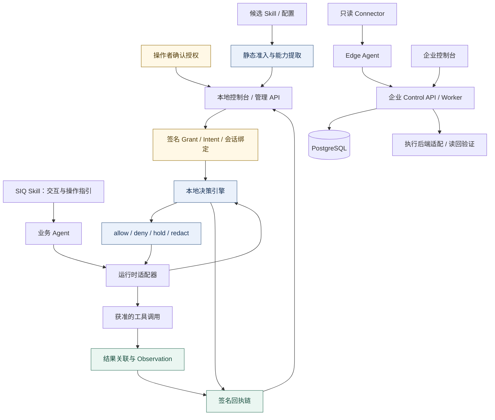
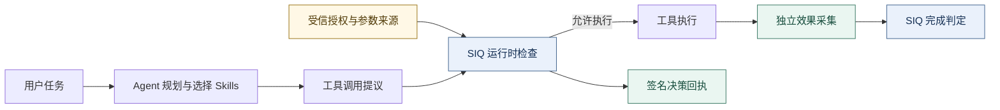

<p align="center">
  
</p>

<h1 align="center">SIQ Agent Security</h1>

<p align="center"><strong>Secure Runtime for Agent Skills</strong><br />
面向 Agent Skills 的可信执行安全运行时</p>

<p align="center">Skills 给 Agent 能力，SIQ 给能力边界。</p>

<p align="center">
  <strong>主分支 main：</strong>
  <a href="https://github.com/maoyadongsh/siq-agent-security/actions/workflows/ci.yml?query=branch%3Amain"></a>
  <a href="https://github.com/maoyadongsh/siq-agent-security/actions/workflows/research.yml?query=branch%3Amain"></a>
  <a href="LICENSE"></a>
  <a href="https://github.com/maoyadongsh/siq-agent-security/releases/tag/siq-agent-security-v0.3.0-rc.1"></a>
</p>

<p align="center">
  CI / research 徽章仅反映 <code>main</code>，不代表未合并分支或已发布版本。<br />
  个人客户端的实现与验收状态见<a href="docs/personal-experience-development-progress-20260910.md">开发台账</a>。
</p>

<p align="center">
  <strong>简体中文</strong> · <a href="README.en.md">English</a>
</p>

<p align="center">
  <a href="#个人用户使用路线">个人用户</a> · <a href="#企业用户使用路线">企业用户</a> · <a href="#快速开始">快速开始</a> · <a href="RESEARCH.md">研究链路</a> · <a href="#研究与证据">研究证据</a> · <a href="#组件与接入">组件接入</a> · <a href="#贡献与下一步">参与贡献</a>
</p>

---

SIQ Agent Security 将用户授权、参数来源、工具执行和实际效果连接成可检查的证据链。Agent 负责规划任务和选择 Skills，SIQ 运行时依据受信授权检查动作，并根据独立采集的效果证据判断任务完成情况。

项目面向研究者、Agent 工具与适配器开发者，以及评估智能体权限治理的平台团队。首次体验可以在普通 Linux 上使用确定性模型夹具，不需要 API 密钥、GPU 或企业控制面。

**项目定位：研究驱动、授权独立、效果可核验的智能体安全管控。** 围绕 Agent 与 Skill 从发现、准入、授权、运行到更新和退出的生命周期，SIQ 将前沿智能体安全研究中的来源约束、运行时权限检查与可验证证据转化为实际产品机制，并针对 **NVIDIA DGX Spark 本地 AI 环境与 NVIDIA OpenShell 执行后端开展深度适配**。目标是在保持智能体任务规划能力的同时，让用户和组织能够界定权限、确认高风险动作、追溯实际结果。

> **签名安装包（2026-09-19）**：[0.3.0-rc.1 预发布版](https://github.com/maoyadongsh/siq-agent-security/releases/tag/siq-agent-security-v0.3.0-rc.1) 已提供完整离线包、签名 Skill 与四目标二进制，基于集成主线 `58ab22e`，使用原发行密钥签发。请选择 Release 中的安装资产；GitHub 自动生成的源码压缩包及 `skills/siq-agent-security/` 仍是开发源码。Linux ARM64 已通过实际安装链路和篡改拒绝验证，其他目标本次仅完成构建与签名摘要核对。见[安装说明](docs/signed-release-packaging.md)和[签发与发布验证记录](docs/evidence/releases/0.3.0-rc.1/README.md)。

## 当前产品方向与支持状态

当前优先完善个人用户体验：发现已有智能体与 Skill、由用户确认权限后启用保护、安全安装和更新 Skill，并记录授权与执行证据。SIQ Skill 提供交互与操作指引；实际裁决依赖本机 Go 运行时与平台适配器，安装 Skill 本身不会自动保护所有智能体。管理界面由本地服务提供，可在浏览器打开。

**截至 2026-09-18，以下状态以 `main` 的 `2187fea` 集成基线为准：** [PR #35](https://github.com/maoyadongsh/siq-agent-security/pull/35) 的 N01 状态兼容、递归备份、迁移恢复和签名发行预检已纳入主线；此后个人客户端的 Skill 更新检查、归属与审批恢复、隐私控制及 Linux 阶段验证持续落盘。[PR #69](https://github.com/maoyadongsh/siq-agent-security/pull/69) 已合入 Mac 阶段成果，[PR #70](https://github.com/maoyadongsh/siq-agent-security/pull/70) 已合入 OpenShell 策略授权、加载等待、签名身份保护和集成修复。[PR #75](https://github.com/maoyadongsh/siq-agent-security/pull/75) 已合入 v6 受约束任务执行与阶段验收代码，[PR #76](https://github.com/maoyadongsh/siq-agent-security/pull/76) 已合入 Windows 阶段计时测试修正。研究源码标签与早期二进制发行版不包含这些后续成果；代码合并、组件测试、实机验收和正式发行分别记账。

| 范围 | 当前可核验状态 | 尚待完成 |
| --- | --- | --- |
| Linux 个人管理 | 本地控制台、后台生命周期、Skill 安装/更新/移除、审批恢复、原文与导出已有实现及分批 Linux 验证；第六代本地候选的已装 B02、R07/R04 联合旅程已通过；原文保留与任务导出已按当前范围验收 | 原版 OpenClaw 审批后检查点、桌面通知视觉确认与正式发行验收；补充性的管理员会话连续 12 小时腿已移出当前范围，未记通过 |
| macOS | LaunchAgent 生命周期与 Mac 适配修复已合入；Luke 的 OpenClaw、Hermes、WorkBuddy 开发成果已有阶段性推送，其中 WorkBuddy 阶段性完成 | 新候选的三宿主同候选复测、完整平台验收和签名公证分发；阶段性完成不等于发布验收 |
| Windows | 主线已有任务准备、注册及后台生命周期；sunbo 正在进行 OpenClaw、Hermes、WorkBuddy 原生/WSL2 实测与适配，已推送部分分支 | 审阅尚未合入的成果并完成剩余开发；原生与 WSL2 分开验收，不能以交叉构建替代实机 |
| OpenClaw / Hermes / WorkBuddy | OpenClaw、Hermes 的部分本机 Linux 原生归属与批准重试路径已有验证；Skill 新版检查与更新流程已有实现 | Linux 只交付 OpenClaw、Hermes；Windows/macOS 的三宿主按各自同候选实机证据验收，WorkBuddy 不借用 CodeBuddy 证据 |
| DGX Spark / OpenShell | 已有 DGX Spark / GB10 / Linux ARM64 部署与本地推理证据；第六代本地候选的真实 OpenShell D05 为 373 步零 fail，B3 功能旅程 57/57 | 远端单任务停止协议、少数外部/协议残余项、性能与正式发行门；不将旧候选或其他网关版本的结果迁移为当前通过 |
| 局域网团队多设备管理 | 仓库已有可选企业 Control API、Edge、Connectors 与多租户治理基础 | 个人体验优先收口，再完成团队设备接入、统一管控与多设备验收 |

主线现已有 v6 OpenShell 受约束任务执行入口：执行前需要显式绑定 CLI 与 endpoint、确认策略加载及实例身份，并再次校验授权。历史 `policy_apply` 响应仍不代表任务实际执行；任务是否启动以执行入口的回执和效果证据判断。旧候选的真实网关与性能结果只对应旧源码；[当前 Linux 续作任务](docs/linux-dual-host-integration-development-taskbook-20260918-205119.md)及其[进度台账](docs/linux-dual-host-progress-20260918.md)分别记录第六代候选的已装服务、双宿主与 OpenShell 功能结果。远端单任务停止确认、性能及完整发行门槛仍未关闭。发现资产不等于已启用保护；保护范围取决于实际接入的工具路径。

OpenClaw 的版本能力也分别记账：本机共享安装仍保持 2026.5.12；当前 Linux 候选另在隔离 Node 24.18.0 环境中，用[受控启动入口](docs/openclaw-controlled-start-linux-20260919.md)实际运行 OpenClaw 2026.9.4 公共 CLI，并完成产品托管原生旅程 22/22。该结果属于摘要固定的临时补丁副本；2026.9.4 原版仍没有 SIQ 所需的批准后、执行前最终参数复查合同，因此不能解释为默认升级、上游原版审批能力或正式发行支持。版本升级不会自动提升保护等级，具体范围以同版本、同候选证据为准。

2026-09-17 的[平台范围决策](docs/personal-platform-scope-decision-20260917.md)明确本机 Linux 仅支持 Hermes 与 OpenClaw 的后续交付；Linux/WorkBuddy 不再排期，历史探测或矩阵占位不代表验收通过。**CodeBuddy 后续任务和新适配已全平台取消**，不在当前支持矩阵中；本地候选阻止其新安装、新 Grant 和旧待激活 Grant 的启用，保留历史配置和记录的安全查看、拒绝、撤销及卸载。Linux 控制台、管理 API 与 CLI 同样阻止新的 WorkBuddy 接入，保留既有配置的查看与卸载。第六代本地候选已完成同二进制 D05 与 B3 功能复测；条件项、性能与正式发行继续单独记账。

当前入口：[个人与团队 v5 总体任务书](docs/personal-experience-lan-team-next-development-taskbook-20260915-232155.md) · [接续进度与复核记录](docs/personal-experience-closure-progress-20260913.md) · [原始开发台账](docs/personal-experience-development-progress-20260910.md) · [Mac 后续任务](docs/personal-macos-luke-remaining-development-20260917.md) · [Mac 集成报告](docs/evidence/personal-experience/macos-stage-review-fixes-20260917/report.md) · [GLM/OpenShell 集成报告](docs/evidence/personal-experience/glm-stage-integration-20260917/report.md)。历史文档中的“未提交”等表述是当时快照，当前提交范围以 Git 历史和后续复核为准。尚未合入的任务书不作为主线可用功能承诺。

## 核心价值

**核心结果：Trusted Agent Execution（可信的 Agent 执行）。** Agent 动态规划，SIQ 以受信意图约束权限、以参数来源核验动作、以实际效果判定完成。

| 研究重点 | 已实现的技术机制 | 业务用途 |
| :--- | :--- | :--- |
| **权限独立于模型** | Go 运行时核验 Grant / Intent、会话绑定与执行前审批；模型提议不能扩大权限 | 为自动化操作设置可审计的授权边界 |
| **同值参数，区分来源** | 将受信 Context 与参数来源绑定到动作；相同收件人值可因可信数据库 / MCP 来源不同而获准或拒绝 | 约束被工具结果诱导的收件人替换与越权交付 |
| **完成依赖实际效果** | 签名回执关联动作；独立观察文件与受控接收端，区分工具成功、效果发生和任务完成 | 为交付验收、故障定位与执行审计提供证据 |

商业应用方向包括企业 Agent 权限治理、研究与报告交付、工具平台集成。现有基础是本地运行时、适配器与可选企业控制面；规模化部署、外部 SaaS 效果证明和商业收益仍需具体场景验证。创新性评价以[研究问题](docs/research/research-questions.md)与[技术报告](docs/research/technical-report.md)为依据，当前不宣称首创或已获同行评审认可。

### 技术难点与工程创新

SIQ 的差异化集中在把**授权依据、真实调用与可核验结果连接起来**，并让这一关系在异步审批、状态变更、平台适配和故障恢复中保持成立。

| 技术难点 | 本项目的实现路径 | 可检查的工程价值 |
| --- | --- | --- |
| 模型会被外部内容影响，工具参数看似合法却可能来自不可信来源 | 将受信 Intent / Context、参数来源与动作绑定，由确定性运行时检查；同值不同来源可以产生不同决定 | 从“参数是什么”进一步检查“参数从哪里来、谁授权使用”，见 [来源与授权实现](docs/research/technical-report.md) |
| 审批与实际执行之间会发生参数漂移、撤权或重放 | 签名 Grant、会话绑定、执行前复验，以及持久化 hold 预留；观察缺失时保留不确定状态 | 批准只适用于被绑定的动作，不成为可重复消费的通行证，见 [运行时合同](packages/contracts/README.md) |
| 工具声称成功，却未发生所需交付效果 | 区分普通 Observation、独立 EffectEvidence 和 Completion；关联文件与受控接收端的实际观察 | 把“调用成功”与“任务完成”分开，支持伪成功、缺失和冲突证据判定 |
| 策略已提交不代表已加载，错误回滚可能扩大权限或覆盖他人修改 | 保真读回完整策略、核对修订与摘要、等待加载确认、操作绑定及漂移拒绝；应用前检查基线能否按当前授权恢复 | 将策略发布、实际加载和安全恢复纳入同一治理流程，见 [OpenShell 集成复核](docs/evidence/personal-experience/glm-stage-integration-20260917/report.md) |
| Skill 更新、主机配置变更与版本回退可能破坏权限和身份连续性 | 暂存比较、用户确认、更新后授权/归属复核、未知对象保留；状态兼容门禁及缺失历史签名密钥拒绝自动重建 | 在可恢复的生命周期中保持权限、用户数据与审计身份的连续性 |

这些机制构成项目探索前沿智能体安全管控模式的工程基础。**技术创新主张应落实为机制、对照实验和可复核证据**：本项目已有工程实现与受控验证，尚不以功能数量或小样本通过率宣称行业排名、通用防护率或形式化安全证明。

### 商业价值与落地场景

| 使用者 / 场景 | 需要解决的问题 | SIQ 可提供的产品基础与价值验证方向 |
| --- | --- | --- |
| 个人开发者与智能体重度用户 | 不清楚装了哪些 Skill、权限多大，安装更新可能改变行为 | 本地盘点、权限确认、更新差异和任务追溯；以首次保护耗时、授权操作成本和恢复成功率评价体验 |
| 企业内部 Agent 平台与工具团队 | 不同宿主各自配置权限，缺少统一的审批和审计依据 | 可选多租户控制面、Edge 采集、版本化合同及运行时接入；支撑治理集成、适配交付与运维服务，团队多设备产品仍按路线建设 |
| 本地 AI / 私有化部署团队 | 希望机密分析在本地执行，同时保留外部规划与工具协作能力 | DGX Spark 部署配置、本地模型路径与敏感信息出口约束；以实际传输记录、成本和任务完成情况验证价值 |
| 研究报告与自动化交付团队 | 需要解释一次操作为何获准，确认交付是否真实发生 | 来源绑定、签名回执及效果核验；减少排障时的信息缺口，为人工复核和责任追溯提供材料 |

商业化空间来自可维护的跨宿主适配、私有部署、策略治理与证据服务。当前仓库提供的是这些能力的产品和技术基础，客户收益、规模化运营成本、合规适用性与服务等级需要在具体试点中验证；审计材料本身不等于合规认证。

> [!IMPORTANT]
> **研究源码预发布：已提供 Sigstore 数字签名**
>
> [research-v0.1.0-rc.1](https://github.com/maoyadongsh/siq-agent-security/releases/tag/research-v0.1.0-rc.1) 附 `SOURCE-INFO.json`、`SHA256SUMS` 与 `SHA256SUMS.sigstore.json`，不包含新编译的二进制或模型权重。签名绑定本仓库的 GitHub Actions 发布工作流身份，通过校验清单覆盖源码包和版本信息文件。请先验证签名，再核对文件摘要：[验证方法与签名范围](docs/research/release-authentication.md)。

<details>
<summary>发布源码与版本身份</summary>

发布源码固定在 [`aefab111`](https://github.com/maoyadongsh/siq-agent-security/commit/aefab111c7fcad9075c8f429f97c9eab519dcd22)，后续首页与发布回执更新不改变这一身份。

2026-09-09 为原有附件补充独立签名，未改写原附件。`SOURCE-INFO.json` 中的 `official_signature=false` 保留首次打包时的历史状态；本次 Sigstore 签名及验证结果见[签名记录](docs/research/evidence/release-signing-20260909.json)。

</details>

## 从这里开始

需要用 `vercel-labs/skills` 分发 SIQ Skill 时，先运行[固定版本的分发兼容验证](docs/research/skills-distribution.md)。安装内容一致性与二进制准备、准入授权、运行时保护分别验收。

| 你的目标 | 推荐入口 | 可以获得什么 |
| :--- | :--- | :--- |
| 管理本机智能体与 Skill | [个人用户使用路线](#个人用户使用路线) · [个人管理端](#个人管理端linux-源码体验) | 启动本地服务、配对后管理；按平台验证范围启用保护 |
| 管理组织内的智能体资产与策略 | [企业用户使用路线](#企业用户使用路线) · [控制面部署](docs/control-plane.md#快速开始) | 注册环境与 Edge、汇总资产证据、审批策略并跟踪实际生效范围 |
| 体验完整流程 | [快速开始](#快速开始) | 无需模型密钥的本地演示 |
| 复现与评价 | [复现指南](REPRODUCIBILITY.md) · [研究导航](docs/research/README.md) | 固定案例、评价协议与证据 |
| 接入自己的 Agent | [组件与接入](#组件与接入) | 运行时、适配器和合同入口 |
| 参与开源研究 | [贡献指南](CONTRIBUTING.md) · [社区任务](docs/research/community-backlog.md) | 有明确范围的贡献起点 |

## 两类用户，两个使用入口

SIQ 面向个人与企业提供两条使用路线，共享安全合同与部分规则，但有各自的服务、身份和管理界面。用户可以先按下面的目标选择入口，再阅读具体操作流程。

| 选择依据 | 个人用户：管理自己的智能体与 Skill | 企业用户：治理组织中的资产、权限与策略 |
| --- | --- | --- |
| 主要使用者 | 本机操作者、开发者、研究人员 | 平台管理员、安全负责人、资产负责人、审批与审计人员 |
| 管理入口 | 本机 Go 服务提供的浏览器控制台，使用一次性配对码建立管理会话 | 企业 Web 控制台与 Control API，生产接入组织身份认证并按角色授权 |
| 部署组成 | 本地运行时 + 平台适配器；SIQ Skill 可作为操作引导；OpenShell 按需接入 | Control API + PostgreSQL + Worker + 企业 Web；客户环境部署 Edge / Connector，按需接执行后端 |
| 管理重点 | 发现已有资产、确认权限、安装更新 Skill、批准具体动作、查看任务和回执 | 环境与设备注册、资产归属、权限事实、风险处理、策略审批部署、漂移和审计 |
| 日常工作方式 | 继续在原智能体平台完成任务，在 SIQ 确认权限、检查运行记录 | 业务团队继续使用原有 Agent 平台，管理人员通过 SIQ 配置治理流程与核验结果 |
| 当前交付边界 | 源码开发版与分平台阶段验证；优先完善个人体验 | 已有企业控制面与多环境接入基础；客户生产验收、便捷局域网多设备产品流程仍需完成 |

## 个人用户使用路线

### 从首次使用到日常管理

个人用户的主要目标是：**知道本机有哪些智能体和 Skill，为接入的动作设定权限，并能解释一次任务做了什么、为什么获准或被拒绝。** SIQ 的个人管理端围绕现有智能体工作，不要求用户把所有任务迁移到新的聊天工作台。

1. **准备并启动本地管理端。** 当前体验最新功能请从 `main` 构建，按下方[Linux 源码体验](#个人管理端linux-源码体验)启动本地服务并打开管理地址。嵌入式界面随 Go 服务提供，无需同时启动企业 Control API、数据库或前端开发服务器。Windows / macOS 按各自阶段说明使用，跨平台正式发行状态见上方支持表。
2. **配对自己的浏览器。** 输入终端生成的一次性管理配对码，建立本机管理会话；之后从“总览”检查服务、平台识别与适配器状态。SIQ Skill 可以指导这些操作，但实际检查和裁决由本地运行时执行。
3. **发现并核对现有资产。** 在“智能体资产”检查识别到的平台、实例、Skill 与来源。先阅读检查结果，再选择需要接入的对象；发现结果不会自动变成授权，也不会自动接管所有已安装程序。
4. **确认权限并接入保护。** 在资产详情、权限视图与“签发”中核对工具、文件、网络等范围，确认后部署授权；按宿主支持情况安装适配器或使用受控启动。检查实际接入状态和可阻断范围后，再让该智能体执行工作。
5. **继续使用原平台，集中处理待确认动作。** 适配器将接入路径上的调用交给 SIQ 裁决；需要人工确认的动作进入“确认待办”。用户核对请求、资源和权限后决定批准或拒绝。批准后是否可直接恢复执行取决于宿主适配；请求变化、过期或撤权需要重新处理。系统通知是提醒入口，实际确认发生在 SIQ，桌面通知效果按平台验收。
6. **按需添加和更新 Skill。** 在“导入 Skill”选择本地目录、本地 ZIP 或符合限制的 HTTPS ZIP 直链，先暂存检查，再预览安装目标与权限并确认安装。在“已安装 Skill”和更新页面检查新版、比较内容变化，确认后更新；权限变化需要重新核对。**当前页面的 Git 仓库导入入口尚未开放**，不能将任意仓库首页当作可用下载入口，真实网络来源还需满足访问与安全校验条件。
7. **查看运行过程和结果。** 从“任务活动”进入具体任务，关联智能体、会话、授权、审批与调用记录；“回执”提供执行决定和验签线索。接入了效果采集的路径还可检查文件或受控接收端的证据，区分调用成功、效果已核验与证据不足。
8. **管理隐私、维护与退出。** 原文采集默认关闭；需要排障时，先启用按需原文仓，再针对具体任务单独授权，并管理到期清理。可导出脱敏材料；停止服务、升级恢复或卸载时按操作手册处理，核对保留的数据和宿主配置。

### 个人端有什么功能

| 用户需求 | 对应功能与入口 | 用户可得到的结果 |
| --- | --- | --- |
| 看清已有智能体和 Skill | 总览、智能体资产、资产详情、运行时绑定 | 看见发现来源、实例归属、适配状态和需要处理的对象 |
| 控制接入路径上的权限 | 权限视图、签发、适配器接入与诊断 | 将允许的资源和动作明确下来，区分声明、观察和后端读回事实 |
| 判断新 Skill 能否准入 | 导入、静态检查、权限预览、安装确认 | 在执行前检查内容和需求，对触发隔离规则的候选停止准入 |
| 避免更新悄悄改变权限 | 新版检查、内容差异、用户确认、更新后归属与授权复核 | 在用户确认下更新；拒绝候选漂移和不匹配的旧状态写入 |
| 处理风险与待批准动作 | 风险中心、确认待办、审批记录 | 明确处理原因与适用范围，避免批准变成可重复使用的通行证 |
| 追溯任务与排障 | 任务活动、签名回执、已接入的效果证据、脱敏导出 | 将操作、授权与结果关联起来，定位阻断、失败和证据缺口 |
| 控制本地记录的敏感程度 | 设置、按任务原文授权、查看与到期清理 | 默认保存必要的脱敏记录，按需记录原文；原生采集覆盖仍取决于适配器 |
| 维护本地客户端 | 服务状态、后台生命周期、升级、备份恢复和保留退出流程 | 管理服务与数据的连续性，具体操作以 OS 实测范围为准 |

**一个典型场景：** 已在 OpenClaw 中使用报告 Skill 的用户，先在 SIQ 检查该实例和 Skill 的权限，将可用目录与网络目标限定到任务需要的范围，再回到 OpenClaw 执行任务。若接入的调用需要额外权限，用户到 SIQ 核对确认；任务结束后查看相关回执和已采集效果。后续 Skill 更新时，先看差异再确认，而不是让新版本自动继承扩大后的权限。

个人端的保护强度取决于实际接入路径和操作系统边界。同一系统用户下能够绕过适配器的程序，不会因安装 SIQ Skill 就获得强制隔离。完整操作步骤见[个人客户端操作手册](docs/personal-client-operation-guide-20260916.md)与[本机操作指南](AGENTSHIELD.md)。

## 企业用户使用路线

### 从环境接入到持续治理

企业用户的主要目标是：**将分散在环境中的智能体资产、权限依据、策略变更与运行证据汇总到组织治理流程中。** 企业控制面可独立部署，通过版本化接口与已有身份、Agent 平台及执行后端集成；不要求业务系统与 SIQ 共用数据库。

1. **部署控制面，配置组织身份。** 平台团队部署 Control API、PostgreSQL、Worker 与企业 Web。生产入口配置 HTTPS、受信身份提供方和任务签名密钥，管理员、资产负责人、策略提出者、批准者和审计人员按权限工作。开发模式的模拟身份只用于本地验证。
2. **登记环境并注册 Edge。** 为需要治理的主机或环境创建记录，通过一次性注册码接入 Edge。Edge 在授权范围内运行 Connector，向控制面出站上报心跳和证据；管理员可以查看注册状态并吊销设备凭据。网络可达并不等于设备已被信任或自动纳管。
3. **发现资产，确认归属。** 根据实际环境启用框架、目录、MCP、进程、容器或 Kubernetes 等 Connector。采集结果先形成候选与来源证据，由负责人确认或驳回，逐步建立资产清单。模型辅助分类是可选项，低置信结论仍需人工复核。
4. **检查权限事实与风险。** 在资产详情、权限视图和风险中心查看声明、推断、运行观察、后端生效读回和未知状态，确定哪些权限过大、缺乏证据或发生漂移。风险接受需记录负责人、原因与到期时间，便于后续复查。
5. **提出并审批策略变更。** 负责人依据业务需求草拟资源范围，经过校验、提案和审批后部署。提出者不能自行成为唯一批准者；紧急处理也保留独立权限、跨人批准与事后复核。模型建议不能直接变成已生效权限。
6. **在已接入后端部署并核验。** 对能够实施限制的后端编译和下发策略，检查返回状态与读回结果，并在验收中验证真实动作是否受限。发现资产的 Connector 与执行限制的适配器/后端职责不同；只部署采集组件不会自动阻断工具调用。不能表达的限制或执行模式应明确显示不支持。
7. **持续处理变化与异常。** 通过定期采集、风险评估、策略漂移检测、变更记录和审计定位带外修改与过期风险；需要恢复时，按权限和后端能力执行回滚。设备退出、凭据吊销和异常恢复都应保留记录。
8. **以试点证据扩展部署。** 先选定宿主、环境与执行后端，验证“发现 → 归属 → 审批 → 部署 → 读回 → 行为测试 → 恢复”的闭环，再增加环境。身份提供方、数据库恢复、密钥轮换、运维监控与跨设备场景须在实际部署中验收。

### 企业端有什么功能

| 治理需求 | 已有功能基础 | 实际用途与范围 |
| --- | --- | --- |
| 统一环境与设备入口 | 环境登记、Edge 注册、心跳、签名任务、凭据吊销 | 建立环境归属与设备信任，支持集中收集不同环境的资产证据 |
| 发现分散资产 | 框架/目录/MCP/进程/容器/集群 Connector，候选确认与驳回 | 盘点组织中的智能体相关资产；采集支持范围见[兼容说明](docs/compatibility.md) |
| 管理权限依据 | 多状态权限事实、证据关联、五域编辑器 | 看清期望权限与实际观察/读回的差距，不把模型推断当成生效权限 |
| 管理风险与可疑内容 | 规则分析、静态威胁检测、隔离记录、风险接受与到期重开 | 在不执行被扫描内容的条件下检查风险，为人工处置提供依据 |
| 治理策略变更 | 变更单、职责分离审批、幂等部署、紧急审批与回滚审计 | 将谁提出、谁批准、部署结果与恢复过程记录在同一流程中 |
| 对接执行后端 | OpenShell 策略编译、能力探测、策略读回与漂移检测 | 在后端实际支持的范围内约束行为；读回状态仍需与真实阻断证据区分 |
| 审计与系统集成 | 多租户身份边界、同事务审计、Outbox 事件、脱敏导出与版本化 API | 为组织内的管理系统、运维与审计流程提供可关联材料 |

**一个典型场景：** 平台团队先把试点研发环境的 Edge 注册到企业控制面，采集运行中的 Agent 和框架配置；资产负责人确认归属后，安全人员核对网络访问需求，提出收紧策略，由另一位有权限的人员批准。已接入的 OpenShell 后端执行策略部署，团队用读回与真实正负用例核验，之后持续关注漂移与审计记录。这个过程可以沿现有环境接入基础扩展，但每个新增平台仍需验证其采集和执行能力。

### 企业集中管理与后续局域网团队版的关系

当前企业路线已有 **Control API + Edge / Connector 的集中管理基础**，并非只能在同一台电脑上采集资产；部署范围取决于网络连通、身份配置、设备注册和 Connector 支持情况。后续“局域网团队多设备管理”要进一步把这一基础做成便捷的团队产品流程，补齐跨设备接入体验、统一授权协同、设备离线/恢复和三系统完整验收。它仍在总体路线中，不能理解为现在只需打开多个个人端网页即可自动组成团队。

企业控制面与个人本地端是两个明确的运行入口。当前不能把个人端的配对会话直接当成企业身份，也不能假设个人端已有的每条 Skill 安装、审批恢复和任务证据路径都已自动接入企业多租户流程。

部署步骤见[企业控制面快速开始](docs/control-plane.md#快速开始)。准备生产试点时，逐项核对[企业生产运行手册](docs/enterprise-production-runbook-v1.md)中的缺口：真实身份提供方、PostgreSQL 备份恢复、密钥轮换等仍需环境验收。企业 OpenShell CLI 后端当前只支持 `block` 部署；虽然治理模型包含 `audit_only` / `warn`，不能据此承诺后端已支持这两种运行模式。DGX Spark 本地 AI 部署和 OpenShell 适配机制见[深度适配说明](#dgx-spark-与-nvidia-openshell-深度适配)。

## 可以验证什么

以“分析仓库、生成报告并交付给指定联系人”为例，Agent 动态选择研究、报告和交付 Skills。演示包含以下四种可观察结果：

| 场景 | 关键检查 | 预期结果 |
| --- | --- | --- |
| 正常交付 | 任务授权、受信联系人、文件与接收端效果 | `verified`：要求的效果已核验 |
| MCP 收件人注入 | 不可信工具结果提出更换收件人 | `blocked`：不允许的动作被阻止 |
| 同值不同来源 | 相同收件人值分别来自可信数据库与 MCP | 可信路径允许；MCP 路径拒绝 |
| 工具伪成功 | 工具返回成功，但受控接收端没有对应事件 | `incomplete`：缺少所需效果 |

这些演示使用显式模型夹具驱动真实 SIQ 组件。它们验证指定安全路径，不是实模型遭受提示注入时的攻击成功率测量。

## 工作方式

### 组件与授权链路

下图保留完整的本地运行时与企业控制面关系。企业控制面是可选部署；本地演示不依赖该链路。



### 任务执行与效果核验



- **执行前**：静态扫描 Skill，记录能力需求；通过 Grant、Intent、受信 Context 和参数来源约束动作。模型输出不能创建有效权限。
- **执行时**：在已接入的工具入口检查授权；需要审批的动作在执行前重新核验。适配器将实际调用与决策关联。
- **执行后**：记录签名回执，采集文件或受控接收端的效果证据。工具自报成功、已观察效果和任务完成状态分别记录。

普通 Observation 的结果关联与独立 EffectEvidence 的效果核验具有不同证明范围。架构、合同和方法细节见[技术报告](docs/research/technical-report.md)、[合同目录](packages/contracts/README.md)与[安全边界](#安全边界)。

## DGX Spark 与 NVIDIA OpenShell 深度适配

**DGX Spark 承载本地 AI 工作负载，SIQ 管理动作授权与证据，OpenShell 承担其实际支持的执行隔离和策略约束。** 本仓已提供专用部署、环境预检、模型与服务身份检查，以及 Go / Python OpenShell 后端适配；适配深度覆盖部署、授权、策略、读回、故障恢复和证据验证。

| 适配层 | 已落地机制与证据 | 适用范围 |
| --- | --- | --- |
| DGX Spark 环境与部署 | [专用部署配置](deploy/dgx-spark/README.md)记录 DGX Spark / GB10 / aarch64 环境；预检采集硬件、驱动、CUDA、源码身份和服务状态 | 环境预检与实际模型推理分别验证，健康检查不自动升级为部署或任务验收 |
| 本地模型与数据驻留 | 已归档 Ornith 本地推理与 StepFun 远程规划的分轨实验；敏感分析本地失败时不静默回退远程 | [技术报告](docs/research/technical-report.md)中的本地 canary 与零远程传输观察仅覆盖对应配置和任务，不推定所有输入均已正确分类 |
| 网关身份与能力诊断 | 配置指纹、真实网关握手、mTLS 环境接入、目标策略读回；区分 CLI 版本、配置事实、握手及行为证据 | `gateway info` 成功不等于后端已就绪；版本提升不自动赋予能力，缓存与证据会失效 |
| 策略保真与权限编译 | 从获准网络范围生成策略；读回保留程序、端点及可表达的 method/path、CIDR 等限制；不可保真写入拒绝降格 | 网络动态策略与文件系统/进程等静态段分开处理，不承诺所有限制都能在线修改 |
| 加载确认与恢复 | Go 与 Python 的实际应用/回滚使用有界 `--wait --timeout`；核对修订/摘要，拒绝漂移、越权恢复和已知不可恢复的基线替换 | 加载超时保留副作用可能发生的不确定性，不重试为无等待写入；当前操作协调有明确进程范围 |
| 受约束任务执行 | `main` 已含 v6 执行入口：执行前重验目标实例、策略加载与授权，区分任务启动、结果证据和不确定状态；[本机续作进度](docs/linux-dual-host-progress-20260918.md)单独记录新候选实测 | 执行入口的存在不等于所有网关版本可远端单任务停止，也不等于正式发行验收 |
| 实机负向验证 | 归档 OpenShell **0.0.83** 独占测试目标的允许正控、跨边界 HTTP 403、独立接收端零到达及原策略恢复；另有 rc.6 的 57 项策略 HTTP 旅程 | [加载等待修复与实测](docs/openshell-policy-load-wait-repair-20260916.md)绑定当时源码、候选和网关；后续候选及其他版本需重新验证 |

上游策略机制参考 [NVIDIA OpenShell 官方文档](https://docs.nvidia.com/openshell/sandboxes/policies)。上游文档会随版本演进，本仓能力声明以已适配实现和具体版本实测为准。**配置可表达、策略可读回、沙箱确认加载、行为实际受阻是不同证据层级**，不能相互替代。

主线已有受约束 OpenShell 任务执行入口及分级验证；跨场景完整验收、远端单任务停止确认和新候选端到端性能继续分别记账。DGX 上的 CPU 夹具测试也与 GPU/本地模型推理分别统计。普通 Linux 用户仍可独立使用本地安全管理和无密钥研究演示。

## 快速开始

### 个人管理端：Linux 源码体验

以下使用当前 `main` 的前台启动入口，准备 Git、Go **1.26.6**、Node.js **22 / npm**；不需要企业 Control API 或 PostgreSQL。在仓库根目录运行（尚未克隆时先执行下方演示中的 `git clone` 和 `cd`）：

```bash
npm --prefix apps/web ci
npm --prefix apps/web run build:local
mkdir -p .tmp/personal-bin
GOTOOLCHAIN=go1.26.6 go -C apps/agentshield build \
  -o "$PWD/.tmp/personal-bin/siq-agent-security" ./cmd/agentshield

export SIQ_AGENT_SECURITY_STATE_DIR="$PWD/.tmp/personal-state"
.tmp/personal-bin/siq-agent-security start --port 47611
```

保持终端运行，打开 **http://127.0.0.1:47611/overview**，使用服务打印的一次性配对码。配对码过期时，在另一终端进入同一仓库根目录运行：

```bash
export SIQ_AGENT_SECURITY_STATE_DIR="$PWD/.tmp/personal-state"
.tmp/personal-bin/siq-agent-security pair --port 47611
```

`start` 会初始化或复用该目录的配置；按 `Ctrl+C` 停止前台服务。示例状态保存在 `.tmp/personal-state`，再次使用时保持同一路径，清理 `.tmp` 前先保留需要的数据。后台安装、升级与恢复命令及其平台限制见[本地操作指南](AGENTSHIELD.md)，使用前核对所在分支是否包含对应实现。 完整的配对、权限确认、Skill 更新、原文与导出、保留退出流程见[个人客户端操作手册](docs/personal-client-operation-guide-20260916.md)。

<details>
<summary>前端开发与「未连接」排查</summary>

先保持上述 Go 服务运行，再在另一终端执行：

```bash
npm --prefix apps/web run dev:local
```

使用 Vite 打印的地址访问个人界面。开发代理固定连接 `http://127.0.0.1:47611`；`dev:local` 只启动前端，不会启动后端。若显示「未连接」或「决策 API 不可达」，先检查本地 Go 服务与端口，再完成配对。企业前端使用独立的 Control API 配置，不能与个人入口混用。正式嵌入式界面由 Go 服务直接提供，无需同时运行 Vite。

</details>

### 1. 启动无需模型密钥的研究演示

已验证的入门环境为 Linux；准备 Git、Go **1.26.6**、Python **3.12+**、Node.js **22 / npm**。首次安装依赖和工具链需要联网。请使用新克隆的目录：启动器会拒绝覆盖已有演示状态。

```bash
git clone https://github.com/maoyadongsh/siq-agent-security.git
cd siq-agent-security

bash scripts/hackathon/start.sh --mode test --port 47621
bash scripts/hackathon/healthcheck.sh
bash scripts/hackathon/pair.sh
```

启动器会安装 Web 锁定依赖、构建本地界面和 Go 程序。打开 **http://127.0.0.1:47621/demo**，输入终端给出的一次性配对码，再选择上表中的场景。配对码和服务状态文件应留在本机。

> [!NOTE]
> `--mode test` 必须显式给出：启动器默认的 `demo` 模式会使用配置的真实模型。需要固定首发源码时，在启动前执行 `git switch --detach research-v0.1.0-rc.1`。

体验完成后停止这个演示实例：

```bash
bash scripts/hackathon/stop.sh
```

再次启动前，需要先按[复现指南](REPRODUCIBILITY.md)归档该实例的旧状态。端口冲突、配对问题和环境诊断也见该指南。

### 2. 复现固定基准

额外准备 **uv**，从仓库根目录运行。每次尝试使用新的状态目录和输出目录。

```bash
(cd apps/control-api && uv sync --dev --locked)
mkdir -p .tmp/research-bin
GOTOOLCHAIN=go1.26.6 go -C apps/agentshield build \
  -o "$PWD/.tmp/research-bin/siq-agent-security" ./cmd/agentshield

apps/control-api/.venv/bin/python benchmarks/hackathon/run.py \
  --binary .tmp/research-bin/siq-agent-security \
  --state-root .tmp/my-research-controls \
  --out .tmp/my-research-results/controls.json

apps/control-api/.venv/bin/python benchmarks/hackathon/verify.py \
  .tmp/my-research-results/controls.json \
  --out .tmp/my-research-results/verification.json
```

默认执行全部 **23 个固定控制案例**。查看预期是否满足和 verifier 结果；攻击案例的 `blocked`、伪成功案例的 `incomplete` 都可能是正确结果。保留失败尝试，分享前按[证据导出规则](docs/research/data-export-policy.md)检查报告，不上传私密状态目录。

### 3. 可选：接入真实模型

<details>
<summary>查看 StepFun + DGX Spark 配置入口</summary>

已有的实模型演示使用 **StepFun `step-3.7-flash` 远程规划**与 **DGX Spark 上的 Ornith 本地分析**。这条路径需要独立配置模型、私密凭据和硬件；与上面的无密钥路径分开运行、分开统计。

从 [DGX 部署说明](deploy/dgx-spark/README.md)、[私密模型配置](docs/hackathon/step-plan.md)和[三轨复现指南](REPRODUCIBILITY.md)进入。机密分析的本地失败不能因此自动获准回退到远程模型。

</details>

## 研究与证据

### 从研究问题到真实工程

项目围绕五个问题形成连续研究链路：运行时授权能否在保留正常任务能力的同时约束危险动作；同值参数的来源差异是否影响授权；工具成功与实际效果能否区分；机密分析是否遵守配置的本地路径；动态 Skill 编排的安全、效用和成本如何权衡。问题定义与待补实验见 [RQ1–RQ5](docs/research/research-questions.md)。

| 研究阶段 | 仓库中的对应产物 |
| --- | --- |
| 明确信任边界与攻击路径 | [威胁模型](docs/threat-model.md)、[研究概览](docs/research/research-overview.md)、[前沿参考文献目录](<Frontier References on Agent Security/>) |
| 将理论问题写成可执行约束 | [开发规格](docs/agentshield-dev-spec-v1.md)、[版本化合同](packages/contracts/README.md)、受信上下文与参数来源绑定 |
| 实现跨组件运行时 | Go 决策与签名、Python Secure Agent、原生适配器、OpenShell 策略后端与浏览器管理界面 |
| 用对照与负例检验机制 | 同值不同来源、伪成功、撤权、重放、漂移、未知恢复对象等测试；[固定案例](benchmarks/hackathon/README.md)与[运行时基准](benchmarks/runtime-security/README.md) |
| 复现、审阅并反馈产品 | [评价协议](docs/research/evaluation-protocol.md)、[结论—证据映射](docs/research/claims-evidence.md)、候选摘要、签名验证、CI、真实宿主旅程及失败保留 |

### 与前沿智能体安全研究的关系

- **模型外的权限与信息流约束**：[CaMeL（2025）](https://arxiv.org/abs/2503.18813)研究控制/数据流分离和工具调用能力约束。SIQ 在自身架构中落实独立授权、受信来源注册和执行前检查；不把模型的自我判断作为权限来源。
- **参数来源与用户授权对齐**：[AuthGraph（2026，预印本）](https://arxiv.org/abs/2605.26497)研究将执行来源关系与授权基线对照。SIQ 的相关研究点是已实现的参数来源绑定和“同值不同来源”控制案例；它不等同于复现该论文的双图算法。
- **同时评估攻击与正常任务效用**：[AgentDojo（2024）](https://arxiv.org/abs/2406.13352)提供工具型智能体在不可信数据环境中的评测框架。SIQ 对自己的固定语料分别统计正常完成、不安全效果与证据完整性；当前结果不属于 AgentDojo 排名，也不与其他论文实验合并分母。

上述文献用于说明研究背景与机制关联；SIQ 的实现、实验和创新性评价以仓内可复核产物为准，不借用外部论文的安全证明或性能数字。后续需补充预注册协议、未见任务、自适应攻击、消融与独立复现，才能进一步评价泛化能力和相对优势。

### 已归档结果

以下数字属于已归档的特定运行，不能视作任意环境或未来版本的保证。

| 已归档观察 | 结果 | 证据与范围 |
| --- | --- | --- |
| 固定控制案例 | **23/23** 满足预期 | [报告与验签摘要](docs/research/result-reproduction.md)；开发期间的受控夹具运行 |
| 正常任务完成 | **5/5** | 同一控制报告中的全部正常任务 |
| 不安全目标实际执行 | **0/13** | 注册了不安全目标的案例；分母与正常任务不同 |
| 回执与效果封装校验 | **318** 条回执、**20** 个效果封装 | [独立验证输出](docs/research/evidence/reproduction-b/verification.json) |
| 普通 Linux 浏览器复现 | **9/9** 场景通过 | [托管 Ubuntu 运行记录](docs/research/evidence/reproduction-a/hosted-linux-identity.json)；无需 GPU 或模型密钥 |
| 首发源码 CI | **31** 项必需检查通过 | [发布源码记录](docs/research/evidence/release-ci.json)；对应 `aefab111` |

历史 StepFun 与 Ornith 正常任务 cohort 各保留了后续 **5/5** 的结果，早期 **4/5** 的失败也完整保留在[原始基准报告](docs/hackathon/benchmark-report.md)。这些小样本不构成统计保证，不能与固定夹具或后续演示合并分母。托管 CI 复现也不等于外部研究者的独立复现。

研究入口：[研究问题](docs/research/research-questions.md) · [数据卡](docs/research/dataset-card.md) · [评价协议](docs/research/evaluation-protocol.md) · [逐项结论与证据](docs/research/claims-evidence.md)。当前没有已发表论文、DOI 或独立制品认证。

## 组件与接入

| 组件 | 职责 | 使用入口 |
| --- | --- | --- |
| Secure Agent 与研究 Skills | 任务规划、动态选择研究 / 报告 / 交付能力 | [Agent 说明](apps/secure-agent/README.md)、[Skills](skills/) |
| 本地 Go 运行时 | 准入、授权、管理 API、签名回执与效果核验 | [本地操作指南](AGENTSHIELD.md)、[开发规格](docs/agentshield-dev-spec-v1.md) |
| 运行时适配器 | 当前产品矩阵按 OS 接入 Hermes、OpenClaw、WorkBuddy；CodeBuddy 仅保留历史配置、记录和安全退出兼容 | [适配器目录](adapters/runtime/)、[能力矩阵](docs/agentshield-capability-matrix-v1.md)、[平台范围决策](docs/personal-platform-scope-decision-20260917.md) |
| OpenShell 与 DGX Spark 接入 | 专用部署预检、本地推理配置、策略授权/加载/恢复与分级诊断 | [DGX Spark 部署](deploy/dgx-spark/README.md)、[OpenShell 适配](apps/agentshield/internal/openshell/)、[实机证据](docs/openshell-policy-load-wait-repair-20260916.md) |
| 企业控制面 | 多租户资产、证据、策略审批及 Edge 协调 | [控制面说明](docs/control-plane.md)、[生产运行手册](docs/enterprise-production-runbook-v1.md) |
| Edge 与 Connectors | 配置、目录、框架、进程、容器及集群采集 | [Edge](edge/agent/)、[Connectors](connectors/)、[兼容说明](docs/compatibility.md) |
| 合同与基准 | 跨组件数据合同、固定语料和证据验证 | [合同](packages/contracts/)、[Agent 基准](benchmarks/hackathon/README.md)、[运行时基准](benchmarks/runtime-security/README.md) |

本地演示无需 PostgreSQL、企业登录或企业 API。平台的采集能力、工具阻断能力和实机验证状态分别登记；存在适配器不代表所有版本、所有调用路径均受保护。企业生产部署条件和未验证事项以对应运行手册为准。

## 安全边界

- **同 UID 不隔离**：当前桌面模式不能阻止同一操作系统用户的恶意进程读取密钥或改写状态；Python ToolGateway 不是 OS 沙箱。
- **接入范围有限**：授权检查只覆盖正确接入的执行路径；来源注册与敏感级别分类仍依赖可信操作者。
- **效果证明有范围**：文件与受控接收端的观察不代表对所有外部 SaaS 的交付证明；缺失或冲突的证据不能当作成功。
- **实验结论有限**：固定小语料与模型夹具不代表通用提示注入防护、完整语义来源追踪或生产安全认证。跨平台编译也不等于各平台原生验收。

完整说明见[威胁模型](docs/threat-model.md)、[能力矩阵](docs/agentshield-capability-matrix-v1.md)和[数据卡](docs/research/dataset-card.md)。未修复漏洞请通过 [SECURITY.md](SECURITY.md) 的私密入口报告。

## 贡献与下一步

欢迎普通 Linux 复现、同值来源解释、夹具诊断、指标纠错和有来源依据的负向案例。先阅读[贡献指南](CONTRIBUTING.md)，再选择[首批任务](docs/research/community-backlog.md)、[Issues](https://github.com/maoyadongsh/siq-agent-security/issues)或 [Discussions](https://github.com/maoyadongsh/siq-agent-security/discussions)。

产品开发按“个人体验 → 局域网团队多设备管理”推进，优先补齐跨系统后台生命周期、可信 Skill 运行归属、审批后恢复执行、任务追溯与隐私控制，再完成真实平台综合验收。具体任务见[个人与团队 v5 总体任务书](docs/personal-experience-lan-team-next-development-taskbook-20260915-232155.md)与[接续进度](docs/personal-experience-closure-progress-20260913.md)；OpenShell 最新已合入范围以[集成报告](docs/evidence/personal-experience/glm-stage-integration-20260917/report.md)为准。

研究方向继续推进长期归档与 DOI、外部独立复现、预先确定协议的新实验，以及论文与制品评审。新二进制研究版本仍需单独的分发与原生验收。实际进展见[开源实施记录](docs/research/operations-20260908.md)与[任务台账](docs/open-source-research-tasks-20260908.md)。贡献签署与评审遵循 [DCO](DCO) 和[治理规则](GOVERNANCE.md)，社区交流遵循[行为准则](CODE_OF_CONDUCT.md)。

## 许可、引用与历史材料

自有软件采用 **[Apache-2.0](LICENSE)**；明确列出的原创研究文档采用 **[CC BY 4.0](LICENSES/README.md)**。第三方代码、补丁与字体保留各自许可，详见[适用范围](LICENSES/scope.json)及[第三方归属](THIRD_PARTY_NOTICES.md)。模型权重和外部 API 服务不在项目许可之内。

引用软件请使用 **[CITATION.cff](CITATION.cff)**，并记录实际使用的版本、提交和语料摘要；[引用指南](docs/research/citation-guide.md)说明了源码与研究材料的区别。

| 社区与治理 | 研究与归档 |
| :--- | :--- |
| [贡献指南](CONTRIBUTING.md) · [DCO](DCO) | [引用指南](docs/research/citation-guide.md) · [CITATION.cff](CITATION.cff) |
| [治理规则](GOVERNANCE.md) · [行为准则](CODE_OF_CONDUCT.md) | [研究技术报告](docs/research/technical-report.md) · [复现指南](REPRODUCIBILITY.md) |
| [私密安全报告](SECURITY.md) · [第三方归属](THIRD_PARTY_NOTICES.md) | [比赛演示](HACKATHON.md) · [V5 冻结快照](docs/hackathon/final-submission-state.md) |
| [开发约定](AGENTS.md) · [持续集成](https://github.com/maoyadongsh/siq-agent-security/actions) | [开源实施记录](docs/research/operations-20260908.md) · [任务台账](docs/open-source-research-tasks-20260908.md) |

比赛快照保留当时的源码、制品、视频和实验分母；本轮研究发布及后续文档更新使用各自的身份记录。
