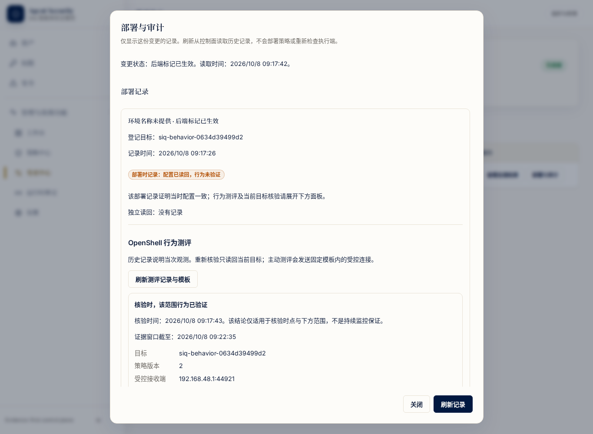

# OPT-09：企业 OpenShell 行为证据闭环验收

日期：2026-10-08。结论：OPT-09 在本任务书的适用范围内完成。范围为 DGX Spark／Linux、本机受保护 rootful Docker OpenShell 目标、企业 Control API 和 Web 控制台；不代表全部优化任务、生产身份系统或发行包验收完成。

## 产品结果

部署结果现在区分三类事实：部署时的配置读回、某次已采信的行为观测，以及重新核验当前目标所得的限定等级。用户可以查看运维批准的目标、接收端、允许／拒绝程序路径和轮数，确认后发起受控测评；只读账号可以查看历史并核验当前目标，不能发起主动探针。

后端不把 `accepted` 历史记录永久写成部署的 `enforcement_verified`。当前核验重新检查批准链、目标归属、模板、真实网关／策略和受保护程序，只有校验器接受已持久观测与当前事实时，才返回该时点、该范围的 `enforcement_verified`。策略变化、授权失效、过期、审计失败或无法核验时，返回 `unverified`。前端显示核验时间与证据窗口，到期自动撤去正向提示，刷新失败清除旧快照。

公开证据：[当前核验与浏览器联验证据](evidence/optimization-20261007/enterprise-behavior-assessment.json)。保留上一批[认证接口验收](optimization-opt09-api-validation-20261008.md)及此前协议、台账、保护检查和失败记录，不回写历史结果。

## 逐项验收映射

| 任务书 OPT-09 要求 | 实现和本次可核对证据 |
| --- | --- |
| 1. 区分只读验证与主动探针，固定模板／接收端 | history GET、profile GET、只读目标核验和主动采集分别授权；真实API与浏览器均验证viewer无主动权限；模板范围可见 |
| 2. 绑定目标、指纹、revision/digest、操作、窗口和程序 | challenge/v2、result/v3、父apply密封来源与独立容器／程序保护核验；数据库与公开观测逐项一致 |
| 3. 允许、拒绝、可达性对照，失败不冒充阻断 | 同一目标三轮：允许3/3、明确policy_denied拒绝3/3、主机前后对照6/6；不可达／缺样本／错状态反例保持拒绝 |
| 4. 确认实际binary路径归因及镜像工具身份 | 两路径同ELF、实际UID998、root保护路径／镜像／摘要核验；原拒绝路径显式授权后新挑战成功 |
| 5. 前后策略核验，过期／重放／伪造拒绝 | 既有协议、台账及本批范围／时间／模板hash测试；实际修改策略后当前核验从verified变为changed／unverified |
| 6. 持久阶段、未知／失败／超时及恢复 | prepare／claim审计提交后才联网，探测不持有数据库写事务；原ID重试与历史读取均不重放；前端丢失响应后仅查询原ID |
| 7. 校验后提升限定等级，UI呈现状态／范围／时间 | accepted专用校验入口不伪造running；短事务授权复核与核验审计；实际生产构建页面通过真实HTTP API显示核验等级与范围 |
| 8. 单列未验证路径 | UI和本报告明确仅该IPv4／CONNECT／程序路径；IPv6、重定向、其他程序、其他目标不继承结论 |

验收条款中的错误摘要、revision、目标、指纹、过期与重放由定向负向覆盖；真实目标的允许／拒绝差分、授权反转、策略变更失效和无探针重放由独立网关及接收端实测。没有把单纯DNS失败、timeout或服务停机算作有效策略拒绝。

## 新接口与兼容性

- `GET /api/v1/deployments/{id}/behavior-profiles`：只展示本租户／部署当前有效的运维模板投影，不披露其他部署条目。
- `deployment-behavior-start/v2`：在既有请求字段外绑定用户看到的 `profile_sha256`；批准文件变化或同ID更换摘要均拒绝。v1保留兼容，新增Web入口只使用v2。
- `POST /api/v1/deployments/{id}/behavior-assessment`：接受已保存verification ID，按当前真实目标重新核验，不发送回显探针、不重新领取或消费记录。新合同为 `deployment-behavior-assessment/v1`。
- 所有对象按验证身份定位租户；先404对象定位，再403权限判定；敏感响应no-store。审计缺失不能返回正向等级。

`valid_until` 是证据窗口上限，不是对未来策略或运行时不变的承诺。界面用“核验时，该范围行为已验证”描述快照，并保留部署时的配置读回记录。历史API仍固定返回 `current_enforcement_verified=false`，旧消费者不会收到永久缓存的正向当前等级。

## 验证批次

| 批次 | 结果 | 边界 |
| --- | --- | --- |
| 后端定向回归 | 154项通过 | 12项当前核验／模板API、13项既有采集API、25项协调器、37项台账、58项协议、9项认证截止时间；最后一次完整定向运行 |
| 前端定向 | 31项通过 | 21项新合同／时效／摘要绑定测试及10项部署历史与等级展示回归 |
| PostgreSQL | 48项通过 | 既有0032迁移与行锁，加5项当前核验审计、失败回滚、到期检查；观测为合成材料，数据库及事务真实 |
| 真实OpenShell／API | 13项运行检查、9项API检查通过 | 同一候选同次运行，检查有重叠，不累加为独立样本数 |
| 浏览器故障与窄屏旅程 | 9项通过 | 真实生产Web构建，API响应为明确夹具；覆盖到期、策略变化展示、刷新失败、丢失响应按原单查询、只读动作与390px布局 |
| 真实浏览器联验 | 通过 | Chromium → 回环HTTP Control API → 当前真实OpenShell读回／保护核验；未拦截Control API响应，viewer仅核验，没有主动probe POST |
| 构建与静态检查 | 通过 | `npm ci --ignore-scripts`、`VITE_DEV_MODE=false npm run build`；TypeScript编译、受影响Ruff和diff检查；测评面板独立加载 |

最终真实记录ID为 `opv-1696fd1ddf64472cb9c5bf4131e56d06`。独立只读查询确认唯一 `accepted/epoch2` 行、父apply revision/digest、原始观测和模板摘要一致；三条采集状态审计保留。三次当前核验审计分别为API verified、真实浏览器 verified、实际策略改变后的unverified。Deployment的历史等级仍是readback_verified。

实际12次探针收到9条允许／主机对照标识；真实浏览器的只读核验没有增加接收端流量。之后显式授权原拒绝路径，新挑战收到第10条标识。副作用与观测由独立接收端核对，没有模型裁定安全性。

## 浏览器实况

以下截图来自真实Control API与OpenShell联验；审批数据和RS256发行者为测试身份源。只读账号没有环境读取权限时，环境名称按现有权限规则隐藏。

[390px窄屏截图](evidence/optimization-20261007/enterprise-behavior-mobile-20261008.png)。界面可滚动、无横向溢出，保留时间、目标和限定范围。

## 开发问题与保留记录

- 首次构建命令误在仓库根目录执行，未生成产物；随后前端目录构建因本机 `VITE_DEV_MODE=true` 被安全门禁拒绝。显式采用false后构建通过，未修改用户环境文件或放宽门禁。
- `opt09-owned-assessment-browser-001`：实际采集与核验已执行，浏览器断言同时匹配历史范围和当前范围而失败。收窄到当前核验容器后修正；该失败批次保留，不计整批成功。
- `opt09-owned-assessment-browser-002`：端口预检报占用，没有启动网关。确认端口空闲后用独立003目录执行，通过；未结束未知进程，也未改写002目录。
- 003及前面的真实assessment批次、浏览器夹具批次分别保留，统计不合并为更多重复样本。没有因未变动的Go、模型或其他模块重复执行全量测试。

## 复现与清理

后端入口：在 `apps/control-api` 使用 `.venv/bin/pytest -q` 运行 `test_behavior_assessment.py`、`test_deployment_behavior.py`、`test_openshell_behavior_coordinator.py`、`test_openshell_behavior_journal.py`、`test_openshell_behavior_protocol.py`、`test_behavior_identity_expiry.py`，路径前缀均为 `app/tests/`。

前端入口：在 `apps/web` 执行 `npm test -- src/api/deploymentBehavior.test.ts src/api/changeExecution.test.ts src/ui/verification.test.ts`，以及 `VITE_DEV_MODE=false npm run build`。

PostgreSQL沿用 `scripts/enterprise-experience/behavior-postgres-check.py NEW_OUTPUT_DIRECTORY`。真实联验沿用owned网关工具的 `--behavior-api --behavior-web apps/web/dist`，显式指定已批准网关模板、二进制、镜像和探针摘要；输出目录必须新建。浏览器故障旅程使用 `python3 scripts/enterprise-experience/behavior-browser-smoke.py --web apps/web/dist --out-dir NEW_OUTPUT_DIRECTORY`。

本地原始输出在忽略目录：`opt09-assessment-postgres-001`、`opt09-assessment-development-001`、`opt09-behavior-browser-001`、`opt09-owned-assessment-001`、`opt09-owned-assessment-browser-001/002/003`，均位于 `var/optimization-20261007/`。公开JSON记录41份候选源码／合同摘要及实际Web执行资产摘要，基线为 `ee329bda`，基线SHA不单独代表本批实现。

所有已启动的自有网关、沙箱、网络、回显端、HTTP服务和浏览器已结束；临时PostgreSQL删除，私有模板／密钥目录清理。原网关模板和TLS摘要保持不变。没有模型调用，没有访问或变更日常业务数据库／服务。

## 完成口径与剩余项目任务

OPT-09的开发、负向回归、真实目标验证和前端接线条件已逐项满足，任务记done；总体10/16（62.5%）。研究候选未扩展实现，冻结测评与用户无关改动保留。

本结论不包括生产IdP／客户组织账号、HA／灾备、完整生产PostgreSQL和浏览器／OpenShell的同次整栈验收，也不包括远端CI、发行签名或main合并。真实链路使用合成RS256发行者与审批、独立开发SQLite，PostgreSQL有独立事务验收。持续监控、外部管理员带外修改后的即时推送失效、IPv6／重定向／其他路径不属于已证明范围；用户重新核验会读取当时实际状态。

OPT-08／10的日常Skill完整候选回归、OPT-11连接器交付、OPT-12钩子完整性、OPT-14进程隔离和OPT-15平台验收仍按原方案继续。本次完成一个任务不等于全项目完成，也不替代最终跨任务交付门禁。
