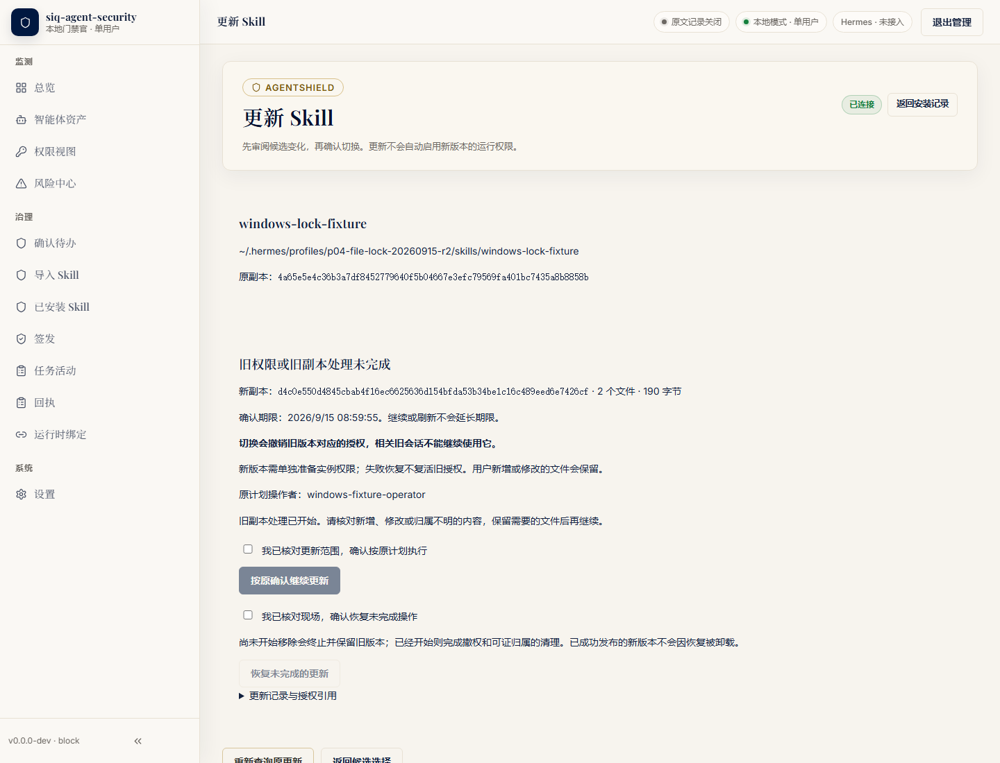
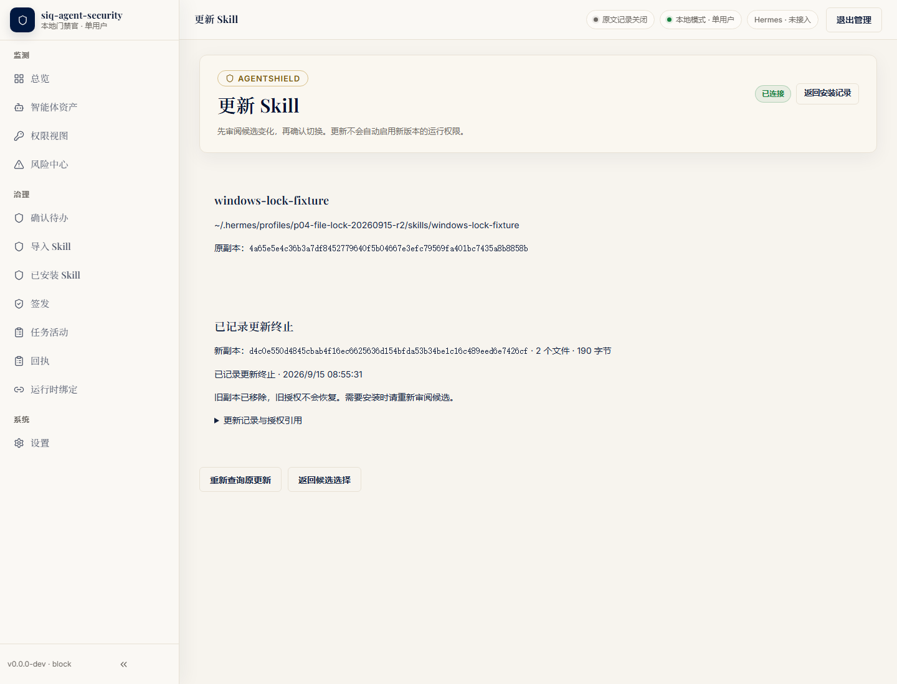

# Windows P04：文件占用导致部分移除后，按原 claim 恢复并终止更新

R2 在 Windows 11 x64、NTFS 上完成一次真实管理 UI 流程：可读文件句柄禁止删除共享 → 更新返回 HTTP 409 → 读回部分移除状态 → 释放句柄 → 沿原 claim 恢复，最终记录更新 aborted、旧目标缺席，安装池保留。13/13 项条件通过。这里使用合成 Hermes profile，Hermes 与 provider 均未运行；不构成三宿主 A/B、Windows native 宿主或运行保护验收。

源前后均为干净的 `b303c6f92392f3a44c306d81ad7323c6291ef4f2`，复用 Windows 二进制 SHA-256 `ee4b78c79bb2aee0d2ea1996ce8e937e9d8a0b320c77cabb3b71ef2b2233e470`。本批没有修改产品源码、产品合同或原三宿主矩阵。

| 尝试 | 实际结果 | 条件完成 | Node 退出／时长 | 恢复状态 |
| --- | --- | --- | --- | --- |
| R1 | harness 的 claim 比较断言失败 | 4/13 | 1／84.79 秒 | 未完成恢复，不能记产品失败 |
| R2 | 完整受控负向与恢复链通过 | 13/13 | 0／85.66 秒 | 同一 claim，aborted／removed |

R1 的比较器使用 `JSON.stringify`，会把对象键序差异误认成文档不同。留存的磁盘 claim.plan 与此前真实 API prepared plan 字段、类型和值相同，键序不同；旧比较器返回 false。R1 当次完整 pending GET claim 没有保存，不能补称其全字段相等或整轮通过。R2 仅将 claim_disk_matches_api、recovered_result_disk 两处改为 `node:util.isDeepStrictEqual`，对象键序无关、字段类型严格、数组有序；其余四个运行脚本原字节不变，全局 equal、grant 历史字节检查及 13 项业务条件未放宽。纯比较测试 3 正向、10 负向通过，包含 R1 留存 plan 的实际假阴性样本。细节见 [比较诊断](r1-comparator-diagnosis.json)。

R2 持锁后，实际 `SKILL.md` 已删除，52 B 的 `z-lock.txt` 保留原字节。两次 UI GET 读回相同的 removing_previous／cleanup_pending 状态，尚无更新或移除完成结果。旧 grant 的原有版本字节保留，revision 1/approved 只追加一版 revision 2/revoked；候选保持原 revision 1/approved，所有候选版本字节不变，没有安装或运行激活，也没有据此标记 effective。

释放句柄后，UI 恢复请求使用原 update/removal claim。结果为更新 aborted、旧移除 removed、目标 absent；旧 grant 继续 revoked，候选仍未安装，两个安装池文件及其原字节保留。恢复没有复活旧权限或安装新版。原件字段、比较文件及阶段摘要均有角色、长度与 SHA 可核对，见 [两轮摘要](attempts.json)。

两轮锁句柄都已关闭，Node 及浏览器 Job 都自然收尾：Job 共纳入 6 个进程，关闭前 active=0、terminated_by_limits=0，没有强制终止。管理服务均签名 stop、读回 drained、退出 0；没有超时或强杀。R1 未到达“释放后 DELETE access 校准”，该字段仍为 false，不把它解释为句柄未关闭。每批另有 28 次辅助命令观察：21 次退出 0，7 次 instance-status 退出 1；全部所持直接进程已回收，不能改写为全部命令退出 0。

| UI 观察到的 HTTP 状态 | R1 次数 | R2 次数 |
| --- | ---: | ---: |
| 200 | 184 | 183 |
| 201 | 6 | 6 |
| 401 | 1 | 1 |
| 404 | 1 | 1 |
| 409 | 1 | 1 |
| 429 | 2 | 2 |

这些是该 UI 的响应计数，包含后台请求；没有把 401、404、429 隐藏为“全部请求成功”。一次业务更新的预期错误严格为 409／skill_install_recovery_required。两轮均未模拟业务响应。

可复现步骤：在固定候选及二进制上新建独立受保护状态根和合成 profile；经真实 UI 导入、批准并安装含 SKILL.md 与 z-lock.txt 的 V1，再导入批准 V2并准备更新；对安装池同对象的 z-lock.txt 打开非继承、GENERIC_READ、共享 READ|WRITE、不共享 DELETE 的自有句柄，核读取成功与 DELETE access 返回 Windows 32；点击 UI 确认更新并核 409、两次稳定 GET、旧 grant 吊销和部分移除；关闭句柄并核 DELETE access 可取得，再经 UI 恢复原 claim；核 aborted、目标缺席、历史与候选字节不变，最后关闭浏览器 Job 并正常停止服务。过程不用真实 provider、宿主或日常配置。

以下为 R2 的五个运行脚本身份，用于核对私有执行输入；本包不公开绑定本机路径的 runner：

| 脚本 | SHA-256 |
| --- | --- |
| run-journey.py | `dee440067bd3859b7adc632be75f670402b1d54d509dba048bd526a7524281ed` |
| harness.py | `6079d59fd9db54e73a9a9ecc42b5bc07904ca961a294e226ca6be42f110ba013` |
| owned_job.py | `ec9c2a97a3a091e09690d4f4a2717c43cf43582094630d3b13fef92670a2ba35` |
| win32_lock.py | `b67540d0d1bcd87f9d1e6690dd1f766fd1acebfebf12c42a3247b292690941eb` |
| ui-journey.cjs | `07c5a71f0c35107e36cab72c6edc48ae51d395216901181dd8d8a20047b9bed5` |

R1 UI SHA 为 `413a0577055b388ef91ef3652fbfbd109481e0ab385b67445b1f8b94c561a595`；其余四文件与 R2 相同。两轮 manifest、脚本长度、原件工具及 Playwright 元数据角色摘要见 [运行输入](runtime-inputs.json)。五脚本与这些工具／元数据核对，不等于整个 Chromium 或 node_modules 依赖树冻结。

stdout/stderr 在运行中保存在有界内存，记录捕获长度、SHA 与 EOF 状态；私有落盘日志经过敏感过滤。本包只列 Node UI／管理服务四条流的捕获摘要及过滤日志文件摘要，不包含原始或过滤日志正文，也不能从过滤文本重建原始流。R2 三组比较记录在断言前独占保存；其中磁盘一侧为文档原字节，API 一侧为解析对象再序列化，并非原始 HTTP 流。业务签名、账号、SID、私有绝对路径和凭据均未复制到公开 JSON。

下列两图直接复制 R2 原截图，没有编辑。画面只含合成 fixture 的显示信息；“Hermes·未接入”不表示已执行宿主：

[独立实际复核](independent-review.json) 完成 79 项限定核验，三组文档的严格 JSON 内容、5 份授权修订、当前明列 25 份历史文件、安装池与源文件均一致。两个池文件的 Python/Node device 原值不同这一观察保留；同一固定 Node 的当前 device/inode 与原 Node 快照精确一致。独立复核不冒称完整操作前历史表或第二次进程生命周期测量。

[实际输出 Schema 校验](output-schema-validation.json) 中，8 份实际更新视图/claim/result 来源通过 12 份固定 b303 合同（Draft7、format checker、本地引用）。API 一侧为解析后重序列化。初始两版只读校验器的 grant URI/方言设置错误及最终按现有合同测试约定完成的修正均保留；合同未改，UI 未因此重跑。

[最终文件清单](manifest.json) 记录本包其它八份文件的精确长度与 SHA。两轮实际运行分别保留，不修改旧结果。本证据仅补文件占用后的更新恢复子旅程，不能将完整 P04 或三宿主验收记为通过。
