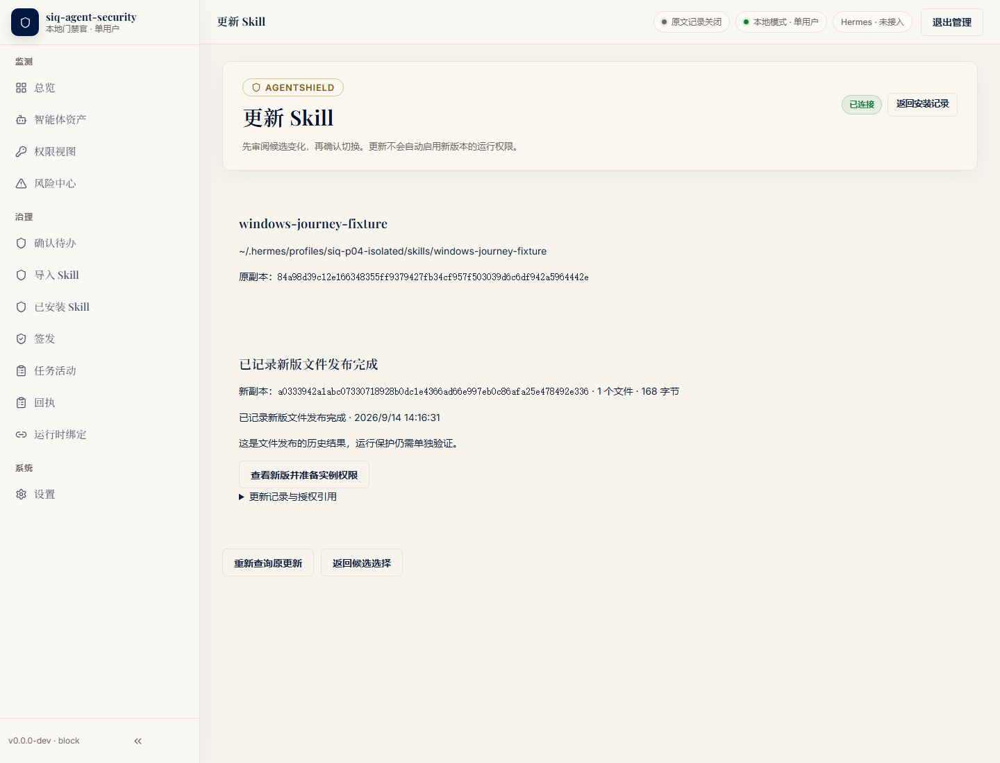
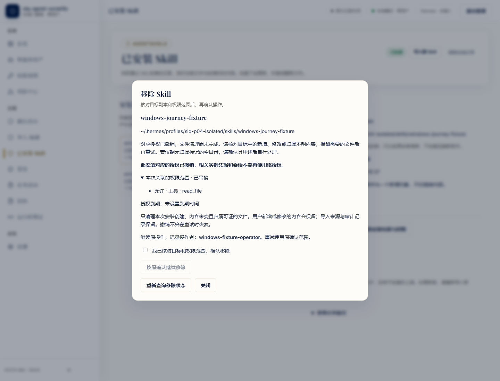
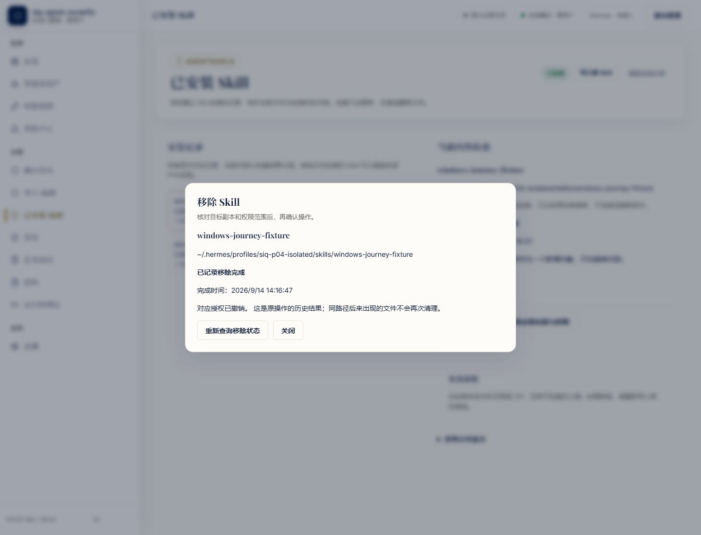

# Windows P04：本地 Skill 安装、确认更新与保留文件移除

在干净候选 `b303c6f92392f3a44c306d81ad7323c6291ef4f2` 上，本批使用真实 Windows SIQ 二进制和 Chromium 管理 UI，完成了一条本地 Skill 文件管理子旅程。最终 R5 退出 0，13 项流程断言通过；已安装文件、授权版本和历史记录均有磁盘摘要核验。**这只补充 P04/A08 的管理与文件事务证据，不能关闭 Windows、Hermes 原生执行或 N09 总验收。**

本机为 Windows 11 专业工作站版 10.0.26200、64 位、NTFS。R3 使用 Go 1.27.1 原生构建，二进制 SHA256 为 `ee4b78c79bb2aee0d2ea1996ce8e937e9d8a0b320c77cabb3b71ef2b2233e470`，VCS revision 与候选一致且 modified=false；R4/R5 在各自新私有目录中复用同一制品的完整字节，没有重新构建或修改产品源码。前端为该候选已跟踪的嵌入资源。本轮浏览器实际版本为 Chromium 141.0.7390.37，自动化使用既有 Node 22.20.0 与 Playwright 1.62.1。

| 实际步骤 | 结果与边界 |
| --- | --- |
| 配对、导入 V1、选择发现的命名 profile、审阅并批准 | 全部通过真实 UI；没有直接调用审批 API 的测试捷径。 |
| 预览并确认安装 V1 | 文件等于 141 字节 V1 输入，状态 installed_unverified。 |
| 导入并批准 V2、比较、准备、返回候选选择 | 取消前后旧文件及旧 grant 各版本字节不变；对应 update claim 不存在，签名预览保留。 |
| 再比较、再核对、确认更新 | updated_unverified；文件等于 168 字节 V2 输入；旧 grant revoked，新 grant approved。 |
| 添加本轮自有 user-note.txt 后确认移除 | cleanup_pending；授权已撤销，原安装文件和新增文件全部保留。 |
| 将唯一自有 note 移到本轮保留目录，再按原确认继续 | 使用同一 removal claim 完成 removed；目标目录消失，note 原字节保留，两份 grant 均 revoked。 |
| 历史与收尾 | 原输入/profile 配置未变；28 份最终历史文件摘要匹配。服务签名 stop 为 drained、exit 0；Node exit 0；浏览器 Job 最后活动数 0，无强制终止。 |

更新确认的浏览器操作耗时为 **28,535 ms**，包含点击、请求和响应读取，不是服务端性能基准。16 项业务写操作均返回 2xx；另有 GET `/v1/grants` 返回 **500 一次**、后台读取返回 **429 四次**、更新结果读取返回 404 两次，以及首次无会话恢复返回 401 一次。现有计数没有保存这些读取响应的正文或发生时间，不能确定 500 原因或关联到具体阶段；后续需定位，不能写成“所有请求无错误”。详见 [HTTP 观察](http-observations.json)、[最终摘要](summary.json)与[逐阶段事实](stages.json)。

先前尝试完整保留，见[尝试台账与原始摘要索引](prior-attempts.json)。A1/A2 是控制器误拒绝 Git 硬链接、误判预检自动创建的隔离 HOME/TMP，产品未运行。R3 已构建并执行到安装预览，随后因测试脚本把 Playwright `.check()` 误改为 `.checkAt()` 而停止，未发送安装 apply；其浏览器 Job 有强制收尾，不能改称自然退出。R4 成功安装并验证取消，但测试端仅等待 15 秒便中止更新；已有更新/移除 claim，旧授权已撤销、旧文件仍在，未取得更新完成结果。服务端允许该请求处理 60 秒，因此 R4 不证明死锁或服务端期限失败。R5 将响应观察上限设为 75 秒，覆盖服务端 60 秒处理与 65 秒响应期限，保留原操作期限及确认流程。

输入是原创合成 [V1](fixtures/v1-SKILL.txt) / [V2](fixtures/v2-SKILL.txt) 文本；用于复现时各置于独立来源目录并命名 `SKILL.md`。它们没有被执行。独立 Hermes profile 仅作为安装目标：未启动 Hermes、加载适配器、调用模型或生成运行回执；没有获得 effective 权限。V1/V2 不代表 N01 两个 SIQ 发行版本，本地重新导入也不证明上游自动检查。取消指确认前离开预览；note 的保存是测试操作者显式单文件移动，不是产品自动备份功能。

全部状态位于新建、受保护的三 ACE 私有根。配对码和会话信息仅在内存中传递，未纳入公开材料；浏览器页面请求未使用 mock。Job 用于管理本轮 Node 子树，不证明 OS 沙箱或每个后代进程身份。原始私密文件保持原位，公开 JSON 仅作字段白名单派生；三张截图经人工可视审阅后原字节复制，背景模糊来自产品对话框。原始材料摘要见 [来源索引](raw-source-index.json)，公开材料摘要见 [字节清单](verification.json)。同机独立代理复核不代表第二台机器复现。

复现顺序采用上表真实 UI 操作，使用新的 SIQ state、隔离 HOME 和命名 profile；保留完整失败现场，响应等待需覆盖产品自身期限。完整三宿主运行、可信 Skill 归属、失联拒绝、上游更新、N01 历史版本迁移和登录/重启等项目仍按各自证据管理；不更新原平台矩阵分母，不关闭共享 Issue #39/#42/#43/#51，不改冻结比赛快照。本 PR 仅提交本子批证据，未修订 runtime、安全合同或共享架构。

实际入口为固定 Go 的 `go -C apps/agentshield build -p=1 -trimpath -buildvcs=true -o <本轮二进制> ./cmd/agentshield`；随后公开 CLI `init --port <本轮端口>`、`serve --port <本轮端口> --mode block`、`status --port <本轮端口>`、`pair --port <本轮端口>` 和 `stop --confirm-stop`。控制器为 Python 3.13.7，全部产品 HTTP 写入来自上述浏览器 UI。此次只提交证据，没有 Go/规则包/合同实现变更；未以本批替代全模块测试、跨 OS 编译或输出 Schema 全矩阵验证。

