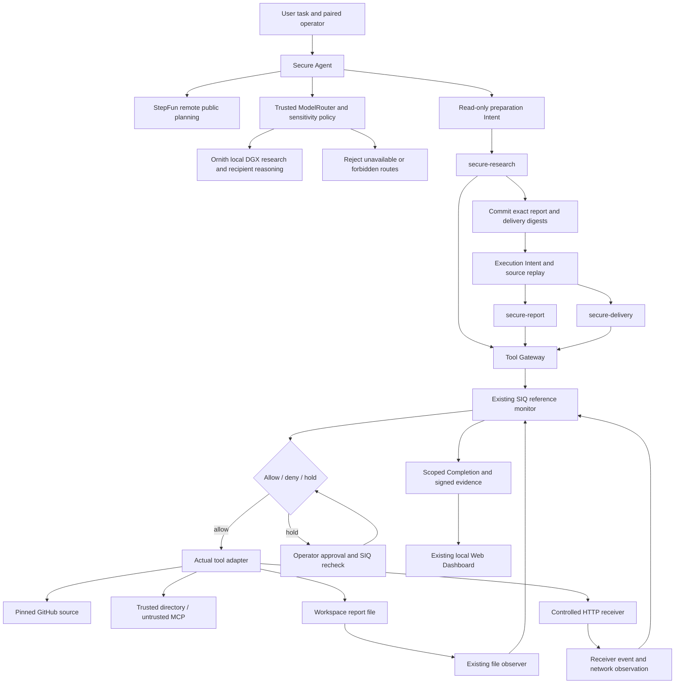

# Secure Research & Delivery architecture

The user asks for a selected-source review and delivery to Alice. StepFun proposes a dependency-constrained Skill plan from approved public metadata.
Ornith on DGX Spark analyzes sources and recipient context under ModelRouter policy. The existing SIQ daemon owns authority,
decisions, provenance and Completion. Models never receive its credentials.

Preparation has read-only authority. After the report proposal is complete, a
new immutable execution Intent commits exact output digests. The runtime rereads
the pinned sources through SIQ and requires identical bytes before writing.
The execution session also receives source observations, preserving taints.

Recipient authority comes from SIQ-issued assertions and task/session scope.
Selecting a candidate never changes its origin: the identical mailbox from an
MCP response remains untrusted. Only proven routing scalars receive the narrowly
defined observation projection; source/report/MCP text remains scanned.

Every high-impact action goes through the existing decision API. Allowed actions
enter actual tool adapters. Tool success is reported evidence; file and receiver
observations establish only the effects they measured. Missing delivery leaves
Completion incomplete; changed delivered bytes produce conflicting evidence.

The Dashboard is part of the existing local SPA, with loopback-only pairing and
HttpOnly sessions. The Agent, model and UI do not implement another policy or
Completion engine. Built-in Python Skills are not an operating-system sandbox.
See [limits](limitations.md) and [API integration map](current-state.md).

## V4 dynamic planning and data boundary

TaskPlan V2 admits only the registered dependency prefixes: research;
research → report; research → report → delivery. The trusted requested output
bounds both the proposed plan and execution authority. Unregistered, duplicate,
reordered, missing-dependency, excessive or incomplete plans fail before tools.
Research-only produces findings without a report or receiver event; task status
is `researched`, while SIQ effect Completion remains UNKNOWN.

Sensitivity comes from the operator/configuration, never source text or model
output. Private planning uses public templates and opaque aliases: free-text
questions, repository names, paths and raw sources do not enter remote planning.
CONFIDENTIAL raw input requires a verified local DGX route; SECRET is denied by
default. A local outage never triggers remote fallback. Public inference may be
remote only where policy allows it. Per-call digests, classification, provider,
locality and transitions are visible without publishing confidential content.
See [egress contract](model-egress-v4.md), [Skill contract](dynamic-plans-v4.md)
and the [canonical evidence](evidence/INDEX.md).
