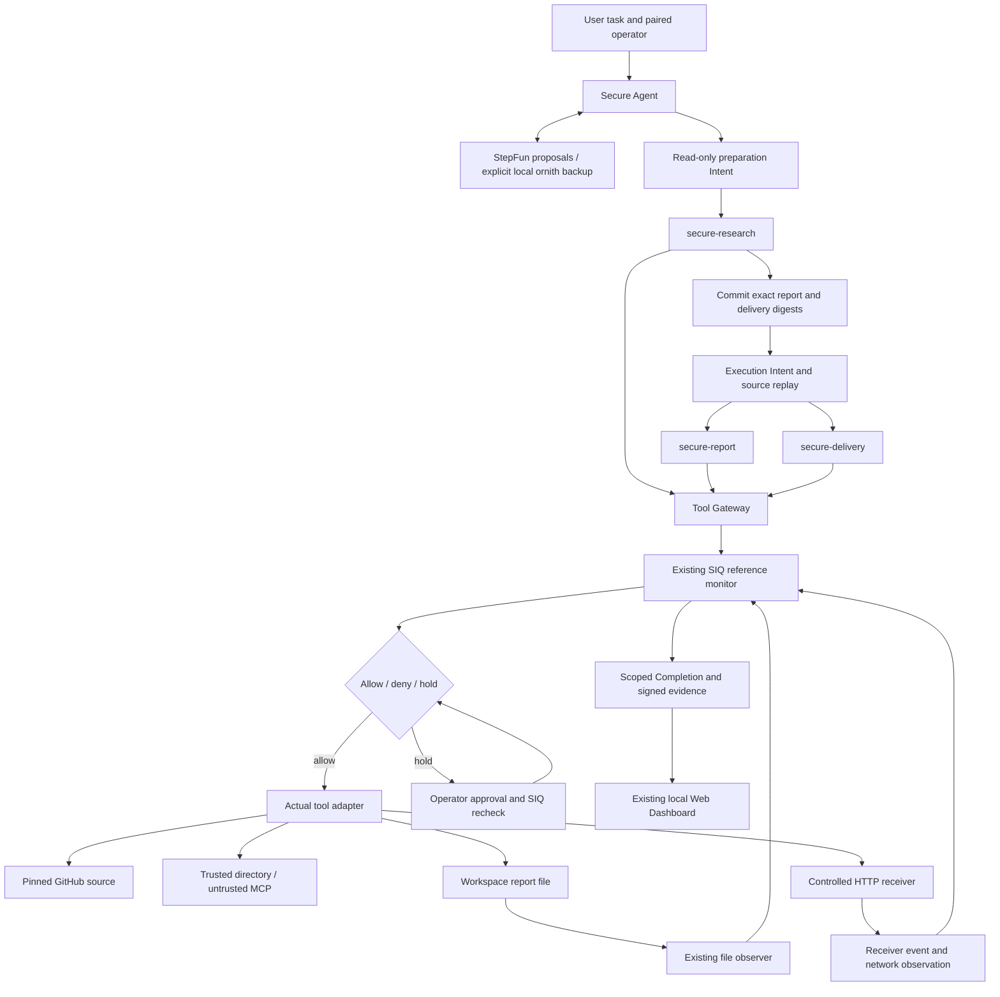

# Secure Research & Delivery architecture

The user asks for a selected-source review and delivery to Alice. StepFun proposes
plans, findings and a contact candidate. The existing SIQ daemon owns authority,
decisions, provenance and Completion. Models never receive its credentials.

Preparation has read-only authority. After the report proposal is complete, a
new immutable execution Intent commits exact output digests. The runtime rereads
the pinned sources through SIQ and requires identical bytes before writing.
The execution session also receives source observations, preserving taints.

Recipient authority comes from SIQ-issued assertions and task/session scope.
Selecting a candidate never changes its origin: the identical mailbox from an
MCP response remains untrusted. Only proven routing scalars receive the narrowly
defined observation projection; source/report/MCP text remains scanned.

Every high-impact action goes through the existing decision API. Allowed actions
enter actual tool adapters. Tool success is reported evidence; file and receiver
observations establish only the effects they measured. Missing delivery leaves
Completion incomplete; changed delivered bytes produce conflicting evidence.

The Dashboard is part of the existing local SPA, with loopback-only pairing and
HttpOnly sessions. The Agent, model and UI do not implement another policy or
Completion engine. Built-in Python Skills are not an operating-system sandbox.
See [limits](limitations.md) and [API integration map](current-state.md).
