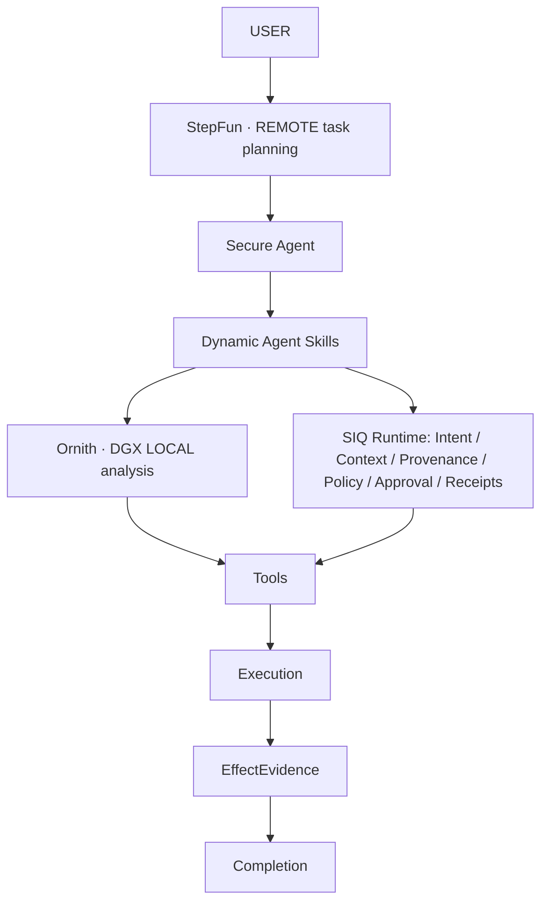

# Final competition architecture

[Current submission identity](final-submission-state.md). Architecture is frozen; this snapshot introduces no runtime changes.



```text
Effective Authorization
= Grant ∩ Intent ∩ TrustedContext ∩ ParameterProvenance ∩ RuntimeState

Decision → Execution → EffectEvidence → Completion
```

Models propose plans/actions; SIQ independently validates consequential execution. The diagram describes the existing closed Skill registry and mediated tools, not a new sandbox. Confidential source analysis stays on DGX under trusted classification; local failure does not authorize remote fallback. Tool-reported success alone cannot satisfy Completion. Scope and residual risks are in the current submission state.
