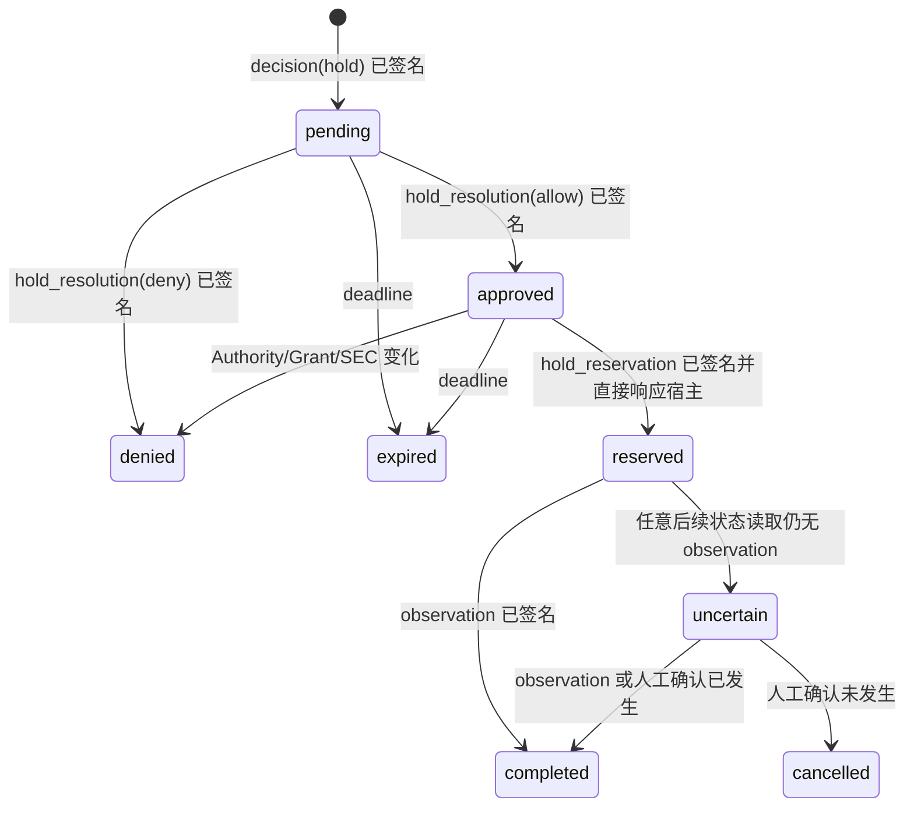

# N06：审批后的可信重试与执行预留（R02）

状态：组件设计与实现批次；原生宿主恢复验收未完成。

## 1. 问题与产品语义

Hermes 的 `pre_tool_call` 钩子不能暂停一个正在等待审批的工具调用。SIQ 返回 `hold` 后，宿主会终止
该次调用；用户批准只表示原动作可以在期限内重试，不表示原动作已经执行。用户再次发起同一动作时，
适配器必须引用原 hold，由服务端验证并原子预留一次执行，再允许宿主调用工具。

本设计不宣称 exactly-once。外部工具副作用与 SIQ 本地回执链无法组成同一原子事务：预留成功后若
进程或网络在结果落盘前中断，SIQ 只能判定 `uncertain`，必须查询外部事实或人工核对，禁止自动再执行。

## 2. 信任边界

- 原 hold decision、管理端 resolution、执行 reservation 和 observation 都写入同一签名追加链。
- 适配器提交的平台、主体、会话、任务、工具、原调用 ID、新调用 ID、最终参数及原回执引用均视为
  不可信输入；服务端必须与签名记录逐项匹配。
- 批准时和预留时分别重读当前 Intent/Authority、Grant、SEC、安装内容、期限及策略。批准不会绕过
  组织上限、硬拒绝、来源变化或服务失联。
- `authority_revision` 即使形似摘要也不授予跨会话、跨任务、跨主体或跨实例复用权。普通的新任务
  永远不能消费旧审批。
- 管理会话可以批准/拒绝；只有绑定实例的 decision credential 可以查询和预留执行。系统通知只展示
  脱敏摘要和打开本机 SIQ 的入口。
- 预留进入 `uncertain` 后，只有管理会话可以提交人工核对结论。核对请求必须绑定原 decision、
  reservation 的 ID 与签名哈希；它只追加结案记录，不能调用工具或重新激活旧预留。

## 3. 版本合同

### 3.1 预留请求

`hold-execution-reserve/v1` 绑定：

- 原 `action_id`、`decision_receipt_id`、`original_tool_call_id`；
- `platform/session_id/agent_id/task_id/runtime_task_id/tool`；其中 `task_id` 是可信 Intent 任务，`runtime_task_id` 是宿主任务，任一改变都不能消费同一预留；
- 新宿主调用的 `retry_tool_call_id`；
- 经 canonical JSON 计算后必须与原决策一致的最终 `params`。

服务端只允许已经批准且仍有效的 hold。签名 `hold_reservation` 记录必须在返回允许执行前持久化。
第一个预留成功后，任何相同或不同请求都不能得到第二个允许结果。响应丢失也不得通过重试预留来猜测；
调用方改为读取状态。

### 3.2 执行状态

`hold-execution-status/v1` 是只读投影：

| 状态 | 含义 | 后续动作 |
| --- | --- | --- |
| `reserved` | 仅原子预留响应直接返回；该响应是宿主执行一次的凭据 | 仅持有本次响应的宿主执行一次 |
| `completed` | 已有 observation，或管理员核实外部操作已经发生 | 不再执行旧预留 |
| `cancelled` | 管理员核实外部操作没有发生 | 旧预留关闭；新操作必须重新决策和批准 |
| `uncertain` | 已预留但没有 observation 或人工核对结论 | 查询外部事实或人工核对，禁止自动重试 |
| `denied` | 预留前 Authority/Grant/SEC/安装内容不再有效 | 不执行，重新建立授权流程 |
| `expired` | hold 或执行窗口到期 | 不执行，重新建立授权流程 |

状态读取必须重呈完整预留身份和 `reservation_receipt_id`。它不签发、延长或消费任何权限。

### 3.3 人工结案

`hold-execution-reconcile/v1` 只接受管理会话，绑定 `action_id`、原 decision receipt、reservation
receipt 及其签名哈希、`actor_id` 和二选一 `outcome`：`occurred` 或 `not_occurred`。服务端追加签名
`hold_reconciliation`。相同结论重试幂等读回，相反结论、已有 observation、错哈希或错引用冲突。
请求和回执均不接收外部结果原文；用户应先在目标系统核对文件、消息或远端状态。

## 4. 状态机与持久化点

链恢复只信任签名记录。缓存不得把 `uncertain` 降回 `approved` 或 `reserved`。未结案 reservation 不受通用 24 小时动作关联清理影响，必须跨窗口和重启保留、继续占用受限动作容量并出现在管理核对列表；容量耗尽时拒绝新决策，不能删除 uncertainty 换取可用性。超出动作窗口后不再接受普通 `Observe`，但管理员仍可在绑定原 reservation ID/hash 后记录人工核对结论。`Observe` 只能引用
reservation receipt；直接引用原 hold decision 即使已批准也不得完成。
`not_occurred` 结案后迟到 observation 视为冲突；两种人工结论都不会使旧 reservation 再次可用。

## 5. 原生宿主行为

Hermes 首次收到 hold 时保留原引用的短期内存映射并阻止调用。用户重试相同 session/task/tool/参数时，
适配器用新的宿主 `tool_call_id` 请求预留；只有 `reserved` 响应允许调用并把 reservation receipt 存入
post-hook 关联。宿主或适配器重启后映射丢失，默认重新走 hold，不能扫描历史记录自动执行。

OpenClaw/WorkBuddy 只有在确认其原生暂停/恢复 API 后才能映射为真正 resume；不具备该能力时与 Hermes
一样明确提示用户重试。平台自报“已批准”不是执行凭据。

## 6. 阶段验收边界

组件批次必须覆盖拒绝、超时、Authority/Grant/SEC 变化、参数篡改、跨主体/实例/Skill/任务、并发双
预留、daemon 重启、人工结案和结果重复送达。组件测试中的隔离临时文件证明预留方的可观察副作用
计数，不替代三个宿主的原生恢复；缺原生证据时 N06 保持 partial。
