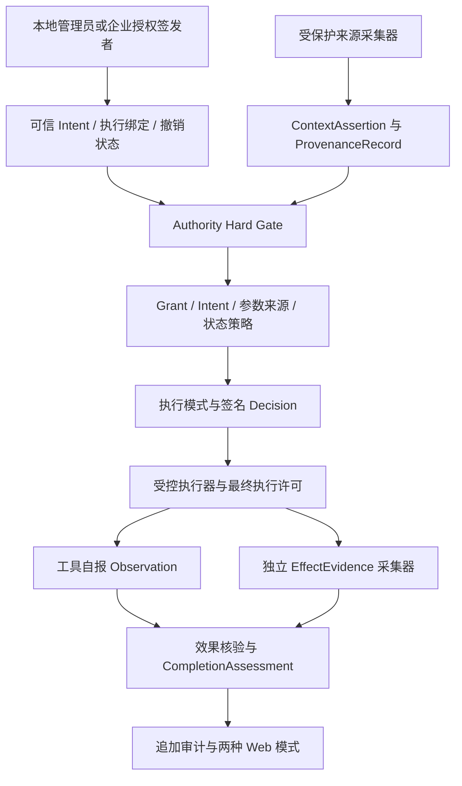
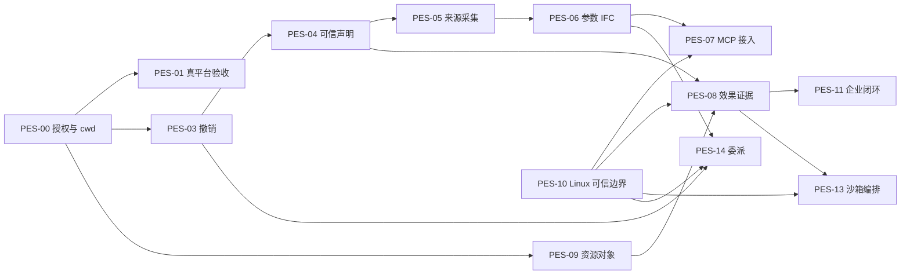

# SIQ Agent Security：前沿学术建议可行性评估与下一阶段开发计划书

> 阶段名称：Provenance-Bound Effect Security。本文将论文启发转化为适合当前代码基线的工程任务；不是已实现能力声明，也不是生产安全认证。

- 生成时间：2026-09-07 18:01:17 +0800。
- 基线：`main`，`1ffd809842adcb108db4813875fe34dd09d033d6`。
- 文档状态：**评估与实施建议已完成；下列新增开发任务全部待实施**。
- 本轮工作范围：建议阅读、代码核对、公开一手来源核查、隔离行为探针和开发计划编制。没有修改运行时代码、部署、调整 GitHub 规则或创建 Release。
- 执行原则：合同与 ADR 先行，先修可复现的权限边界，再扩展可信来源及结果验证；保留既有 Admission、Grant、污点、签名链和平台适配器。

## 1. 决策摘要

**总体可行，主线值得投入，但不能照搬原建议的能力评分、优先级和安全保证。** 当前项目具备足够的结构化授权、签名存储和回执关联基础，可以进入参数来源约束与独立结果证据阶段。完整的模型内部因果追踪、任意工具完全中介、跨平台对象安全及通用委派仍是大幅新增的系统工程。

建议采用三条相互依赖的工作线：

1. **授权与执行边界**：修正 Authority 与 audit/warn 的语义；停止使用调用方自报工作目录作为授权来源；补齐撤销、真实适配器验证及 Linux 执行身份隔离。
2. **可信来源与参数约束**：建立发行者及声明验证，先支持受控结构化数据来源和高影响参数，再增加有界来源图。无法验证来源的模型派生参数保持 unknown。
3. **效果证据与评测**：独立采集明确范围的文件、网络或服务端结果，区分工具自报与独立验证；从首期就加入攻击终点和正常任务效用评测。

对原建议作六项关键调整：

- **新增 P0：`context.cwd` 授权边界**。它已参与当前路径放行，并非仅是未来的 Context Attestation 风险，见 §3.2。
- **Hard Gate 是版本化语义升级**。当前 audit_only/warn 放行符合已写明的规格与测试；既要修引擎，也要更新 receipt schema、错误类别、适配器失联行为及 UI。
- **Managed Linux 前置到关键路径**。其最小设计和探针与 P0 并行，Linux 实现进入 P1；不能先宣称可信来源或独立效果，再把保护采集器的 OS 边界推迟。
- **研究评测从 P0 启动**。后续每个能力都需证明攻击减少且正常任务仍可完成，不能等功能全做完才补 benchmark。
- **Effect Evidence 采用多维描述**。`reported < observed < enforcement_verified` 不是可直接通用排序的安全等级；阻断证据、执行覆盖和业务效果成立是不同结论。
- **保留最小必要 UI**。不做新门户或装饰性页面，但必须让操作者分清“告警放行”“授权硬拒绝”“结果未知”和“独立证据通过”。

不采用“研发 8.7/10、生产 7.1/10”等主观分数作为立项依据。交付以明确威胁模型、可重复实验、支持矩阵和退出条件判定。

## 2. 输入、研究证据与适用范围

### 2.1 输入追溯

用户提供附件：`db2cd739-8a72-49db-83bd-0cf5a222a308/pasted-text.txt`，31,383 字节，SHA-256：

```text
a47f2becdc56a6270f2952f5838336d48a847e036538c0974873a03be7ff318a
```

附件称其作者阅读了论文 ZIP 和补充 XLSX。本次直接收到的是这份评估正文，**没有将“35 篇 PDF、42 篇论文、1006 页全文”作为本次已独立复核的事实**。本次核查聚焦于影响实施决策的一手论文摘要、规范与实际代码；未复现论文实验。

证据分级：

| 等级 | 本文含义 | 可支持的结论 |
| --- | --- | --- |
| A：当前仓库 / 直接验证 | 源码、规格、隔离探针、当前 SHA 的 CI 和 GitHub 查询 | 当前实际行为及已有测试范围 |
| B：原作者 / 官方公开资料 | arXiv 摘要、作者 SSRN 页面、官方协议和产品文档 | 方法方向、作者声称的边界、接口约束 |
| C：二手转述 / 尚未取得材料 | 附件评分、聚合站摘要、未获取全文的条目 | 研究线索，不作为已验证设计前提 |

### 2.2 研究启发与采用边界

| 来源及本次阅读层级 | 可借鉴内容 | 本项目采用方式与限制 |
| --- | --- | --- |
| [AuthGraph 原作者摘要](https://arxiv.org/abs/2605.26497)，B | 将授权基准与执行来源分开比较 | 采用“参数值与来源双约束”；不把模型生成的归因图视为权威，不照搬其实验安全保证 |
| [NeuroTaint 原作者摘要](https://arxiv.org/abs/2604.23374)，B | 离线研究显式传播、语义影响和记忆持久性 | 可进入离线审计实验；不放到在线最终 allow/deny 路径，不宣称确定性追踪解决全部语义影响 |
| [Context Attestation 作者页面](https://papers.ssrn.com/sol3/papers.cfm?abstract_id=6938859)，B | 在策略判断前验证上下文声明 | 建立有作用域的发行者、请求绑定与重放防护；签名不证明声明内容真实，也不能修复被攻陷的权威来源 |
| [SafeClawBench 原作者摘要](https://arxiv.org/abs/2606.18356)，B | 区分语义接受、审计证据、可执行状态危害 | 用分阶段终点评估 SIQ；本文 D0–D5 是拟定的项目协议，不声称是原论文原始分级 |
| [Code-agent security survey 出版商公开页面](https://www.sciencedirect.com/science/article/pii/S0950584926002776)，B | 跨工具、记忆、供应链及自适应攻击的评测缺口 | 纳入测试轴；82 篇研究是该综述自身报告的范围，不等于本次逐篇复核 |
| [MCP 2025-11-25 安全实践](https://modelcontextprotocol.io/docs/2025-11-25/tutorials/security/security_best_practices)，B | 协议认证、凭据及信任边界 | 固定所支持的协议版本并测试；MCP 安全接入与内容授权必须分别验证 |
| [MCP 2025-06-18 Tools 规范](https://modelcontextprotocol.io/specification/2025-06-18/server/tools)，B | 工具 annotations 的信任限制 | tool description / annotations 不直接提升权限；不同版本单列兼容矩阵 |
| [OpenShell 官方策略文档](https://docs.nvidia.com/openshell/sandboxes/policies)，B | 静态与动态策略能力不同 | 只作为集成方向；本仓版本、CLI 及探针结果仍是实际能力依据，不能把官网当前能力倒推到现有部署 |

Behavioral Sandbox、MCP Retrieval Injection 的原附件链接属于聚合来源；本次搜索找到条目信息，但未取得足以复核方法与实验的原始全文。`ClawFuzz`、`IBBC-Guard`、SoK 及原附件其余未逐一核查的论文，统一保留为 C 级研究线索。不得将二手 ASR 数字或未经复现的算法细节写入本项目验收指标。`OpenClaw in the Wild` 出版页面本次读取失败，本文不据此宣称完成论文核查。

## 3. 当前项目事实核对

### 3.1 代码、交付与验证状态

| 核查项 | 当前事实 | 证据 |
| --- | --- | --- |
| 本地与远端基线 | 本次开始时工作区干净；本地 main 与 GitHub 查询 SHA 均为 `1ffd809…` | `git status` / `git log` / GitHub branch API |
| 当前 CI | 最新 SHA 的 CI 为 success | [run 34103966603](https://github.com/maoyadongsh/siq-agent-security/actions/runs/34103966603) |
| Trusted Intent V2 | 本地管理签发、不可变 Store、签名绑定、参数/资源约束、可信主体与引用已经实现 | [intent](../apps/agentshield/internal/intent/)、[管理 API](../apps/agentshield/internal/server/intent_http.go) |
| 动作和恢复 | Decision/Observe 强关联、有界窗口、任务序号、迟到结果隔离、进程强杀恢复测试 | [action_state.go](../apps/agentshield/internal/receipt/action_state.go)、[强杀测试](../apps/agentshield/internal/receipt/crash_recovery_test.go) |
| 来源能力 | provenance_refs 为可信 Intent 的预留引用，没有参数级采集协议、IFC 或 Provenance DAG | [Contract](../apps/agentshield/internal/intent/types.go)、[V2 进度报告](trusted-intent-v2-progress-20260907-164919.md) |
| 效果证据 | Observe 校验关联与幂等，结果来自适配器；不独立证明 OS 或 SaaS 效果 | [Observe](../apps/agentshield/internal/receipt/action_state.go) |
| OpenShell | 本地适配器以网络策略及读回为主，最高结论是 readback_verified | [types.go](../apps/agentshield/internal/openshell/types.go)、[ADR-005](adr/0005-openshell-adapter.md) |
| OS 边界 | desktop-same-uid 为默认；managed-linux 未实现 | [能力 profile](agentshield-capability-profiles-v1.md) |
| 文件语义 | Runtime Resource 当前使用 POSIX 绝对路径，拒绝反斜杠 | [resources.go](../apps/agentshield/internal/runtimeaction/resources.go) |
| 企业集成 | 现有 controlsync 上传盘点；不是企业签发 Intent、下发授权及回传效果的完整链路 | [sync.go](../apps/agentshield/internal/controlsync/sync.go)、[Control API models](../apps/control-api/app/models.py) |
| 前端 | 同一 `apps/web` 工程内存在企业及 local 两种应用入口 | [src/App.tsx](../apps/web/src/App.tsx)、[src/local/App.tsx](../apps/web/src/local/App.tsx)；本阶段沿用两种模式 |
| 研究评测 | Skill eval JSON 有 7 个条目；另有大量工程测试，两者不能混算为研究 benchmark | [evals.json](../skills/siq-agent-security/evals/evals.json) |
| 仓库治理 | branch API 返回 protected=false，main 适用 rules API 返回空数组；Git 索引无 CODEOWNERS | 本次只读 GitHub / Git 查询；不据此推断其他组织治理全部缺失 |
| 最新正式发布 | `siq-agent-security-v0.2.0`，发布于 2026-09-05T17:16:47Z，早于 V2 提交 | [Release](https://github.com/maoyadongsh/siq-agent-security/releases/tag/siq-agent-security-v0.2.0) |

上一轮报告记录 Go 全量/race/vet、四目标构建、Python 501 项、Web 11 项及构建通过。本次是计划评估，未重新跑全部门禁；重新核实了当前 CI，并运行 §3.2 的定向隔离探针。4096 绑定 P99=0.300265 ms 来自已有 [本地基线](evidence/intent-v2/local-20260907-164553-direct-bindings-4096.json)，只代表查找微基准。

### 3.2 两个需要优先处理的行为

**A. required 与 audit/warn：已确认行为，需修订合同语义。**

[engine.go](../apps/agentshield/internal/receipt/engine.go) 在 authorityErr 后设置 deny，随后 enforcement mode 会将其转换为 allow。现有 `TestRequiredIntentAuditProducesSignedWouldDeny` 专门验证这一行为；[receipt.schema.json](../packages/contracts/receipt.schema.json) 的 allOf 还规定 audit_only 的 action 只能是 allow。

本次隔离探针结果：

| Intent 配置 | 运行模式 | 缺失绑定时 actual action | reason_code |
| --- | --- | --- | --- |
| required | block | deny | intent_binding_missing |
| required | warn | allow | intent_binding_missing |
| required | audit_only | allow | intent_binding_missing |

因此不能将其简单描述为“测试遗漏的代码 bug”。需要制定新语义及迁移规则，同时修引擎、合同、适配器与 UI。即使 Authority Hard Gate 完成，**warn 下的普通策略约束仍可能只告警**；不能把“权威合法”宣传为“所有动作都在策略范围内”。

**B. 自报 cwd：可影响现有路径授权，应从 P1 提升到 P0。**

`evaluate()` 读取 `req.Context["cwd"]`，`pathGranted()` 将该目录下的非凭据路径视为允许。隔离探针使用正常生成的测试 Grant、`enforcement_mode=block`、optional 未绑定会话和已获授权的 `exec` 工具，仅传入一段用于评估的命令字符串：

```text
echo sample > /outside/report.txt
```

| 输入差异 | 实际决策 |
| --- | --- |
| context.cwd=/home/u/proj | deny / grant_scope_violation |
| context.cwd=/outside | allow / allow |

探针没有执行上述命令，也未创建 `/outside/report.txt`；只调用 Engine.Decide，签名状态写入测试临时目录。临时 Go 测试文件已移除。该结果证明：**拥有 Decision 调用能力且已获相关工具权限的客户端，可以利用自报上下文扩大这一条路径判断的放行范围**。它不证明突破了所有 Grant、已绑定 Intent、凭据路径保护或 OS 隔离。

修复应将 workspace/cwd 从“调用方声明”变成“管理绑定或受保护执行器确认的工作目录”，并检查 legacy Grant 的字符串路径判断、`..`、别名与资源规范化是否一致。客户端值最多作为一致性提示，不能新增授权。

## 4. 对原建议的逐项裁定

| 原建议 | 可行性裁定 | 调整后的优先级 / 交付方式 |
| --- | --- | --- |
| Authority hard-gate | 采纳，需版本化且端到端执行 | P0；先定义错误类别，再迁移 receipt 和 adapter |
| 三平台真实 V2 E2E | 采纳，是能力宣称的前置条件 | P0；Linux 先做，平台未通过则保留 unverified |
| Branch protection / CODEOWNERS | 采纳 | P0；准备配置，按实际仓库权限与审核人员设置，不能只有文件没有生效规则 |
| v0.3 RC | 有条件采纳 | 在 P0 退出条件满足后准备候选；RC 不等于 production supported |
| 参数级 Provenance / IFC | 采纳受限版本 | P1；受控结构化来源、可信变换和高影响参数，非通用语义因果追踪 |
| source taxonomy | 修改后采纳 | 分离来源类型、完整性、授权范围、敏感度；SECRET 不是来源类型，USER 不是自动可信 |
| Context Attestation | 采纳 | cwd 立即修；通用声明发行者、作用域、有效期、请求绑定进入 P1 |
| MCP lifecycle mediation | 分段采纳 | 首期一个受控 MCP 接入路径，服务器身份与工具描述摘要固定；不宣称覆盖全部 MCP 能力 |
| EffectEvidence | 采纳受限效果域 | P1；先做独立测试端点/对象验证，再接供应商审计 |
| reported < observed < enforcement_verified | 不原样采纳 | 替换为证据来源、验证结论、执行覆盖三个维度，避免“成功日志=强制隔离” |
| 网络最终目的地 | 采纳，需执行点配合 | P1；连接/重定向时再授权，证据不能代替阻断 |
| Windows ResourceNormalizer | 采纳分层版本 | P1 词法规范与拒绝边界；P2 实机句柄、reparse point、junction 验证 |
| Managed Linux 放 P2 | 调整 | P0 定义边界与探针，P1 实现；强保证依赖它 |
| Behavioral Sandbox | 有条件采纳 | P2；OpenShell 编排器，绑定预览环境与正式执行，防止两次执行不等价 |
| Delegation DAG | 采纳最小衰减授权链 | P2；先链后 DAG，不能对任意 regex/policy 直接宣称可判定包含关系 |
| SafeClaw/ClawFuzz 风格评测放 P2 | 调整 | P0 建框架并贯穿各期；具体外部算法需取得原文、许可后评估 |
| 企业和本地统一 Authority | 采纳共同语义，保留不同信任根 | P1 冻结合同，P2 完成企业发行/离线/撤销/汇聚；不重写现有 PermissionFact/DesiredPolicy |
| 不再做更多 UI | 部分采纳 | 不扩展泛化门户；保留管理签发、来源授权、证据状态与审计必要界面 |
| Cross-session IFC / TEE / Neural Taint | 暂缓核心工程 | 研究池，单独立项；必须先验证前述主线收益 |

## 5. 目标架构与安全不变量

### 5.1 目标链路（全部新增块均为计划）



在线授权与执行后核验必须分开：

```text
AuthorityValid(request, identities, assertions, revocations)
    AND PolicyAllows(grant, intent, verified_parameter_bindings, runtime_state)
    AND ExecutionBindingStillValid(action_digest, object, policy_revision)
    → permit execution

independent evidence + expected effect predicate
    → satisfied / violated / unknown / conflicting assessment
```

有委派时才额外评估 Delegation；没有委派的本地调用不能被要求伪造一条空委派记录。未来效果尚未发生，不能作为前置授权已满足的事实。

### 5.2 必须保持的不变量

1. 模型、工具返回、MCP description、普通 adapter context 不能签发、替换或扩大 authority。
2. 授权、数据来源、结果采集三种发行者的签名用途必须隔离；持有公钥映射不等于有权签全部声明。
3. 只有通过身份、scope、用途、时间、重放及撤销检查的声明才可参与安全关键判断。
4. 关键参数必须绑定实际将执行的值；不能仅检查一个来源 ID，随后执行模型提交的另一个值。
5. 绑定与污点状态不得通过 LRU、重启、换 session 或删除缓存假装 clean；缺必需证据时拒绝受保护动作。
6. Receipt hash chain 证明当前可见前缀完整性；完整历史、防删除、防回滚仍需独立锚点和受保护状态，不能由签名自行保证。
7. EffectEvidence 不能自动把 PermissionFact 提升为 effective，不能绕过后端读回或企业审批。
8. 沙箱预览不是正式操作授权；正式执行前重新校验授权版本、对象身份和预览绑定，不双重执行不可逆 SaaS 操作。
9. 所有新增存储、图遍历、重放窗口和采集队列有预算；容量耗尽不得漏掉污点后继续放行。
10. 强安全声明必须限定 profile、OS、平台版本、效果域和采集覆盖；same-UID 模式不承诺防恶意 Agent 移除监控。
11. 保持仓库独立：企业集成只经合同/API/事件；不直接 import 兄弟仓库 internal 或读其数据库。

## 6. 关键设计与合同方案

### 6.1 Authority Hard Gate：错误分类、迁移及适配器联动

建议将统一的 `authorityErr` 拆成结构化评估结果，至少包含 `category`、稳定 `reason_code`、`hard_deny`、`evidence_refs`；不能根据 reason 字符串前缀决定是否硬拒绝。

| 类别 | 示例 | 新语义下 audit_only / warn | block |
| --- | --- | --- | --- |
| 协议/身份完整性错误 | 非法请求、未认证客户端、未知必需版本 | 拒绝；无法安全签回执时返回协议错误，执行器仍不得执行 | 拒绝 |
| 权威缺失或无效 | required 缺绑定、签名/digest 错、过期、撤销、issuer/scope 不符 | 硬拒绝，不产生正常成功 Observation | 硬拒绝 |
| 绑定完整性错误 | principal/agent/task 替换、伪造必需上下文或参数引用 | 硬拒绝 | 硬拒绝 |
| 合法权威下的普通策略不满足 | 普通工具/资源范围、风险规则、污点策略不满足 | 可以告警放行，明确 advisory；不宣称这些约束已强制执行 | deny/hold/redact |
| 无 Intent 且明确 optional | 无绑定、无粘性 bound 状态 | 沿用 Grant 与模式语义，显示 unbound | Grant 与 RuntimeState 决策 |
| 显式 mandatory 参数来源约束 | 高影响 sink 的必需来源证据缺失、无法验证 | 不可通过普通 rollout 模式降级；硬拒绝 | 硬拒绝 |

**版本方案：**新语义使用明确的 authority semantics 版本，并引入 `receipt.v2`，保留历史 v1 验签。因为当前 v1 schema 不允许 audit_only 下 actual deny，不能直接原地改其 allOf 再称历史语义未变。新安装默认严格语义；managed profile 只接受严格语义。现有 `required + warn/audit_only` 配置升级时必须显示或阻止歧义组合，不得静默把“模拟模式”解释为已强制执行。迁移需要提供旧行为报告、显式配置转换和回滚条件。

**端到端要求：**新引擎的有效 hard-deny 可通过明确的 Decision 响应交给适配器。当前 adapter 遇到 HTTP 非 2xx、超时或不可达时，warn/audit 可能放行，因此不能只把错误改成 HTTP 403。严格执行 profile 需要安装时固定最低协议/语义版本，daemon 不可达、版本不足、响应非法时拒绝执行；不能从当次不可达的服务临时获知自己是否应 fail closed。该 profile 配置在 managed-linux 下必须由受保护边界持有。

### 6.2 可信执行上下文与发行者

新增 `ExecutionBinding` 将 platform/session/agent/task 与管理确认的 workspace、执行身份、资源语义版本绑定。`cwd` hint 若与绑定矛盾应拒绝或记录不一致；不能更新 binding。POSIX 路径清理在统一入口完成，legacy Grant 和 Intent matcher 使用同一资源语义，不凭字符串前缀扩大权限。

建议合同：

| 拟新增合同 | 核心字段 | 信任与兼容要求 |
| --- | --- | --- |
| `trust-bundle.v1` | issuer_id、kid、公钥、用途、claim 类型、scope、有效期、bundle revision | 根由本地安装管理或企业受信根确认；bundle 签名密钥不由 Agent 提供 |
| `context-assertion.v1` | issuer/kid、claim_type、subject、audience、tenant/environment、request_binding、value_digest、issued_at/not_before/expires_at、nonce、evidence_ref、signature | 使用范围必须比签名范围更细；重放、未知 claim 和跨租户引用拒绝 |
| `execution-binding.v1` | session/task/agent/platform、workspace/object semantics、executor_identity、authority revision | 由管理/受保护执行器生成；决策客户端只引用 |
| `authority-revocation.v1` | object identity、issuer、revision/epoch、revoked_at、reason_code、signature | 追加式 tombstone；不能删除旧文件来实现撤销 |

ContextAssertion 是经过认证的声明，不自动等于硬件远程证明。对动态 cwd、进程身份、MFA、角色等采用不同发行者及新鲜度要求。历史已认证用户文本仅证明接收来源，不证明其内容或指令永远有权。

### 6.3 参数来源与最小 IFC

来源标签拆成四个正交维度：

| 维度 | 示例 | 规则 |
| --- | --- | --- |
| origin_kind | authenticated_user_input、system_policy、tool_result、mcp_result、web_content、memory、model_output | 描述产生位置，不隐含授权 |
| integrity | attested、reported、unknown | 有有效签名也需检查签名者是否有该用途权限 |
| authority_scope | issuer + tenant/task + claim/sink + audience | 同一数据库字段可以对项目 ID 有权威、对转账账户无权威 |
| sensitivity | public、internal、confidential、secret、unknown | 与来源可信度独立；可信数据库同样可能含恶意或敏感内容 |

**首期最小可验证范围：**可信采集器接收结构化源对象，保存受保护的临时对象或对象引用；允许白名单确定性变换，如 JSON Pointer 提取、指定格式解析、批准映射。变换执行器记录父引用、输入/输出 digest 和版本。模型生成的自由文本、总结、翻译、未覆盖编码操作一律不自动获得完整 lineage。

新增 `ProvenanceRecord` 与 `ParameterBinding`：前者描述来源对象及受控变换，后者把 `/recipient` 等参数路径、将执行值的 digest、source refs、变换版本绑定到 action proposal。服务端重新解析源对象或验证受保护执行器见证；仅由客户端宣称 refs 不成立。存储只追加，按复合 scope 寻址，禁止跨 tenant/session 借用相同文本或 ID。

最有价值的执行方式是**在受控工具网关中从已验证引用构造高影响参数**。例如 recipient 从管理批准的联系人 ID 解析；模型可以提议“发送给 Alice”，但不能把未经验证的外部映射作为 Alice 的真实地址。即使两个字符串相同，也只能证明值匹配，不能证明完整模型因果来源。

首期 sink：`recipient`、`destination_host`、`filesystem_target`；`payment_account`、`credential_ref`、`deployment_target` 在对应受控工具和真实业务验收完成后启用。规则必须同时满足参数值/资源约束与来源资格，不允许“来源可信所以忽略 Intent scope”。

保留 session taint 作为保守下限。来源缺失、不完整图或模型语义变换不能清除既有污点。declassification 只能来自作用域明确的管理批准，生成新记录，不改写父标签。

### 6.4 EffectEvidence：结果真实性与执行覆盖分别表达

首期可沿用已有 decision/observation，增加独立 `effect-evidence.v1` 和 `completion-assessment.v1`，避免一次性重写整条回执链。建议字段：

```text
evidence_id, schema_version, action_id, decision_receipt_id,
execution_attempt_id, executor_identity, collector_identity,
collector_kind, effect_kind, resource_ref, expected_predicate_ref,
observed_at, source_event_id, coverage, gap_reason,
policy_revision, evidence_digest, signature
```

| 维度 | 建议值 | 禁止混淆 |
| --- | --- | --- |
| evidence_origin | adapter_report / protected_executor / independent_provider / test_oracle | daemon 给 adapter 结果签名，不会改变其 origin |
| assessment | satisfied / violated / unknown / conflicting | 无日志或超时只能 unknown，不能当作没有副作用 |
| mediation_coverage | declared / partial / verified_for_scope | `verified_for_scope` 只对指定路径、时间窗和攻击集成立 |

多个 EffectEvidence 可以关联同一 execution_attempt；按 collector + source_event_id 去重。冲突证据保留并报警，不能覆盖先前证据；规则重算产生新 assessment。CompletionAssessment 不额外授权下一动作，也不能自动关闭需要人工审批的任务。

文件首期验证受控临时工作区的创建/写入：比较句柄对应对象、前置状态与后置摘要；必须处理符号链接、路径替换和 TOCTOU。网络首期使用受控代理及独立测试服务：连接目标与重定向逐跳再授权，记录丢失时结论 unknown。邮件等 SaaS 后续用独立查询权限或供应商审计；同一工具返回的 message ID 仍需二次验证，且“供应商接受”不等于“收件人已收到”。

### 6.5 合同版本与身份命名空间

- Intent V2 的 provenance_refs 继续按历史引用处理；新增 mandatory parameter source policy 等会改变授权语义的内容使用拟议 `intent-contract.v3`，未知必需约束拒绝，不做忽略字段的“兼容”。
- 新 RuntimeAction 使用明确 normalization/semantics version；保留旧 ActionID 算法和旧回执验签，不能对旧证据重新计算新 ID。
- 企业下发需要 issuer/kid、tenant/environment、audience、信任 bundle revision；本地单公钥 Store 不能仅加一个 issuer 字符串就变成多发行者系统。
- 不同 issuer/tenant 下同名 intent/source ID 必须区分。跨语言共用 canonical/signing 向量，规范化规则如需改变必须单独版本化。
- 新证据保留摘要和有限脱敏说明；为可重放而临时保留的源对象必须有 TTL、配额、加密或受保护存储边界，不进入常规日志、Outbox 或导出正文。

## 7. 可执行工作分解（WBS）

以下编号统一为 **PES-00 至 PES-15**，与历史 DEV01–DEV18 分开。所有工期都是工程估算，不是承诺；每个工作包需拆成若干可独立审阅的小 PR。负责人用角色表示，不虚构已落实的人员。

### PES-00：授权硬门禁与可信工作目录（P0）

- **目标**：消除 required 模式的语义歧义，并关闭自报 cwd 扩大路径授权的问题。
- **改动范围**：`internal/receipt/{engine,intent}.go`、`internal/runtimeaction/`、`internal/server/`、`internal/state/`、receipt 新版本合同、三类 runtime adapters 及内嵌副本、Web 设置/回执。
- **开发子项**：00-A 编写语义 ADR 与旧/新矩阵；00-B 把身份完整性、必需权威、普通策略结果分开；00-C 管理侧绑定 workspace，统一 legacy Grant 与 Intent 的路径规范化；00-D 适配器协议/profile 协商及严格失联拒绝；00-E 配置迁移、历史验签及 UI 文案。
- **依赖**：现有 V2；00-A 先于其他实现。通用 ContextAssertion 不应阻塞 cwd 的最小修复。
- **验收**：required × 三种模式中，无效权威全部拒绝；optional 无绑定的约定行为可验证；伪造 cwd、根目录、`..`、双路径别名不能扩大范围；旧回执验签保持；严格 adapter 遇服务失联/非法响应/旧版本拒绝执行；deny 不能通过 Observe 或 Hold 转成成功。
- **产物**：ADR、版本合同、迁移命令/说明、至少上述攻击反例及合法用例；范围内所有消费者同步。
- **负责人 / 估算**：Go 安全工程师主责，平台与前端配合；6–10 人日。

### PES-01：Hermes / OpenClaw / CodeBuddy V2 真平台验收（P0）

- **目标**：证明 hook 实际加载且拒绝能阻止工具执行；不以 mock 回调代替平台证据。
- **范围**：`adapters/runtime/*-agentshield/`、`internal/adapterinstall/`、`internal/adapters/`、`docs/evidence/agentshield/`；在隔离 HOME/状态目录与专用测试实例中运行。
- **子项**：固定平台版本及安装包摘要；安装/启用/卸载恢复；管理签发→绑定→合法调用→越权调用→Observe；并发/重复 ID/进程型 hook；hold 审批和拒绝；daemon 重启与超时；独立文件/测试服务见证是否执行。
- **验收**：每平台同时有正常任务和被拒任务；对 duplicate tool_call_id、延迟 post、未知动作、无前置决策、approve 后参数变化建立反例；记录完整命令、版本、配置摘要、回执链、验证输出及副作用见证。
- **阻塞规则**：缺平台安装或许可时该行保持 unverified，其他平台继续。优先真实平台 + 确定性本地工具；若必须调用模型，单独记录模型/费用，不把 prompt 行为当作执行器证据。
- **依赖**：PES-00 协议冻结；现有 fixture 可提前准备。
- **负责人 / 估算**：平台工程师与安全测试；8–13 人日，不含供应商环境等待。

### PES-02：主干治理与 v0.3 候选发布（P0）

- **范围**：`.github/CODEOWNERS`、Actions、release checklist、manifest、GitHub 规则配置方案。
- **子项**：为 contracts、intent、receipt、signing、auth、workflows 指定真实维护者；required PR、必需 CI、禁止强推/删除、失效旧审批；评估管理员 bypass 与应急记录；发布支持矩阵和安全语义迁移说明。
- **验收**：用测试分支/PR 证明失败 CI 阻止合并，敏感路径要求对应审核，实际 GitHub rules 查询与期望一致。单维护者仓库先落实可用的审核人/机制，不能配置一个永远不可满足的审批数。
- **发布门槛**：PES-00/01 达成拟宣称平台范围后再创建 `siq-agent-security-v0.3.0-rc.1`；制品 hash、签名、SBOM/来源证明、安装验签、卸载/回滚证据齐全；RC 不新增 unsupported 平台承诺。
- **依赖**：仓库管理员落实规则与维护人；技术文件可以先完成。规则选项以 [GitHub 官方 ruleset 说明](https://docs.github.com/en/repositories/configuring-branches-and-merges-in-your-repository/managing-rulesets/available-rules-for-rulesets) 为准，不用 CODEOWNERS 文件代替生效的审核规则。
- **负责人 / 估算**：维护者与平台工程师；3–5 人日。

### PES-03：追加式撤销和授权生命周期（P1，受管试点前必需）

- **范围**：Intent/ExecutionBinding Store、管理 API、receipt 恢复、authority revision、CLI 诊断。
- **子项**：新增撤销合同、幂等 tombstone、单写者发布、重启加载、可信时钟/过期/离线窗口；定义撤销的线性化点。
- **验收语义**：撤销提交后不再签发新的执行许可；已签发或已开始执行的外部动作只能按执行器能力取消，不能承诺追溯撤回真实效果。审批在等待期间遇到撤销，恢复时必须重验。
- **测试**：撤销与 Decide 并发、重复撤销、重启、旧快照、过期键、缺撤销流、跨 issuer/tenant 相同 ID；移除 binding 文件不能让 bound 会话回到 unbound。
- **依赖**：PES-00；与 PES-04 共同冻结 issuer/epoch 模型。
- **负责人 / 估算**：Go 安全工程师；5–8 人日。

### PES-04：Trust Registry 与 ContextAssertion（P1）

- **范围**：拟新增 `internal/authority/`、`internal/contextassertion/`，合同、管理面、状态目录；引擎只消费 VerifiedContext。
- **子项**：发行者注册与用途隔离、kid 轮换、audience、claim schema、scope、新鲜度、请求绑定、nonce 去重、验证结果缓存上限；上下文摘要与实际值的可信解析。
- **测试**：合法签名但无签发该 claim 权限仍拒绝；MCP collector 不得签 user_role/MFA；不同会话重放、不同 tenant 引用、过期、future timestamp、吊销、解析歧义全部拒绝。
- **依赖**：PES-00/03；OS 级可信身份声明的能力宣称依赖 PES-10。
- **负责人 / 估算**：Go 安全工程师，企业后端协作；7–11 人日。

### PES-05：来源采集与有界 Provenance Store（P1）

- **范围**：拟新增 `internal/provenance/`、版本合同、来源采集接口、受控临时对象存储及测试工具。
- **子项**：source receipt、parent refs、结构化变换白名单、父节点摘要校验、作用域索引、环/深度检查；将供应链版本 provenance 与运行时值 lineage 分开建模。
- **首期约束**：一条受控 MCP 结果→受信 JSON 字段提取→参数绑定；不使用 Graph DB，不解析完整模型思维链，不根据字符串相似度把模型输出标为可信派生。
- **测试**：缺父节点、环、重复边、伪造 source、跨 session 复用、相同值不同来源、重启、快照落后、超大来源对象、采集丢失、配额溢出。
- **依赖**：PES-04；采集器防篡改宣称依赖 PES-10。
- **负责人 / 估算**：Go 安全工程师与平台工程师；9–14 人日。

### PES-06：高影响参数绑定与确定性 IFC（P1）

- **范围**：拟议 Intent V3、ParameterBinding、runtimeaction 构造器、受控工具网关、receipt 引用。
- **子项**：按工具 schema 注册 sink；绑定参数路径、值摘要、source refs、变换版本；服务端从受保护来源构造参数；来源资格与 Intent 值/资源范围求交；mandatory 与普通策略分开。
- **测试**：外部“联系人改名映射”不能改变收件人；允许域名来源不能替换付款账户；模型签名/自报 refs 不构成证明；参数缺引用、旧 action 引用、数组重排、Unicode/编码及未知变换保守拒绝或标为 unknown；合法可信变换可完成正常任务。
- **效用验收**：需有动态但合法的联系人/项目字段用例，避免只有写死字符串才可通过；记录误拦截及人工确认频率。
- **依赖**：PES-04/05；不得移除 session taint。
- **负责人 / 估算**：Go 安全工程师；8–13 人日。

### PES-07：MCP 生命周期受控接入（P1）

- **范围**：现有 MCP inventory 继续盘点；新增一个受控 client/proxy 接入实现，复用来源与参数协议。具体目录在设计冻结后确定，不把当前 inventory 改名为完整运行时中介。
- **子项**：固定 server identity、transport、tool manifest digest、参数 schema 和版本；tools/list 与变更通知触发失效/重新准入；读取结果生成来源记录；绑定 tools/call 与实际结果；超时/取消/重连/分块结果的状态机。
- **安全约束**：annotations 和 description 是数据；禁止任意 token passthrough、SSRF、采样请求自行升级为用户指令；资源链接另行授权；stdio 子进程只有批准的配置才能由专用执行器启动。
- **测试**：工具描述投毒、工具名碰撞、manifest 更换、response ID 重放、session 劫持、绕过 proxy 直连、MCP 返回 unknown 内容、服务失联；未接入路径明确 out of coverage。
- **依赖**：PES-04/05/06；完整防绕过依赖 PES-10。
- **负责人 / 估算**：平台工程师；7–12 人日。

### PES-08：独立效果证据与完成核验（P1）

- **范围**：拟新增 `internal/effectevidence/`、`internal/completion/`，合同、collector 接口、审计查询与最小 UI。
- **子项**：expected predicate、execution_attempt、证据 origin/coverage、幂等采集、超时及冲突处理；两个最小域：受控工作区文件写入、独立本地 HTTP 测试服务接收。
- **测试**：Tool 报 success 但没有真实写入；write 后对象被替换；发送前断网；返回错误但请求已被服务接收；同事件重传；collector 失联；事件跨 action 搬用；两条矛盾证据；恢复后不能“未知自动完成”。
- **验收**：有至少一个独立 oracle 能区分“未执行、已执行、执行结果未知”；没有发生证据不能得出“没有副作用”；只读核验不触发第二次业务操作。
- **依赖**：PES-04、PES-09；受保护采集器依赖 PES-10。
- **负责人 / 估算**：平台工程师与安全后端；8–13 人日。

### PES-09：资源与实际对象/连接语义（P1 / P2）

- **范围**：runtimeaction normalizer 接口、执行器、OpenShell 集成、跨语言合同向量。
- **网络子项**：区分 scheme/host/port、规范化 host 与授权域；连接时和每个重定向重新检查；绑定真实目的地址及策略 revision；对 DNS rebinding、IP literal、IPv6、代理、协议升级和替代出网路径定义支持范围。
- **文件子项**：POSIX 词法语义与 OS 对象身份分开；保持已打开对象/可信目录锚点，防授权后替换。Windows 分 drive-absolute、drive-relative、UNC、device namespace、ADS、大小写、reparse/junction；无法证明安全的形式先拒绝。
- **验收**：跨编译只算 build；至少 Linux 实机跑对象替换/逃逸反例，Windows 对象语义必须在 Windows runner/VM 验证；网络行为必须有独立目标端证据。
- **依赖**：PES-00，执行点强制依赖 PES-10；Windows 复杂对象子项可不阻塞 Linux 首发。
- **负责人 / 估算**：平台工程师；7–12 人日，复杂 Windows 平台接入不足时另估。

### PES-10：Managed Linux 最小可信计算边界（P0 设计，P1 实现）

- **范围**：Linux 安装与服务管理、受保护 broker/执行器、状态和密钥 ACL、Unix socket、OpenShell/容器边界；桌面模式保持独立。
- **最小边界**：管理/签名服务 UID 与 Agent UID 分离；不把私钥、管理 socket、Docker socket 或可变 service 配置挂入 Agent；远程或受管执行必须经过受控执行许可。
- **平台约束**：当前 `apps/agentshield/AGENTS.md` 限制平台专属 syscall 且要求仅标准库、四目标构建。引入 SO_PEERCRED、namespace、seccomp/cgroup 前先形成新的平台 ADR 并修订相应约定；实现可放隔离 Linux broker 模块或批准的 build-tag 封装，其他 OS 显式 unsupported。不能在业务包里散落 Linux syscall、以破坏跨平台构建换“安全”。
- **测试**：Agent 不能读签名密钥/改策略/自批/替换采集器/卸载受控服务；socket 权限及对端身份拒绝其他 UID；直接网络/文件/替代进程绕过测试；daemon、broker、collector 被 kill 后均符合已声明的失效策略。
- **限制**：独立 UID 只是基础，不等于全部中介；仍需挂载、网络与执行路径约束。对 root、内核、受信管理员被攻陷不作防御承诺。
- **依赖**：P0 即开展最小探针；正式实现依赖 PES-00 协议及平台 ADR。
- **负责人 / 估算**：Linux/安全平台工程师；12–18 人日，不含实机供应。

### PES-11：企业与本地 Authority 合同贯通（P1 设计，P2 闭环）

- **范围**：Control API 模型/迁移/路由、审计/Outbox、Edge 传输合同、Runtime Store、trust bundle、两种前端。
- **子项**：企业签发 Intent、发布者信任与 audience、设备/环境定向投递、撤销水位、离线窗口、回执/效果上报、重复批次与断点恢复、租户级保留策略；本地 local-admin 继续独立工作。
- **既有模型映射**：PermissionFact 表达能力事实；DesiredPolicy 表达期望部署配置；Intent 表达任务授权；ContextAssertion 表达有作用域的声明；EffectEvidence 表达特定动作结果。共同引用，不互相覆盖。
- **身份约束**：SIQ 部署沿用 IAM 权威，按 [ADR-010](adr/0010-identity-dual-track.md) 处理跨仓接口依赖；非 SIQ 部署保持独立身份配置。JWT 身份认证不直接等价于批准高风险任务。
- **测试**：跨租户同名 ID、issuer/kid 替换、重放旧 bundle、重复 Outbox、断网恢复、撤销流缺失、干净库 Alembic 回放、真实 PostgreSQL 并发；模型/Edge 不得上传 effective 权限事实。
- **依赖**：PES-03/04/08；既有 DEV08/11/12 企业验收问题需逐项复用或补证。
- **负责人 / 估算**：Python 企业后端主责，Go 与平台协作；9–15 人日。

### PES-12：攻击终点评测与自适应测试框架（P0 启动，持续）

- **范围**：拟新增 `evals/runtime-security/` 或等价专用目录，固定样本 manifest、runner、oracle、报告、CI smoke；保留原 Skill 七例用途。
- **子项**：建立 §9 的 D0–D5 与安全/效用双指标；第一批建议 6 个攻击家族各 5 个种子、30 个正常对照；再扩展编码、分片、记忆、多步工具、来源洗白和资源间接引用变异。样本数量是起步预算，不作为覆盖充分的证明。
- **测试原则**：规则开发集与封存集分开；变异保存 seed/差异/来源；攻击者不能污染 oracle；被测模型不是最终安全判据；未执行/跳过/超时分别记录。
- **依赖**：P0 探针立即入种子集；各后续能力交付时同步增加反例与效用样本。
- **负责人 / 估算**：安全测试工程师及开发；7–12 人日为框架和首批基线，不含长期研究实验。

### PES-13：Selective Sandbox Orchestrator（P2）

- **范围**：独立编排包，复用 OpenShell；不自研隔离内核或把现有只读探针当成执行沙箱。
- **子项**：高风险/模糊动作选择、只读输入快照、临时身份、无生产凭据和默认禁外网、资源预算、预览效果采集、差异比较、审批与正式执行绑定、销毁与恢复。
- **防重放/TOCTOU**：预览绑定 command/params、输入对象版本、image、policy、env、tool version；正式执行变化则重新检查。不能对任意 shell 由“一次预览通过”取消 unknown 标签；不确定性仍需受控执行或拒绝。
- **SaaS**：只用供应商 dry-run/测试租户/模拟器；不先真实发信、转账或部署再判断安全。
- **验收**：预览无外部副作用；超时/进程遗留/崩溃能够清理；正式执行只进行一次，预览环境与正式环境变化被识别。
- **依赖**：PES-08/09/10，并经 OpenShell 实际版本能力探针。
- **负责人 / 估算**：平台工程师；9–15 人日。

### PES-14：最小衰减委派链（P2）

- **范围**：DelegationEnvelope、验证器、凭据 broker、回执引用；先限制单父链，不上线通用 Delegation DAG。
- **子项**：parent grant/intent refs、principal 保留、子 Agent audience、深度、有效期、revocation epoch、预算预留；无 ambient credential inheritance。
- **包含关系**：首版仅支持可判定的集合/精确值/约束目录/限定 CIDR。任意 regex、脚本策略或语义约束的子集关系无法证明时拒绝委派，不能靠字符串比较或模型判定放行。
- **测试**：子范围扩大、父撤销后子复活、凭据窃用、环、超深度、兄弟委派重复消耗同一预算、跨租户、过期和重启；签名来源真实但无委派权限仍拒绝。
- **依赖**：PES-03/04/06/10；企业委派另依赖 PES-11。
- **负责人 / 估算**：安全后端；8–13 人日。

### PES-15：必要的管理与证据界面（P1，随能力交付）

- **范围**：沿用 `apps/web/src/local/` 与企业 `src/pages/`，共用可复用组件和类型；不新建第三套前端。
- **用户流程**：管理签发并展示批准的 task/sinks/sources；执行前显示硬拒绝和普通告警差别；回执页展示来源、实际动作、结果和独立证据；撤销后可解释已执行/未执行/未知状态。
- **权限与数据**：管理动作只经管理 API，企业 tenant 从认证派生；只展示脱敏标识及引用，token 不入 localStorage；分页、断连、过期、冲突、旧格式及无证据状态可区分。
- **验收**：两种模式各一条真实浏览器治理旅程；键盘操作、权限拒绝、刷新、断连、分页重试与证据未知状态；无“observation 成功”冒充“独立效果通过”。
- **依赖**：PES-00/03/06/08/11 按切片渐进对接。
- **负责人 / 估算**：全栈前端工程师；5–8 人日。

## 8. 依赖、排期与人员配置

### 8.1 关键依赖



PES-02 治理与 PES-12 评测全程并行；PES-15 随 API 交付。Linux 可信边界不是整条开发链的启动阻塞，但在未通过前不得提升依赖它的能力证明等级。

### 8.2 分阶段交付

以下以“3 名主要开发（Go 安全、Linux/平台、Python/全栈）+ 0.5–1 名测试/安全复核支持”为估算假设，时间从项目实际启动算，不承诺日历日期。

| 阶段 | 参考窗口 | 范围 | 可验收交付 / 退出条件 |
| --- | --- | --- | --- |
| M0：语义与信任边界冻结 | 第 1 周 | PES-00-A、02 配置方案、12 种子、10 spike | cwd/required 反例确认；新语义和版本迁移 ADR；Linux profile 范围明确 |
| M1：严格授权与平台 RC | 第 2–3 周 | PES-00、01、02；03 设计 | 拟宣称平台的真实 hook 拒绝有效；严格失联拒绝；历史验签；新 SHA CI；具备候选发布材料 |
| M2：受限 Provenance MVP | 第 4–8 周 | PES-03/04/05/06、07 最小接入、10 主体实现、15 首批 | 单个受控 MCP 来源到高影响参数闭环；伪造/缺失来源拒绝；正常任务可完成；OS 边界用例通过或声明降级 |
| M3：效果证据试点 | 第 9–12 周 | PES-08/09、07 收尾、10 实机验收、12/15 | 文件及 HTTP 两个效果域有独立 oracle；未知/冲突不自动完成；端到端负载与破坏性恢复归档 |
| M4：企业与高级能力 | 第 13–22 周 | PES-11/13/14；Windows 复杂对象验收 | 企业信任与撤销链、受控沙箱预览、限定委派；各项独立放行，不捆绑成一次大重构 |

M1 候选只承诺严格授权与已验证适配器范围；M2/M3 再推出实验性来源/效果能力；任何“managed-linux”正式宣称必须等其退出条件完成。

### 8.3 估算与成本纪律

PES-00…15 基础合计 **118–192 工程人日**，包含方案细化、编码、单元/集成测试和文档，不含外部平台等待、供应商审批、独立审计和大规模模型实验。按 25%–35% 风险预留规划约 **150–260 人日**。单人执行可能需要约 30–52 个工作周；AI 辅助不替代实机验证和独立审查。

最大不确定性在 Managed Linux 完全中介、平台 hook 生命周期、Windows 对象语义和企业离线撤销。每期结束依据实测重估，不能把多人任务简单压缩成一个 Agent 的几天工作。

本地确定性测试优先。真实模型、付费平台和云压测各有独立的 token/调用次数/时间预算；超预算中止并保留 incomplete 状态，不把剩余测试算成功。任何采购、账户接入或生产调整由对应运营负责人落实，本文不是执行这些操作的指令。

## 9. 验证体系与量化验收

### 9.1 攻击终点协议

D0–D5 是 SIQ 拟定的事件/证据分层，借鉴分阶段评估思想；不应假设高层出现就自动补齐低层，也不应将未采集层判为未发生。

| 层 | 定义 | 判定来源 |
| --- | --- | --- |
| D0 Semantic Acceptance | 模型文本表现出接受攻击意图 | 离线文本评审，可用模型辅助；不是实际危害结论 |
| D1 Unsafe Commitment | 出现违背批准任务的结构化计划/承诺 | 预置场景标注和确定性约束 |
| D2 Action Attempt | 发出违规工具调用或执行许可请求 | 请求记录，包含被门禁拒绝的尝试 |
| D3 Tool Materialization | 工具/进程实际启动或请求实际发出 | 受保护执行器记录，不能仅用 D2 请求代替 |
| D4 Observed Effect | 采集到目标状态变化/外部接收事件 | collector，明确覆盖范围及丢失情况 |
| D5 Independently Verified Effect | 独立 oracle 验证效果及其是否违背批准任务 | 独立测试端点、对象验证或供应商审计；不能与被测工具共用可篡改证据源 |

### 9.2 每个报告必须包含的指标

- 各层攻击成功数 / **该层有效评测数**；不能把缺少 D5 oracle 的样本放进 D5 分母形成虚假的低 ASR。
- 正常任务完成率、正常误拦截率、人工审批率、未知结果率；安全改进不能只靠“全部 deny”。
- 按直接注入、工具返回、MCP、记忆、供应链、资源间接映射、同 UID 绕过、跨 Agent 分组，不只报总均值。
- 模型/平台/OS/内核/OpenShell/规则/合同版本、commit、语料 digest、随机 seed、执行模式、profile、采集覆盖和重复次数。
- 时间分解：上下文验证、来源解析、Intent 匹配、回执 fsync、执行许可、工具耗时、效果采集；单独报告 p50/p95/p99，禁止把 0.3ms 查找写成整条链延迟。
- 样本数、区间估计与超时/跳过列表；外部论文 ASR 不作为本项目预设阈值。

### 9.3 测试矩阵

| 维度 | 必测项 |
| --- | --- |
| Authority | issuer/kid/用途、签名、digest、scope、tenant、task、audience、缺失、过期、future timestamp、撤销、重放 |
| 模式迁移 | optional/required × audit/warn/block × legacy/strict；旧 adapter、版本不足、配置冲突、断网 |
| Context | cwd 伪造、相对/根路径、`..`、工作区替换、假 MFA/role、缓存失效 |
| Provenance | 相同值不同来源、跨会话借用、模型自报 lineage、未知变换、父节点缺失、图环、深度/体积溢出 |
| Effects | 虚假 success、错误返回但已执行、对象替换、DNS/重定向、采集缺失、重复事件、矛盾证据、延迟到达 |
| Concurrency / Recovery | binding/revoke/decide 并发，pending observation，异步效果、崩溃、重启、重放风暴、回滚旧信任 bundle |
| OS / 平台 | 不同 UID、直接绕过、挂载/网络出口、shell 替代进程；Linux / Windows 的实际语义分别验收 |
| 企业 | 对象定位与权限顺序、跨租户、PostgreSQL 锁/租约、迁移、Outbox、离线恢复 |
| 产品 | 两种 Web 模式、权限、刷新/断连、分页/重试、未知/冲突效果、旧证据显示 |

### 9.4 CI 和门禁层次

- **每个 PR**：适用模块的 schema 正负向、canonical 固定向量、Go fmt/vet/test/race、Python Ruff/pytest、Web 类型/测试/构建及现有静态安全门禁。
- **定时隔离任务**：固定真实平台版本、MCP 模拟服务器、受控效果端点、进程强杀、负载、来源变异。Nightly 失败必须指向实际 SHA，不能只更新一个“最近通过”文件。
- **候选发布**：四目标构建、安装/卸载、真实平台完整旅程、Linux OS 边界、适用的 Windows 实机测试、SBOM/签名/来源证明、回滚、独立安全复核。
- **已知绕过反例**：当前有限测试集中必须全部达到预期拒绝/降级行为；这只是关闭已知反例，不等于未知攻击 ASR=0。

## 10. 状态、预算、兼容与发布策略

### 10.1 有界存储与资源预算

保持现有约束：Intent/Binding 当前最多 4096 记录；action correlation 当前上限 8192、24 小时窗口。新 provenance/effect 存储不能复制出无限增长的 map 或无保留策略的全量原文仓库。

拟在 M0/M2 压测后冻结的候选初始预算：每 task 1024 个来源节点、4096 条边、单节点最多 32 个父引用、遍历深度 64；进程全局另设节点/字节/磁盘上限。它们是待测默认值，不是现有实现或性能承诺。对相同事件幂等复用不重复收费，攻击性重复关联也不能绕过预算。

到限额时停止签发依赖完整来源的执行许可，写入明确 capacity/coverage 错误；不丢弃不可信节点后重新计算成 clean。原始临时对象与长期审计引用分别保留；对仍有有效授权依赖的对象，不得仅因 LRU 清除后继续按验证成功使用。GC/归档、租户配额和作用域摘要必须共同设计。

### 10.2 迁移、灰度和回滚

1. 发布独立版本合同和固定向量，增加双读能力，默认仍能显示/验签旧证据。
2. 固定严格执行 profile 与最低 adapter/daemon 版本，先在隔离环境运行行为矩阵。
3. 处理 required+warn/audit 的旧配置；对无法兼容的新硬门禁显式提示迁移，不静默更改已签文档。
4. 新来源规则可先 shadow 记录 would-deny；**权威完整性失败与明确 mandatory 约束不随 shadow 降级**。试点报告分别显示影子结果和实际阻断。
5. 新 schema 和对象 ID 命名空间进入新记录；不回填改写历史签名文件。企业新增表与索引通过 Alembic 迁移。
6. 回滚只允许回到能识别所用合同与严格配置的最低安全版本；无法识别新 mandatory 约束的旧程序必须拒绝受保护执行，不能借回滚恢复宽松授权。
7. 制品、信任 bundle、服务配置分别记录 revision；降级/撤销/恢复必须有可审计结果。强保证未验证的 profile 不进入正式支持名单。

### 10.3 运行观测

至少增加或明确采集：硬拒绝按 reason_code 的数量、ContextAssertion 验证失败、来源缺失/未知、图容量、撤销水位、collector 事件丢失、effect unknown/conflicting、验证耗时、审批等待、恢复失败。标签禁止携带原始命令、URL query、文件正文、邮箱或 token；高基数主体标识使用受控查询，不直接作为无界 metrics label。

## 11. API、模块与前后端交付边界

下表是**拟新增接口职责**，不是当前可调用 API。最终路径在合同评审中冻结；如沿用 `/v1` URL，必须有明确版本协商及新 DTO，不能通过宽松解析忽略安全必需字段。

| 拟议接口/事件 | 调用者 | 职责与必须拒绝的行为 |
| --- | --- | --- |
| Trust bundle 注册/轮换 | 本地管理或已认证企业管理发行者 | 固定根、kid、用途和 scope；禁止 Decision token 安装自己的公钥 |
| ExecutionBinding 创建/读取 | 管理面或受保护执行器 | 固定身份/工作区/任务；调用方 cwd 不覆盖已存在的绑定 |
| Intent/Binding revoke | 管理面 | 追加撤销、幂等确认、返回 committed revision；非管理身份不可用 |
| ContextAssertion 提交/验证 | 已登记且用途受限的 claim issuer | subject/request/scope 验证；不能由任意 adapter 代签 MFA、role 或 approval |
| Provenance source/transform event | 受保护 collector/transform runner | 生成限定语义的记录；普通 tool result 可入 reported 通道但不提升为 attested |
| ParameterBinding resolve | 引擎或受控工具网关 | 从已验证来源引用构造实际 sink 值；拒绝正文值与绑定值不一致 |
| EffectEvidence ingest | 登记的效果 collector | action/attempt/resource/collector scope 校验；不能自己创建前置授权 |
| CompletionAssessment query | 管理、审计及对应任务主体 | 输出 expected/actual/unknown/conflicting 与引用；普通客户不能自行标记 verified |
| 企业 authority 发布事件 / evidence 上报 | Control API / Edge | 绑定 tenant/environment/audience；有事务审计、Outbox 幂等和旧版本拒绝 |

**避免 action_id 的循环绑定：**ContextAssertion 需要请求绑定，而最终 action_id 需要包含验证后的参数/来源。首版建议由受保护执行器先生成短期 proposal_id/nonce，将 assertion 绑定到 proposal、task、参数路径及值摘要，再由引擎生成最终 action_id。禁止依赖客户端随意选择的 nonce 宣称不可重放，也不能要求源记录预先知道尚未生成的最终 ID。

建议新增包边界：`authority` 验证发行者与用途；`contextassertion` 解析声明；`provenance` 管来源节点/边；`parameterbinding` 构造和值约束；`effectevidence` 管证据；`completion` 管核验。receipt.Engine 负责调用顺序和签名决策，不承担全部存储、采集、图推导、OS 执行和企业同步。

企业新增表以模型评审为准，可包括 issuer/trust_bundle、intent_publication、execution_binding、authority_revocation、provenance_object、effect_evidence、completion_assessment。唯一性和索引包含 tenant 与发行者作用域；上传对象先定位后权限校验；审计与状态变化同事务。不得用统一“万能 JSON 表”跳过作用域、唯一约束和迁移设计。

## 12. 风险登记及应对

| 风险 | 发生条件 / 影响 | 应对与退出条件 |
| --- | --- | --- |
| 只改 Engine，adapter 仍失联放行 | required 的真实执行路径仍可绕过 | 严格 profile 安装契约、最低版本、实际 hook 故障测试；PES-00/01 联合关闭 |
| 签名洗白不可信事实 | collector 或工具自报被解释为权威 | issuer 用途和 scope 分离，证据 origin 不因补签而改变；伪造来源负向集 |
| 模型语义影响无法完整追踪 | 自由文本参数、总结、编码或隐式决策 | 明确 unknown；关键 sink 从受控引用构造；保留 session taint 与审批，不宣传完整 IFC |
| 同 UID 可移除监控 | Agent 能读管理密钥、改配置或卸载 hook | Managed Linux 关键路径；桌面模式保留有限声明，不能只加第二个 token |
| 授权与执行对象不一致 | 路径替换、DNS 重绑定、redirect、沙箱预览后变化 | 执行时对象/连接绑定、逐跳授权、预览快照约束及独立 oracle |
| 观测延迟与丢失 | collector 崩溃、异步 SaaS、请求超时 | unknown 状态、独立对账、幂等 source_event_id；禁止盲目重试不可逆动作 |
| 来源或证据形成资源耗尽攻击 | 大图、重复引用、超大对象、无限重放 | 节点/边/深度/字节/磁盘/时间多级预算；容量错误不清除安全状态 |
| 企业断网后权威过旧 | 撤销流失联、旧 trust bundle 复用 | 短时有效期、最低 revision、明确离线租约与水位；高影响动作在无法验证时拒绝 |
| 版本升级破坏验签和模式约定 | 原地改变 canonical/schema/action_id | 新版本、固定向量、历史双读、未知必需字段拒绝、安全回滚下限 |
| 测试只有“全部拒绝” | 误拦截高，业务不可用 | 成对正常样本、效用/审批率、动态合法数据测试；阶段门槛同时看安全与效用 |
| 测试结论与产品宣称脱节 | cross-build 被当成 Windows 安全支持 | 能力矩阵按 OS/profile/platform/effect 域拆开，发布门禁检查证据引用 |
| 依赖升级改变执行语义 | OpenShell/MCP/平台 hook 版本漂移 | pin 版本、能力探针、变更失效与重新验收，不仅比较版本号 |
| 过度范围扩张 | DAG、图数据库、TEE、神经 taint 同时进入首期 | 按 M1/M2/M3 分期，P2 独立评审；未达入口条件不投入后续重构 |

## 13. 人员、环境与管理输入

### 13.1 可以先由开发完成的事项

- 整理 PES-00 语义矩阵和版本合同草案，把本次两个反例落为长期回归测试。
- 准备适配器隔离 harness、MCP 测试 server、独立效果 oracle、恶意/正常语料。
- 编写新合同、Store/验证器、迁移脚本、CLI 诊断、必要 Web 界面和发布检查。
- 准备 CODEOWNERS/ruleset 建议配置、Managed Linux 安装配置及实机验证脚本。
- 运行本地确定性门禁、生成有 SHA/版本/语料摘要的报告；已有环境可以使用隔离测试数据继续验证。

### 13.2 必须落实的外部输入

| 输入/责任 | 需要提供或决定的具体内容 | 不满足时影响 |
| --- | --- | --- |
| 产品/安全负责人 | strict 模式迁移策略、哪些 sink 必须执行来源约束、可接受审批和离线时窗 | 不能将实验默认值直接用于正式客户任务 |
| 仓库维护者 | 实际 code owners、审核人、GitHub rules 权限与应急 bypass 管理 | 治理配置只能停留在文件/方案层，不能宣称已生效 |
| 平台负责人 | 专用 Linux VM/runner，允许创建独立服务 UID；Windows 验证环境；平台版本与合法使用条件 | 对应 OS/profile/平台仍 unverified，其他本地开发继续 |
| 业务系统负责人 | 测试 MCP/邮件/HTTP 等账户、测试租户、批准的 scope 与独立 audit/read 权限 | SaaS EffectEvidence 只能做到模拟或供应商自报，不能提升证据结论 |
| 企业身份负责人 | IAM/OIDC、issuer key 生命周期、tenant/environment 映射和撤销传播约定 | 企业闭环依赖保留，本地 standalone 可独立交付 |
| 独立安全审核人员 | 对威胁模型、绕过路径、迁移和实验方法进行独立审阅 | 开发者自测不能替代发布门槛中的独立复核 |

以上为计划中的责任与依赖，不是本次要求用户再次确认每个开发细节。实施时先完成可审阅的代码/配置/实验方案，再对真实环境或治理变更落实相应操作安排。

### 13.3 前十个工作日的推荐执行顺序

1. 第 1–2 天：PES-00-A 与 Context/cwd ADR；把探针改为可回归的安全测试；建立统一“硬拒绝/策略结果/实际执行”术语表。
2. 第 3–4 天：Engine 和 workspace binding 最小修复、新 receipt 版本；并行准备平台 fixtures 与 strict adapter 协议。
3. 第 5–6 天：三类 adapter 和内嵌 assets 同步；required/offline/非法响应/旧版本矩阵；UI 明确实际动作。
4. 第 7–8 天：Linux 隔离平台 E2E；建立 managed profile 最小 UID/挂载/出网探针；记录未覆盖平台。
5. 第 9–10 天：历史兼容和候选制品测试、治理配置审查；冻结下一期 Trust Registry/Revocation 合同。

这一顺序是多人并行的工作安排，不是承诺十天内完成所有 16 个工作包。若真实平台 hook 证明无法提供所需绑定，先降低该平台能力声明，并调整接入层，不能靠测试桩补齐证据。

## 14. 与现有计划的衔接及最终验收

### 14.1 避免重复建设

| 已有计划项 | 本阶段对应 | 处理方式 |
| --- | --- | --- |
| Trusted Intent V2 / 早期优化计划 O1 | PES-00/01/03 | 基于已完成实现修正语义和补生命周期，不重新建设签名 Store |
| O2 供应链 provenance | PES-05/07 | 区分软件包来源与运行时数据来源，关联但不合并授权含义 |
| O3/O5 轨迹及标签 | PES-05/06/12 | 保留现有 task/action/taint，以有界参数来源补充 |
| DEV02/08/18 身份与信任边界 | PES-04/10/11 | 复用已有管理分权、JWKS、profile 和威胁模型；强 OS 与企业联调另验 |
| DEV03/10 恢复与幂等 | PES-03/05/08 | 复用不可变发布、执行记录与恢复模式；新增对象带新的故障注入 |
| DEV09 合同签名 | 所有新合同 | 固定向量、跨语言验证、双读与防回滚，禁止各包另造 canonical |
| DEV11/12 企业一致性 | PES-11 | Alembic/PostgreSQL/租约/Outbox 既有工程能力继续复用 |
| DEV13/15/16 产品、证据、性能 | PES-08/12/15 | 两种前端最小展示、隐私导出、全链性能和存储预算 |
| DEV04/17 发布治理 | PES-02 | 用新 SHA 的候选制品、SBOM、签名、安装证据，不能复用过期支持结论 |
| O7 委派 | PES-14 | 先可判定的最小授权链，避免另起第二套 Agent 身份模型 |

历史计划中的“进行中”行不是本次完整复审的结论。实施前应检查对应已合并代码及证据，避免把过时台账当作要求重做全部功能的依据。

### 14.2 每个工作包的关闭清单

- [ ] 关联威胁、输入及攻击者能力清楚，设计/合同已冻结。
- [ ] 代码在正确 owning module，既有用户改动和独立仓库边界未破坏。
- [ ] 至少有合法用例、明确反例、边界、并发/恢复测试（适用时）。
- [ ] 来源可信度、实际执行和独立效果结论可区分；unknown/skipped 未计通过。
- [ ] 消费者、adapter 内嵌副本、CLI、两种 Web 模式及文档已按影响同步。
- [ ] 存储/日志/Outbox/导出未增加秘密正文泄漏，预算与清理策略可验证。
- [ ] 对应 SHA 的 CI、适用真实环境记录、样本摘要及复测命令归档。
- [ ] 兼容迁移、回滚最低版本、残余风险和 capability matrix 同步。
- [ ] 独立评审完成；不以作者自检替代要求中的独立复核。

### 14.3 本计划完成时可争取的产品声明

M3 达标后，可以按实际范围表述为：

> 在已验收的受管 Linux 环境、指定平台版本和工具路径上，SIQ 验证任务授权与受支持参数来源，通过受控执行路径限制动作，并对已覆盖的文件/网络效果提供独立证据；未覆盖来源、效果与平台会明确标记未知或不支持。

仍不能表述为“防御所有 Prompt Injection”“完整证明模型因果思考”“所有操作零越权”“任意 SaaS 均可沙箱预演”或“Windows 编译成功即支持强文件隔离”。

## 附录 A：本次行为核查的复测方法

基线固定为 `1ffd809…`。以下 Go 测试是评估探针，断言**当前基线行为**，用于重现 §3.2；不是修复后的期望行为。放入该模块 `internal/receipt/` 的临时 `_test.go` 文件后运行，完成后删除。全部使用已有测试 fixture 与 `t.TempDir()`，不启动或执行被评估命令。

```go
package receipt

import "testing"

func TestPlanAssessmentAuthorityAndContext(t *testing.T) {
    for _, mode := range []string{"block", "warn", "audit_only"} {
        fx := newFixture(t, mode, nil, false)
        fx.eng.opts.IntentEnforcement = "required"
        d, err := fx.eng.Decide(req("hermes", "read_file", nil))
        if err != nil { t.Fatal(err) }
        want := ActionAllow
        if mode == "block" { want = ActionDeny }
        if d.Action != want || d.Receipt.ReasonCode != "intent_binding_missing" {
            t.Fatal("baseline behavior changed", d)
        }
    }
    for _, tc := range []struct{ cwd, want string }{
        {"/home/u/proj", ActionDeny}, {"/outside", ActionAllow},
    } {
        fx := newFixture(t, "block", deployedGrant(t, "hermes", false), false)
        r := req("hermes", "exec", map[string]any{
            "command": "echo sample > /outside/report.txt",
        })
        r.Context["cwd"] = tc.cwd
        d, err := fx.eng.Decide(r)
        if err != nil || d.Action != tc.want { t.Fatal(d, err) }
    }
}
```

```bash
cd apps/agentshield
go test ./internal/receipt -run '^TestPlanAssessmentAuthorityAndContext$' -count=1 -v
```

本次实际探针记录了相同五条行为，结果见 §3.2；实现 PES-00 时必须将危险 allow 的基线断言改为修复后的拒绝预期，并保留合法工作目录的正向测试。

## 附录 B：建议的首批 PR 切片

1. `docs:` Authority/Context 信任边界 ADR 和迁移矩阵。
2. `contracts:` 新版本 receipt、execution binding 与稳定错误分类合同。
3. `agentshield:` 可信 workspace、路径规范化及自报 cwd 负向测试。
4. `agentshield:` Authority Hard Gate 与旧回执/模式兼容。
5. `adapters:` strict profile、最低版本、失联/非法响应拒绝及内嵌副本同步。
6. `web:` 硬拒绝、告警放行、未知证据的必要展示。
7. `test:` 真平台 V2 harness、独立执行见证与初始攻击终点基线。
8. `docs:` 实际证据矩阵、候选发布材料和未验证范围。

后续再按 PES-03…15 推进，避免将身份、来源、效果、OS broker 和企业数据库一次性混进一个大提交。
