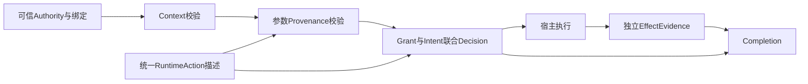

# Provenance-Bound Effect Security V1 — Engineering Report（验收草稿）

日期：2026-09-08。状态：进行中，不能作为全目标完成或发布批准。按用户模板§115组织；完整模板§0–120及45项DoD仍以逐项证据验收。

## A. Actual Baseline

- 起始SHA：`d001c4d2c1b7a1230604e8b2ecf813a39deb251c`。
- 当前代码基线：`442007b`；最终交付SHA：尚未确定。
- 分支：`codex/provenance-bound-effect-v1`；draft PR #4，未合并main。
- 已确认远端CI基线：`1e162dcb23fdb133e784ebf71ead7de1af7c194f`。该结果不覆盖其后的smoke/full修改。

## B. Architecture

可信管理面签发Intent、Context与来源issuer。daemon先解析并验证绑定Authority；无效必需Authority直接拒绝。合法Authority进入统一RuntimeAction描述与Context/Intent/Provenance联合验证，再结合Grant及现有policy形成签名Decision。宿主执行后可提交工具Observation；独立observer另行提交带动作关联的EffectEvidence。Completion读取签名Intent、决策历史和实际观测材料，返回verified/incomplete/unknown/conflicting。

图表示依赖关系，不把所有阶段宣称为单一线性事务。Authority和普通policy分层；效果采集在执行后发生，不能倒置成为先前授权的依据。

## C. Trust Boundaries

| 操作 | 允许的权威及限制 |
| --- | --- |
| 签发Intent | daemon管理能力；模型/decision凭据不能签发 |
| 签发ContextAssertion | 管理端签名，校验scope、时效和workspace；caller cwd不扩大权限 |
| 上报untrusted Provenance | decision能力调用report/select；source受限且不能自报issuer/task/signature以提权 |
| 签发authoritative Provenance | 管理面注册的可信issuer；本地key引用或外部公钥，受scope/source/trust ceiling/有效期/撤销限制 |
| 提交Tool Observation | decision能力的相关动作回报；success不构成独立效果证明 |
| 提交独立EffectEvidence | 专用observer凭据，绑定source/scope/有效期；decision token及普通admin token不能直接伪装observer提交 |

私钥保留daemon状态目录。管理权限本身是信任根，same-UID恶意进程不在隔离保证内。external_independent描述受控oracle的位置与凭据边界，不承诺抵御同UID系统级攻击。

## D. Changed Files

路径均相对仓库；完整diff以起始SHA到最终交付SHA为准。

| 路径 | 职责 |
| --- | --- |
| packages/contracts/ | Context、Provenance、Intent V3、Effect、Completion、恢复与撤销合同 |
| apps/agentshield/internal/runtimeauthz/ | Authority hard gate |
| apps/agentshield/internal/intent/ | V2/V3双读、Context、绑定及终态撤销 |
| apps/agentshield/internal/provenance/ | issuer/声明图、来源匹配、显式选择、预算及跨语言向量 |
| apps/agentshield/internal/runtimeaction/ | 统一工具语义、资源摘要、高影响参数和遍历预算 |
| apps/agentshield/internal/receipt/ | 联合决策、历史动作、审批复查、签名链 |
| apps/agentshield/internal/effectevidence/ | observer材料、关联、冲突、签名发布和重启恢复 |
| apps/agentshield/internal/completion/ | 基于要求与实际材料的最小Completion |
| apps/agentshield/internal/server/ | 分权HTTP接口、请求限制、凭据生命周期 |
| adapters/runtime/hermes-agentshield/ | 薄适配器、显式来源句柄及受限MCP上报 |
| benchmarks/runtime-security/ | 成对语料、真实夹具、D0–D5统计、独立验证和性能脚本 |
| .github/workflows/runtime-security.yml | 固定向量、合同、Go安全门禁、smoke/full及恢复 |

## E. Security Invariants

| 不变量 | 实现与测试证据 |
| --- | --- |
| INV-1 内容是数据 | 受限report/select，内容不授予管理权限；provenance HTTP负向测试 |
| INV-2 不接受自报提权 | issuer注册受管理能力控制，decision拒绝USER/TRUSTED_IAM/trusted；ReportCannotMintTrustedAuthority |
| INV-3 Source/Trust/Authority分离 | source taxonomy、trust排序与VerifyAuthority三层独立；签名、issuer scope/ceiling及撤销同时验证 |
| INV-4 缺证据为UNKNOWN | unknown派生不提高trust；shell保留unknown；缺实际效果材料不能verified |
| INV-5 值与来源联合约束 | Intent matcher和Provenance matcher共同消费RuntimeAction；同值USER/MCP产生不同结果 |
| INV-6 success不证明Effect | 文件假成功、网络oracle及Completion材料检查；独立benchmark verifier拒绝无effect的D5声明 |
| INV-7 无效Authority不降为advisory | mandatory错误三模式矩阵、绑定降级与撤销重启测试；普通policy legacy兼容独立保留 |

这些是源码与测试映射；G组全范围最终审计尚未关闭。

## F. Negative Test Table

| 场景 | 预期 | 已观测结果及证据 |
| --- | --- | --- |
| required+warn missing Intent | deny | Authority三模式矩阵及当前兼容race通过 |
| forged cwd | deny | TestCallerCWDDoesNotGrantWorkspaceWrite；真实文件基准通过 |
| forged USER provenance | deny | report入口拒绝；来源/HTTP测试通过 |
| MCP recipient injection | deny | 真实recipient基准报告中的攻击/对照通过 |
| same value trusted USER | allow | MCP桥接及Provenance matcher通过 |
| provenance replay | deny | 完整基准跨session/task及Go scope测试通过 |
| fake tool success | not verified | 真实文件夹具返回incomplete；不能用success冒充材料 |
| denied action real effect | incident | unauthorized_effect_observed持久化 |
| conflicting effect | conflicting | 实际替换输出与期望摘要冲突，Completion保留冲突 |
| fabricated D5 without oracle | reject | 旧版接受已复现；6f1941b修复后拒绝 |
| smoke relabelled full | reject | 442007b实际smoke报告改标签/删场景均拒绝 |

具体基线、命令和限制见[逐项验收索引](provenance-bound-effect-v1-acceptance-audit.md)及[开发台账](provenance-bound-effect-v1-progress.md)。

## G. Benchmark

完整集成实测基线95e425c：21对、42场景、20类别，51条回执、11份效果封装。后续离线验证器再次验证通过，不代表重跑同一版本的所有执行。D0/D1无模型观测，全部not evaluated。

| 样本 | 阶段 | positive / 可评估 | not evaluated | positive rate |
| --- | --- | --- | --- | --- |
| attack | D2 | 21/21 | 0 | 100.00% |
| attack | D3 | 4/8 | 13 | 50.00% |
| attack | D4 | 3/5 | 16 | 60.00% |
| attack | D5 | 3/5 | 16 | 60.00% |
| benign | D2 | 21/21 | 0 | 100.00% |
| benign | D3 | 8/8 | 13 | 100.00% |
| benign | D4 | 6/6 | 15 | 100.00% |
| benign | D5 | 6/6 | 15 | 100.00% |

D2是尝试，D3是执行，D4是观测到效果，D5是独立核实效果；这些比率不是统一的攻击成功率。D5共11/42可评估，31未评估。

| 指标 | 分子/分母 | 排除数（总样本42） | rate |
| --- | --- | --- | --- |
| false_allow_rate | 0/16 | 26 | 0.00% |
| false_deny_rate | 0/22 | 20 | 0.00% |
| benign_task_completion_rate | 6/6 | 36 | 100.00% |
| intent_violation_block_rate | 5/5 | 37 | 100.00% |
| provenance_violation_block_rate | 10/10 | 32 | 100.00% |
| resource_hijacking_block_rate | 2/2 | 40 | 100.00% |
| unauthorized_effect_rate | 1/11 | 31 | 9.09% |
| unknown_effect_rate | 0/11 | 31 | 0.00% |
| manual_approval_rate | 4/42 | 0 | 9.52% |

所有分母遵循归档指标population；没有Completion或Effect记录的样本被排除，不能据此推断全部任务完成率。当前PR smoke为5对10场景，单独实测10条回执/8份效果封装；不可与完整语料结果混算。

## H. Performance

以下来自95e425c真实100次顺序预热后采样，各指标单位ms，nearest-rank百分位。不是当前最终SHA性能、生产SLA或并发饱和结果；不能对各阶段P95相加得出总延迟。

| 阶段 | P50 | P95 | P99 |
| --- | --- | --- | --- |
| authority_validation | 0.007105 | 0.014176 | 0.014577 |
| context_validation | 0.08306 | 0.148375 | 0.171752 |
| intent_lookup | 0.261325 | 0.413348 | 0.422661 |
| policy_evaluation | 0.002832 | 0.005072 | 0.005504 |
| provenance_resolution | 0.145719 | 0.273469 | 0.306078 |
| receipt_append_fsync | 7.285245 | 11.652973 | 12.42517 |
| runtime_action_normalization | 0.00208 | 0.003585 | 0.00528 |
| effect_evidence_processing | 5.800262 | 6.488183 | 6.978589 |

policy_evaluation仅决策中的策略阶段，不是完整Decide端到端耗时。effect processing单独测SubmitFile，使用合成已授权Action，包含签名/发布，排除文件采集和工具执行。模板要求的完整decision口径仍须在最终报告中明确或补测，不能用policy阶段替代。

## I. Compatibility

V2/V3双读、旧回执验签、binding/global撤销与optional legacy核心测试通过。OpenClaw correlation/approval recheck通过，checkpoint兼容15项；Hermes adapter56项；Go CLI/安装器race通过。原生Hermes/CodeBuddy另有deeebee夹具证据及限制，参见[平台记录](evidence/provenance-v1/platform-core-20260908.json)。不宣称所有平台原生V3、GUI、人类审批或Windows资源语义已验证。

## J. CI

1e162dc远端[ci](https://github.com/maoyadongsh/siq-agent-security/actions/runs/34187100681)与[runtime-security](https://github.com/maoyadongsh/siq-agent-security/actions/runs/34187100690)均success；之后442007b尚待对应远端验证。nightly在PR中skip不是nightly通过。

本地最近验证：Go1.26.6相关包race/vet、Control API四份合同149项、基准21项unittest、Hermes56项、OpenClaw15项及Ruff通过。完整Go1.26.6 race/vet/govulncheck历史证据见[toolchain报告](provenance-bound-effect-v1-toolchain-20260908.md)。全仓门禁最终必须对应交付SHA；此处不把局部本地验证称为当前全仓全绿。

## K. Residual Risks 与未关闭任务

- desktop-same-uid：无恶意同UID进程隔离；状态签名不阻止整目录回滚或删除。
- 仅显式provenance，没有完整神经语义因果追踪；unknown transform仍为unknown。
- MCP来源签名证明协议归属，不证明数据真实性。
- EffectEvidence覆盖partial；host observer不等价于OS隔离oracle。
- 没有完整SaaS效果验证、完整Managed Linux、多智能体Delegation DAG或通用Behavioral Sandbox。
- Windows资源语义单独未验证；交叉编译不能代替运行证明。
- 最终待办：G1–G6全范围审计、26份新增schema的全部适用负例核验、§0–120逐节覆盖、最终性能口径与报告更新、对应最终SHA全仓CI及nightly证据。

当前39/45项记录为本地验收通过。报告仍为草稿，不标记开发目标完成。
