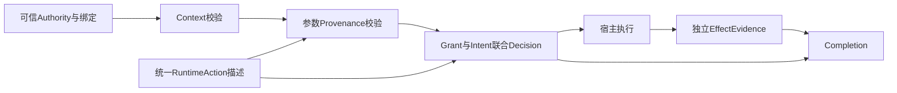

# Provenance-Bound Effect Security V1 — Engineering Report

日期：2026-09-08。状态：当前实验性组件的工程验收报告，按用户模板§115组织。代码、合同与门禁基线固定为8eb4540；范围与外部平台限制见K节。此报告不构成生产部署或main合并批准。

## A. Actual Baseline

- 起始SHA：`d001c4d2c1b7a1230604e8b2ecf813a39deb251c`。
- 最终功能代码SHA：`8eb45407b4b01e1cc17713574f6a07e21d34eeb5`；其后提交仅归档本报告、证据及文档状态，不混称为同一SHA。
- 开发分支：`codex/provenance-bound-effect-v1`。用户明确授权后经`4a0943e`合并main；Cursor环境配置另经`f6ccf2b`合并。main集成提交与功能验收SHA分开记录，新增环境脚本未在本机执行系统安装或数据库变更。
- 同SHA全仓CI 28/28 jobs成功，runtime-security两项PR必需job成功；workflow_dispatch三轮完整nightly全部成功，详见J节。

## B. Architecture

可信管理面签发Intent、Context与来源issuer。daemon先解析并验证绑定Authority；无效必需Authority直接拒绝。合法Authority进入统一RuntimeAction描述与Context/Intent/Provenance联合验证，再结合Grant及现有policy形成签名Decision。宿主执行后可提交工具Observation；独立observer另行提交带动作关联的EffectEvidence。Completion读取签名Intent、决策历史和实际观测材料，返回verified/incomplete/unknown/conflicting。

图表示依赖关系，不把所有阶段宣称为单一线性事务。Authority和普通policy分层；效果采集在执行后发生，不能倒置成为先前授权的依据。

## C. Trust Boundaries

| 操作 | 允许的权威及限制 |
| --- | --- |
| 签发Intent | daemon管理能力；模型/decision凭据不能签发 |
| 签发ContextAssertion | 管理端签名，校验scope、时效和workspace；caller cwd不扩大权限 |
| 上报untrusted Provenance | decision能力调用report/select；source受限且不能自报issuer/task/signature以提权 |
| 签发authoritative Provenance | 管理面注册的可信issuer；本地key引用或外部公钥，受scope/source/trust ceiling/有效期/撤销限制 |
| 提交Tool Observation | decision能力的相关动作回报；新增tool-effect-reports只允许self_reported/unknown。签名证明收录声明，不证明success属实 |
| 提交独立EffectEvidence | 专用observer凭据，绑定source/scope/有效期；decision token及普通admin token不能直接伪装observer提交 |

私钥保留daemon状态目录。管理权限本身是信任根，same-UID恶意进程不在隔离保证内。external_independent描述受控oracle的位置与凭据边界，不承诺抵御同UID系统级攻击。

## D. Changed Files

路径均相对仓库；完整diff以起始SHA到最终交付SHA为准。

| 路径 | 职责 |
| --- | --- |
| packages/contracts/ | Context、Provenance、Intent V3、Effect、Completion、恢复与撤销合同 |
| apps/agentshield/internal/runtimeauthz/ | Authority hard gate |
| apps/agentshield/internal/intent/ | V2/V3双读、Context、绑定及终态撤销 |
| apps/agentshield/internal/provenance/ | issuer/声明图、来源匹配、显式选择、预算及跨语言向量 |
| apps/agentshield/internal/runtimeaction/ | 统一工具语义、资源摘要、高影响参数和遍历预算 |
| apps/agentshield/internal/receipt/ | 联合决策、历史动作、审批复查、签名链 |
| apps/agentshield/internal/effectevidence/ | observer材料、关联、冲突、签名发布和重启恢复 |
| apps/agentshield/internal/completion/ | 基于要求与实际材料的最小Completion |
| apps/agentshield/internal/server/ | 分权HTTP接口、请求限制、凭据生命周期 |
| adapters/runtime/hermes-agentshield/ | 薄适配器、显式来源句柄及受限MCP上报 |
| benchmarks/runtime-security/ | 成对语料、真实夹具、D0–D5统计、独立验证和性能脚本 |
| .github/workflows/runtime-security.yml | 固定向量、合同、Go安全门禁、smoke/full及恢复 |

## E. Security Invariants

| 不变量 | 实现与测试证据 |
| --- | --- |
| INV-1 内容是数据 | 受限report/select，内容不授予管理权限；provenance HTTP负向测试 |
| INV-2 不接受自报提权 | issuer注册受管理能力控制，decision拒绝USER/TRUSTED_IAM/trusted；ReportCannotMintTrustedAuthority |
| INV-3 Source/Trust/Authority分离 | source taxonomy、trust排序与VerifyAuthority三层独立；签名、issuer scope/ceiling及撤销同时验证 |
| INV-4 缺证据为UNKNOWN | unknown派生不提高trust；shell保留unknown；缺实际效果材料不能verified |
| INV-5 值与来源联合约束 | Intent matcher和Provenance matcher共同消费RuntimeAction；同值USER/MCP产生不同结果 |
| INV-6 success不证明Effect | 文件假成功、网络oracle及Completion材料检查；独立benchmark verifier拒绝无effect的D5声明 |
| INV-7 无效Authority不降为advisory | mandatory错误三模式矩阵、绑定降级与撤销重启测试；普通policy legacy兼容独立保留 |

G1–G6及其余45项DoD的逐项证据见验收索引；这里的组件验收不把外部平台综合支持或OS隔离升级为已验证。

## F. Negative Test Table

| 场景 | 预期 | 已观测结果及证据 |
| --- | --- | --- |
| required+warn missing Intent | deny | Authority三模式矩阵及当前兼容race通过 |
| forged cwd | deny | TestCallerCWDDoesNotGrantWorkspaceWrite；真实文件基准通过 |
| forged USER provenance | deny | report入口拒绝；来源/HTTP测试通过 |
| MCP recipient injection | deny | 真实recipient基准报告中的攻击/对照通过 |
| same value trusted USER | allow | MCP桥接及Provenance matcher通过 |
| provenance replay | deny | 完整基准跨session/task及Go scope测试通过 |
| fake tool success | not verified | 真实文件夹具返回incomplete；不能用success冒充材料 |
| denied action real effect | incident | unauthorized_effect_observed持久化 |
| conflicting effect | conflicting | 实际替换输出与期望摘要冲突，Completion保留冲突 |
| fabricated D5 without oracle | reject | 旧版接受已复现；6f1941b修复后拒绝 |
| smoke relabelled full | reject | 442007b实际smoke报告改标签/删场景均拒绝 |

具体基线、命令和限制见[逐项验收索引](provenance-bound-effect-v1-acceptance-audit.md)及[开发台账](provenance-bound-effect-v1-progress.md)。

## G. Benchmark

完整集成实测基线8eb4540：三轮独立完整执行，每轮21对、42场景、20类别、51条回执、11份效果封装；三轮产物均下载后本地复验。下表为单轮口径，不将重复次数当成新增独立场景。D0/D1无模型观测，全部not evaluated。

| 样本 | 阶段 | positive / 可评估 | not evaluated | positive rate |
| --- | --- | --- | --- | --- |
| attack | D2 | 21/21 | 0 | 100.00% |
| attack | D3 | 4/8 | 13 | 50.00% |
| attack | D4 | 3/5 | 16 | 60.00% |
| attack | D5 | 3/5 | 16 | 60.00% |
| benign | D2 | 21/21 | 0 | 100.00% |
| benign | D3 | 8/8 | 13 | 100.00% |
| benign | D4 | 6/6 | 15 | 100.00% |
| benign | D5 | 6/6 | 15 | 100.00% |

D2是尝试，D3是执行，D4是观测到效果，D5是独立核实效果；这些比率不是统一的攻击成功率。D5共11/42可评估，31未评估。

| 指标 | 分子/分母 | 排除数（总样本42） | rate |
| --- | --- | --- | --- |
| false_allow_rate | 0/16 | 26 | 0.00% |
| false_deny_rate | 0/22 | 20 | 0.00% |
| benign_task_completion_rate | 6/6 | 36 | 100.00% |
| intent_violation_block_rate | 5/5 | 37 | 100.00% |
| provenance_violation_block_rate | 10/10 | 32 | 100.00% |
| resource_hijacking_block_rate | 2/2 | 40 | 100.00% |
| unauthorized_effect_rate | 1/11 | 31 | 9.09% |
| unknown_effect_rate | 0/11 | 31 | 0.00% |
| manual_approval_rate | 4/42 | 0 | 9.52% |

所有分母遵循归档指标population；没有Completion或Effect记录的样本被排除，不能据此推断全部任务完成率。当前PR smoke为5对10场景，单独实测10条回执/8份效果封装；不可与完整语料结果混算。

## H. Performance

代码8eb4540，Go1.26.6，Linux arm64，5次预热后每项100次顺序采样。原始样本、工具链与源码摘要见[完整性能记录](evidence/provenance-v1/performance-8eb4540-20260908.json)。单位ms；不是生产SLA或并发饱和指标。

| 阶段 | P50 | P95 | P99 |
| --- | --- | --- | --- |
| effect_evidence_processing | 5.812141 | 6.289349 | 6.580923 |
| authority_validation | 0.007488 | 0.011952 | 0.015792 |
| context_validation | 0.123298 | 0.14997 | 0.465017 |
| decision_total | 8.1206 | 12.080642 | 12.72171 |
| intent_lookup | 0.321574 | 0.384744 | 0.477081 |
| policy_evaluation | 0.003057 | 0.005008 | 0.008496 |
| provenance_resolution | 0.23618 | 0.263781 | 0.275781 |
| receipt_append_fsync | 7.2854 | 11.453926 | 12.272662 |
| runtime_action_normalization | 0.002848 | 0.003856 | 0.008032 |

完整decision_total包围Engine.Decide及其内部回调、授权检查和回执持久化，不含HTTP与工具执行；各内部阶段不能与总时长相加。effect_evidence_processing单独测SubmitFile，使用合成已授权Action，包含签名/发布，不含文件采集及工具执行。测试按同一样本验证各内部阶段不超过完整调用耗时。

## I. Compatibility

V2/V3双读、旧回执验签、binding/global撤销与optional legacy核心测试通过。OpenClaw correlation/approval recheck通过，checkpoint兼容15项；Hermes adapter56项；Go CLI/安装器race通过。原生Hermes/CodeBuddy另有deeebee夹具证据及限制，参见[平台记录](evidence/provenance-v1/platform-core-20260908.json)。不宣称所有平台原生V3、GUI、人类审批或Windows资源语义已验证。

## J. CI

以下运行均对应8eb4540，job与步骤详情、三轮产物摘要见[CI归档](evidence/provenance-v1/ci-8eb4540-20260908.json)。

| 门禁 | 实际结果 |
| --- | --- |
| [全仓ci 34190568787](https://github.com/maoyadongsh/siq-agent-security/actions/runs/34190568787) | 28/28 jobs success：Control API Ruff/pytest/依赖审计，Web构建及依赖检查，Edge与各Connector矩阵，Go测试/跨平台构建，gitleaks及发布清单/Skill自扫描 |
| [runtime-security 34190568771](https://github.com/maoyadongsh/siq-agent-security/actions/runs/34190568771) | contracts与patched-toolchain success；PR内nightly skipped，未计为通过 |
| [完整nightly 34190577905](https://github.com/maoyadongsh/siq-agent-security/actions/runs/34190577905) | 5/5 jobs success，含三轮完整基准、恢复、性能及Hermes MCP bridge |

核心命令：`gofmt -l .`、`go vet ./...`、`go test ./...`、`go test -race ./...`、`govulncheck ./...`；严格漏洞门禁固定Go1.26.6及govulncheck v1.7.0。基础兼容job的旧Go扫描可能报告警告，不能代替patched-toolchain严格通过证据。Python合同与向量、Hermes adapter、benchmark单测、smoke、恢复及离线验签命令均在runtime-security.yml中固定。

本地另完成Go1.26.6全模块race/vet和四平台编译，42场景完整运行与离线验证，三轮远端产物的report/recovery本地复验。远端三轮各验证51条回执/11个效果封装；各恢复报告验证2个pending、2个recovery、1个observer撤销、1条恢复回执和1个文件Completion。摘要仅校验同一制品一致性，不是独立外部信任锚。

未修改GitHub Ruleset或main保护规则。是否将这些检查配置为main合并必需项仍由仓库管理员确认；CI成功不代表规则已强制启用。

## K. Residual Risks 与外部验收

- desktop-same-uid：无恶意同UID进程隔离；状态签名不阻止整目录回滚或删除。
- 仅显式provenance，没有完整神经语义因果追踪；unknown transform仍为unknown。
- MCP来源签名证明协议归属，不证明数据真实性。
- EffectEvidence覆盖partial；host observer不等价于OS隔离oracle。
- 没有完整SaaS效果验证、完整Managed Linux、多智能体Delegation DAG或通用Behavioral Sandbox。
- Windows资源语义单独未验证；交叉编译不能代替运行证明。
- 新版工具声明接口为显式调用；Hermes等平台不会因此自动获得所有工具/所有效果采集覆盖。通用网络absence证明尚未提供。

45项DoD已有注明范围与基线的验收记录；模板逐节索引另行保留全部121节交付证据。后续真实平台验收使用仓库现有validate-intent-v2-hermes.py、validate-intent-v2-codebuddy.py及相应平台fixture；这些命令只能证明指定平台/版本/场景，不能将V2原生证据替代全部V3支持。Managed Linux须先具备不同UID与可信observer/attestor部署，按ADR-0018执行边界验证；本轮未实现该部署，因此保持unverified。
