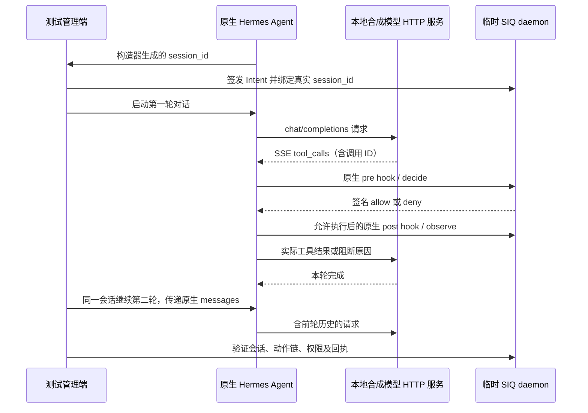

# Trusted Intent V2：Hermes 完整会话与远端 CI 验收增量

- 日期：2026-09-07，Asia/Shanghai。
- SIQ 基线：`3d1a9b50b2e9429c183b4381a20f36e2cac2f735`；本轮新增验证脚本和文档，未修改产品授权实现。
- Hermes：`42f0c8179e30cf6ba4cba0a8f2852e609f717773`，工作树干净；使用其已安装的 Python 3.11.15 环境。
- 结论：原生 Agent 跨轮会话、真实会话 ID 绑定、流式工具调用解析与回执关联通过；该基线的完整远端 CI 已成功。整个 V2 验收仍未关闭。

## 1. 本轮补足的证据

此前 Hermes 验收由测试直接调用原生 `handle_function_call`，会话与工具调用 ID 也是测试传入，不能证明 Agent 会话循环能够保留这些字段。

新增 [validate-intent-v2-hermes-conversation.py](../scripts/validate-intent-v2-hermes-conversation.py) 调用未修改的 `AIAgent.run_conversation`。本地 HTTP 合成模型按 OpenAI 兼容协议返回 SSE 工具调用与最终回答；实际 Hermes 完成响应解析、工具执行、pre/post hook、历史消息传递和下一次模型请求。测试没有替换 Agent、工具分发器、插件钩子或 SIQ 决策服务。



管理端使用临时配对会话签发并绑定 Intent，管理 bearer 不放进 Agent 子进程环境或模型请求。模型提供的调用 ID 只是关联标识，授权始终来自 SIQ 管理端绑定的签名 Intent。

## 2. 实际结果与断言

原始结果：[native-hermes-conversation-20260907.json](evidence/intent-v2/native-hermes-conversation-20260907.json)。

| 场景 | 实际交互 | 已验证行为 |
| --- | --- | --- |
| 已绑定会话，第一轮 | 读取 company-a；尝试读取 company-b | 合法读取返回固定测试内容；越权返回阻断原因，模型后续请求不含 company-b 内容 |
| 同一会话，第二轮 | 尝试 company-a-evil；尝试写文件；再次读取 company-a | 前缀碰撞和写入均被拒绝，文件不存在；合法读取仍执行 |
| 新建未绑定会话 | 尝试读取 company-a | required 模式返回 `intent_binding_missing`；不继承前一个 Agent 会话的绑定 |
| 授权与动作关联 | 检查所有实际回执 | session_id 与原生构造器生成值一致；工具 ID 来自模型协议；Intent digest、task、principal 和 authority_revision 一致 |
| 跨轮行为链 | 检查已绑定会话的五次决策 | task_seq 连续为 1–5；拒绝不推进成功动作父节点；第二轮合法动作仍引用先前成功动作 |
| 回执完整性 | HTTP 分页验签与停机 CLI verify | 六条 decision、两条 observation，共八条；拒绝动作不产生成功 observation |

两次原生 Agent 实例共进行三轮用户对话、六次工具调用、九次流式 completion 请求。另有原生模型元数据探测请求，单独记录，不计入 completion 数量。模型元数据服务提供固定测试容量；这不是实际模型上下文能力或性能的测量。

源码、共享测试工具、适配器与构建二进制的 SHA-256 均记录在 JSON 中。报告标记 `siq_dirty=true`，因为验证脚本尚未提交；Hermes 的 `hermes_dirty=false`。测试后的临时状态、配对信息、工具内容和原始日志全部随临时目录清理。归档 JSON 是验证摘要，不是可独立重放的完整签名回执档案。

## 3. 复测方式

前提：Go 可用；`--hermes-root` 指向已安装依赖的 Hermes 源码。不会自动安装第三方运行时，也不会调用付费模型。

```bash
python3 scripts/validate-intent-v2-hermes-conversation.py \
  --hermes-root /home/maoyd/siq/hermes-agent \
  --hermes-python /home/maoyd/siq/hermes-agent/venv/bin/python \
  --out /tmp/intent-v2-hermes-conversation.json

uv run --project apps/control-api ruff check \
  scripts/validate-intent-v2-hermes-conversation.py
git diff --check
```

脚本设置独立 `HERMES_HOME`、空 managed/bundled plugin 目录，关闭项目上下文、记忆和后台复核，仅启用文件工具和本项目插件。子进程使用 Python audit hook 限制连接到两个临时 loopback 服务，拒绝外部 DNS，并阻止读取实际 Hermes home 和测试目录外的常见凭据文件。此限制用于约束测试 IO，不是产品 OS 隔离实现或恶意代码沙箱。

任何会话初始化、模型消息断言、回执关联或验签失败都会以非零码退出；原生运行时缺失不会记为通过。子进程诊断只返回异常类型和栈位置，不回显捕获的日志。

## 4. 新提交的完整远端 CI

`3d1a9b5` 的 [GitHub Actions 运行 34119045995](https://github.com/maoyadongsh/siq-agent-security/actions/runs/34119045995) 已为 `completed / success`，共 28 个 job 全部成功：Web、Control API、gitleaks、本地 Agent，以及 Edge/Connector 的 Go 1.22 与 stable 矩阵。

归档：[ci-3d1a9b5-20260907.json](evidence/intent-v2/ci-3d1a9b5-20260907.json)，包含完整 head SHA、状态、各 job 起止时间与链接。DoD 17 对此提交已有远端证据；不把该结果外推为尚未提交的本轮脚本已经接受远端测试。完整原生会话测试目前为显式安装前提下的本机集成测试，没有加入依赖外部 Hermes 安装的默认 CI。

## 5. 尚需完成的验收

1. **平台审批与 hold**：本轮没有驱动人类批准或平台原生审批。本项目 Hermes 适配器的 hold 映射仍是阻断并提示控制台，不能声称原生自动续执行。
2. **OpenClaw 完整会话与审批**：已有加载器和工具链集成证据，仍需连接完整 Agent/网关会话验证实际上下文传递。
3. **CodeBuddy 原生运行**：当前未安装该运行时，现有合同与 hook 测试不能替代实机归档。
4. **故障与独立复核**：已有 600 秒持续运行、强杀、重启与边界测试，不等于任意断电、存储故障和长期生产可靠性；独立安全复核仍待完成。

本次证据具体增强了 Hermes 会话链路的可信度。能力矩阵的综合平台 V2 状态继续保持 `unverified`，以免把一组明确通过的场景扩展为全部平台能力已完成。Provenance DAG、任务撤销、OS 强隔离与多智能体委托仍按已有报告保留为后续阶段。
